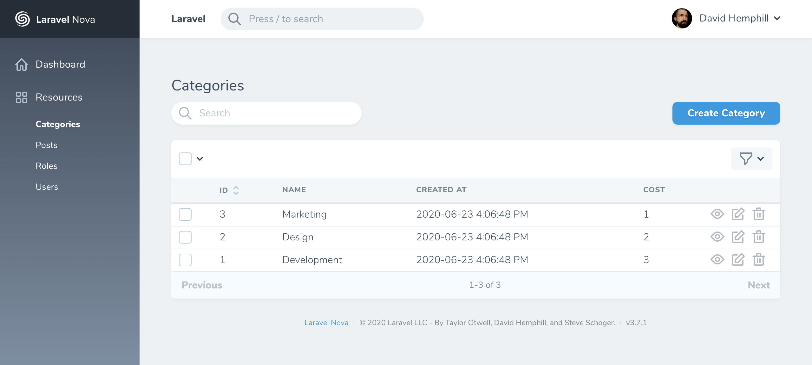
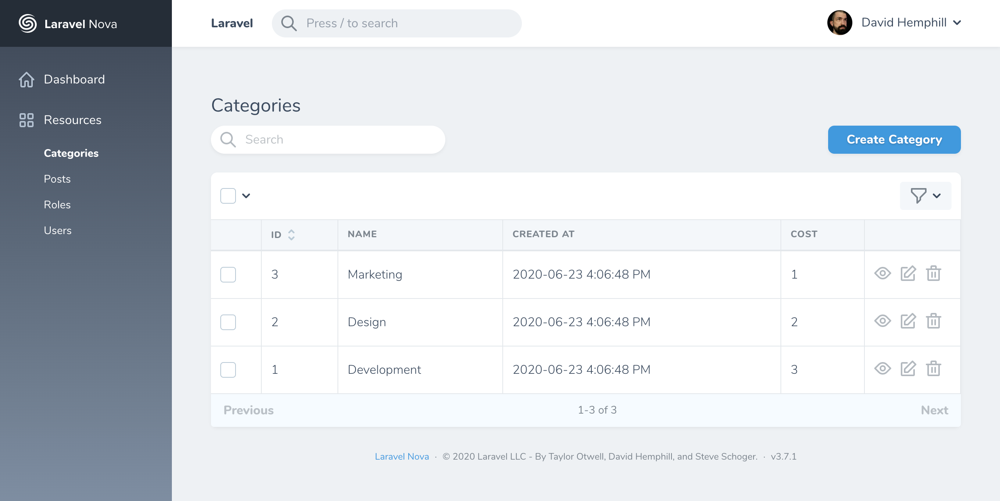
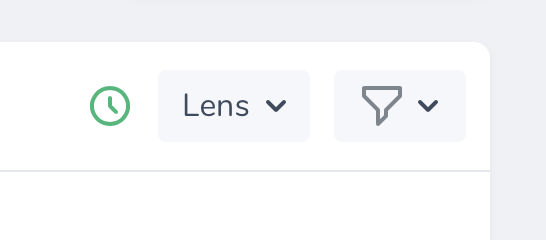

# The Basics

[[toc]]

## Introduction

Laravel Nova is a beautiful administration dashboard for Laravel applications. Of course, the primary feature of Nova is the ability to administer your underlying database records using Eloquent. Nova accomplishes this by allowing you to define a Nova "resource" that corresponds to each Eloquent model in your application.

## Defining Resources

By default, Nova resources are stored in the `app/Nova` directory of your application. You may generate a new resource using the `nova:resource` Artisan command:

```bash
php artisan nova:resource Post
```

The most basic and fundamental property of a resource is its `model` property. This property tells Nova which Eloquent model the resource corresponds to:

```php
/**
 * The model the resource corresponds to.
 *
 * @var string
 */
public static $model = 'App\Models\Post';
```

Freshly created Nova resources only contain an `ID` field definition. Don't worry, we'll add more fields to our resource soon.

:::warning Reserved Resource Names

Nova contains a few reserved words, which may not be used for resource names.

- Card
- Dashboard
- Field
- Metric
- Resource
- Search
- Script
- Style
- Tool
  :::

## Registering Resources

:::tip Automatic Registration

By default, all resources within the `app/Nova` directory will automatically be registered with Nova. You are not required to manually register them.
:::

Before resources are available within your Nova dashboard, they must first be registered with Nova. Resources are typically registered in your `app/Providers/NovaServiceProvider.php` file. This file contains various configuration and bootstrapping code related to your Nova installation.

**As mentioned above, you are not required to manually register your resources; however, if you choose to do so, you may do so by overriding the `resources` method of your `NovaServiceProvider`**.

There are two approaches to manually registering resources. You may use the `resourcesIn` method to instruct Nova to register all Nova resources within a given directory. Alternatively, you may use the `resources` method to manually register individual resources:

```php
use App\Nova\User;
use App\Nova\Post;

/**
 * Register the application's Nova resources.
 *
 * @return void
 */
protected function resources()
{
    Nova::resourcesIn(app_path('Nova'));

    Nova::resources([
        User::class,
        Post::class,
    ]);
}
```

Once your resources are registered with Nova, they will be available in the Nova sidebar:


If you do not want a resource to appear in the sidebar, you may override the `displayInNavigation` property of your resource class:

```php
/**
 * Indicates if the resource should be displayed in the sidebar.
 *
 * @var bool
 */
public static $displayInNavigation = false;
```

## Grouping Resources

If you would like to separate resources into different sidebar groups, you may override the `group` property of your resource class:

```php
/**
 * The logical group associated with the resource.
 *
 * @var string
 */
public static $group = 'Admin';
```

## Resource Table Style Customization

Nova supports a few visual customization options for your resources.

### Table styles

Sometimes it's convenient to show more data on your resource index tables. To accomplish this, you can use the "tight" table style option designed to increase the visual density of your table rows. Override the static `$tableStyle` property or the static `tableStyle` method on your Resource class:

```php
/**
 * The visual style used for the table. Available options are 'tight' and 'default'.
 *
 * @var string
 */
public static $tableStyle = 'default';
```

This will display your table rows with less visual height, enabling more data to be shown:



### Column Borders

You can show borders on the sides of columns by overriding the static `$showColumnBorders` property or the static `showColumnBorders` method on your Resource class:

```php
/**
 * Whether to show borders for each column on the X-axis.
 *
 * @var bool
 */
public static $showColumnBorders = true;
```

This will display the table with borders on every table item:



## Eager Loading

If you routinely need to access a resource's relationships within your fields, [resource title](./../search/global-search.md#title-subtitle-attributes), or [resource subtitle](./../search/global-search.md#title-subtitle-attributes), it may be a good idea to add the relationship to the `with` property of your resource. This property instructs Nova to always eager load the listed relationships when retrieving the resource.

For example, if you access a `Post` resource's `user` relationship within the `Post` resource's `subtitle` method, you should add the `user` relationship to the `Post` resource's `with` property:

```php
/**
 * The relationships that should be eager loaded on index queries.
 *
 * @var array
 */
public static $with = ['user'];
```

## Resource Events

All Nova operations use the typical `save`, `delete`, `forceDelete`, `restore` Eloquent methods you are familiar with. Therefore, it is easy to listen for model events triggered by Nova and react to them. The easiest approach is to simply attach a [model observer](https://laravel.com/docs/eloquent#observers) to a model:

```php
namespace App\Providers;

use App\Models\User;
use App\Observers\UserObserver;
use Illuminate\Support\ServiceProvider;

class AppServiceProvider extends ServiceProvider
{
    /**
     * Bootstrap any application services.
     *
     * @return void
     */
    public function boot()
    {
        User::observe(UserObserver::class);
    }

    /**
     * Register the service provider.
     *
     * @return void
     */
    public function register()
    {
        //
    }
}
```

If you would like to attach an observer **only during** Nova related HTTP requests, you may register observers within `Nova::serving` event listener in your application's `NovaServiceProvider`. This listener will only be executed during Nova requests:

```php
use App\User;
use Laravel\Nova\Nova;
use App\Observers\UserObserver;

/**
 * Bootstrap any application services.
 *
 * @return void
 */
public function boot()
{
    parent::boot();

    Nova::serving(function () {
        User::observe(UserObserver::class);
    });
}
```

## Preventing Conflicts

If the model has been updated since its last retrieval, Nova will automatically respond with a `409 Conflict` status code and display an error message to prevent unintentional model changes. This may occur if another user updates the model after you have opened the "Edit" screen on the resource. This feature is also known as "Traffic Cop".

### Disabling Traffic Cop

If you are not concerned with preventing conflicts, you can disable the Traffic Cop feature:

```php
/**
 * Indicates whether Nova should check for modifications between viewing and updating a resource.
 *
 * @var bool
 */
public static $trafficCop = false;
```

You may also override the `trafficCop` method on the resource if you require more intense customization when determining if this feature should be enabled:

```php
/**
 * Indicates whether Nova should check for modifications between viewing and updating a resource.
 *
 * @param  \Illuminate\Http\Request  $request
 * @return  bool
*/
public static function trafficCop(Request $request)
{
    return static::$trafficCop;
}
```

:::tip Time Synchronization

If you are experiencing issues with traffic cop you may first want to check that the system time is correctly synchronized using NTP.
:::

## Resource Polling

Nova can automatically fetch the latest records for a resource at a specified interval. To enable polling, override the `polling` property of your Resource class:

```php
/**
 * Indicates whether the resource should automatically poll for new resources.
 *
 * @var bool
 */
public static $polling = true;
```

To customize the polling interval, you may override the `pollingInterval` property on your resource class with the number of seconds Nova should wait before fetching new resource records:

```php
/**
 * The interval at which Nova should poll for new resources.
 *
 * @var int
 */
public static $pollingInterval = 5;
```

## Toggling Resource Polling

By default, when resource polling is enabled, there is no way to disable it once the page loads. You can instruct Nova to display a start/stop toggle button for resource polling by setting the `showPollingToggle` property on your resource class:

```php
/**
 * Indicates whether to show the polling toggle button inside Nova.
 *
 * @var bool
 */
public static $showPollingToggle = true;
```

Nova will then display a clickable button inside the interface:



## Preventing Accidental Resource Form Abandonment

When creating and editing resource forms with many fields, you may wish to prevent the user from accidentally leaving the form due to a misclick. You can enable this for each of your resources by setting the static `preventFormAbandonment` property to `true`:

```php
/**
 * Indicates whether Nova should prevent the user from leaving an unsaved form, losing their data.
 *
 * @var bool
 */
public static $preventFormAbandonment = true;
```

## Redirection

Nova allows you to easily customize where a user is redirected after performing resource actions such as creating or updating a resource:

- [redirectAfterCreate()](#after-creating-redirection)
- [redirectAfterUpdate()](#after-updating-redirection)
- [redirectAfterDelete()](#after-deletion-redirection)

:::warning Redirection Limitation

Behind the scene, Nova's redirect features use the Vue router's `push()` method. Because of this, redirection is limited to paths within Laravel Nova.
:::

#### After Creating Redirection

You may customize where a user is redirected after creating a resource using by overriding your resource's `redirectAfterCreate` method:

```php
    /**
     * Return the location to redirect the user after creation.
     *
     * @param  \Laravel\Nova\Http\Requests\NovaRequest  $request
     * @param  \Laravel\Nova\Resource  $resource
     * @return string
     */
    public static function redirectAfterCreate(NovaRequest $request, $resource)
    {
        return '/resources/'.static::uriKey().'/'.$resource->getKey();
    }
```

#### After Updating Redirection

You may customize where a user is redirected after updating a resource using by overriding your resource's `redirectAfterUpdate` method:

```php
    /**
     * Return the location to redirect the user after update.
     *
     * @param  \Laravel\Nova\Http\Requests\NovaRequest  $request
     * @param  \Laravel\Nova\Resource  $resource
     * @return string
     */
    public static function redirectAfterUpdate(NovaRequest $request, $resource)
    {
        return '/resources/'.static::uriKey().'/'.$resource->getKey();
    }
```

#### After Deletion Redirection

You may customize where a user is redirected after deleting a resource using by overriding your resource's `redirectAfterDelete` method:

```php
    /**
     * Return the location to redirect the user after deletion.
     *
     * @param  \Laravel\Nova\Http\Requests\NovaRequest  $request
     * @return string|null
     */
    public static function redirectAfterDelete(NovaRequest $request)
    {
        return null;
    }
```

## Keyboard Shortcuts

You may press the `C` key on a resource index to navigate to the "Create Resource" screen. On the resource detail screen, the `E` key may be used to navigate to the "Update Resource" screen.

## Pagination

Nova has the ability to show pagination links for your Resource listings. You can choose between three different styles: "simple", "load-more", and "links", depending on your application's needs:


By default, Nova Resources are displayed using the "simple" style. However, you may customize this to use either the "load-more" or "links" style. You can enable this by setting the `pagination` option in your `nova` configuration file:

```php
'pagination' => 'links',
```

## Customizing Pagination

If you'd like to customize the amounts shown on each resource's "per page" filter menu, you can do so by customizing its `perPageOptions` property:

```php
/**
 * The pagination per-page options configured for this resource.
 *
 * @return array
 */
public static $perPageOptions = [50, 100, 150];
```

Alternatively, you can override the `perPageOptions` method on the `Resource`:

```php
public static function perPageOptions()
{
    return [50, 100, 150];
}
```

:::tip Customizing `perPageOptions` & Resource Fetching

Changing the value of `perPageOptions` on your `Resource` will cause Nova to fetch the number of resources equal to the first value in the `perPageOptions` array.
:::

### Resource Index Search Debounce

You may wish to customize the search debounce timing of an individual resource's index listing. For example, the queries executed to retrieve some resources may take longer than others. You can customize an individual resource's search debounce by setting the `debounce` property on the resource class:

```php
/**
 * The debounce amount to use when searching this resource.
 *
 * @var float
 */
public static $debounce = 0.5; // 0.5 seconds
```
