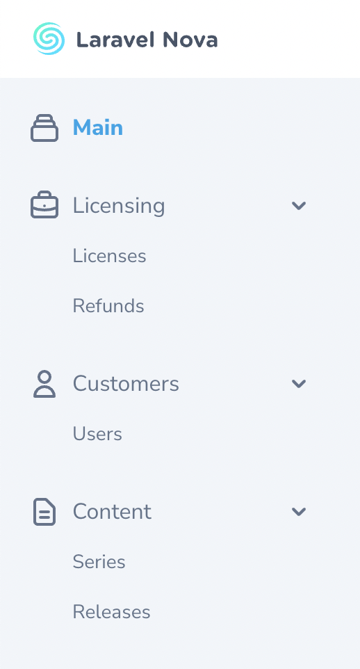

# Menus

[[toc]]

## Overview

By default, Nova's main left-side navigation menu displays all of your application's dashboards, resources, and any custom tools you have registered.



When rendering the main menu, Nova will order your dashboards according to the order in which they are returned by the `dashboards` method within your application's `App\Providers\NovaServiceProvider` class.

Nova will also automatically group your resources under the default "Resources" menu section according to the [`group` property defined in the `Resource` class](./../resources/README.md#grouping-resources). In addition, any custom tools you have registered will be listed in the order they are defined within your application's `NovaServiceProvider`.

### Customizing The Main Menu

While Nova's default main menu is sufficient for most applications, there are times you may wish to completely customize the menu based on your own preferences. For that reason, Nova allows you to define your own main menu via the `Nova::mainMenu` method. Typically, this method should be invoked within the `boot` method of your application's `App\Providers\NovaServiceProvider` class:

```php
<?php

namespace App\Providers;

use App\Nova\License;
use App\Nova\Release;
use App\Nova\Series;
use App\Nova\User;
use Illuminate\Http\Request;
use Laravel\Nova\Nova\Dashboards\Main;
use Laravel\Nova\Menu\Menu;
use Laravel\Nova\Menu\MenuItem;
use Laravel\Nova\Menu\MenuSection;
use Laravel\Nova\Nova;
use Laravel\Nova\NovaApplicationServiceProvider;

class NovaServiceProvider extends NovaApplicationServiceProvider
{
    /**
     * Bootstrap any application services.
     *
     * @return void
     */
    public function boot()
    {
        Nova::mainMenu(function (Request $request) {
            return [
                MenuSection::dashboard(Main::class)->icon('chart-bar'),

                MenuSection::make('Customers', [
                    MenuItem::resource(User::class),
                    MenuItem::resource(License::class),
                ])->icon('user')->collapsable(),

                MenuSection::make('Content', [
                    MenuItem::resource(Series::class),
                    MenuItem::resource(Release::class),
                ])->icon('document-text')->collapsable(),
            ];
        });
    }
}
```

### Customizing The User Menu

Nova also allows you to customize the "user" menu found in the top-right navigation area. You can customize Nova's user menu by calling the `Nova::userMenu` method. This method is typically invoked within the `boot` method of your application's `App\Providers\NovaServiceProvider`:

```php
<?php

namespace App\Providers;

use Illuminate\Http\Request;
use Laravel\Nova\Menu\Menu;
use Laravel\Nova\Menu\MenuItem;
use Laravel\Nova\Nova;
use Laravel\Nova\NovaApplicationServiceProvider;

class NovaServiceProvider extends NovaApplicationServiceProvider
{
    /**
     * Bootstrap any application services.
     *
     * @return void
     */
    public function boot()
    {
        Nova::userMenu(function (Request $request, Menu $menu) {
            if ($request->user()->isImpersonating()) {
                $menu->append(
                    MenuItem::make('Stop Impersonating')
                        ->path('/impersonate/stop')
                );
            }

            $menu->prepend(
                MenuItem::make(
                    'My Profile',
                    "/resources/user/{$request->user()->getKey()}"
                )
            );

            return $menu;
        });
    }
}
```

:::warning User Menu Logout Link

By default, Nova is configured to display a "logout" link in the user menu. This link may not be removed.
:::

:::warning User Menu Items
Nova's user menu only supports `MenuItem` objects. Using `MenuSection` or `MenuGroup` inside the user menu will throw an `Exception`.
:::

#### Appending / Prepending To The Menu

You may call the `append` and `prepend` methods on a `Menu` instance to prepend or append new items to the. These methods are typically most helpful when customizing the user menu, since you often do not want to completely replace the existing menu:

```php
Nova::userMenu(function (Request $request, Menu $menu) {
    return $menu
        ->append(MenuItem::externalLink('API Docs', 'http://example.com'))
        ->prepend(MenuItem::link('My Profile', '/resources/users/'.$request->user()->getKey()));
    });
```

## Building Menus

### Menu Sections

Menu sections represent a top-level navigation item and are typically displayed with an corresponding icon representing the types of items in the menu. You can create a new menu section by calling the `MenuSection::make` method. This method accepts the name of the menu section and array of menu groups / items that should be placed within the section:

```php
use App\Nova\Dashboards\Sales;
use App\Nova\License;
use App\Nova\Refund;
use Illuminate\Http\Request;
use Laravel\Nova\Menu\MenuGroup;
use Laravel\Nova\Menu\MenuItem;
use Laravel\Nova\Menu\MenuSection;
use Laravel\Nova\Nova;

Nova::mainMenu(function (Request $request) {
    return [
        MenuSection::make('Business', [
            MenuGroup::make('Licensing', [
                MenuItem::dashboard('Sales', Sales::class),
                MenuItem::resource('Licenses', License::class),
                MenuItem::resource('Refunds', Refund::class),
                MenuItem::externalLink('Stripe Payments', 'https://dashboard.stripe.com/payments?status%5B%5D=successful'),
            ]),
        ]),
    ];
});
```

Instead of displaying a list of links, you may indicate that a menu section should just be a large, emphasized link to another location. To accomplish this, you may invoke the `path` method when defining the menu section:

```php
use Laravel\Nova\Menu\MenuSection;

MenuSection::make('Dashboard')->path('/dashboards/main')
```

For convenience, if you are only creating a menu section to serve as a large, emphasized link to a Nova dashboard, you may invoke the `MenuSection::dashboard` method:

```php
use App\Nova\Dashboards\Sales;
use Laravel\Nova\Menu\MenuSection;

MenuSection::dashboard('Sales', Sales::class),
```

:::warning Menu Sections As Links
Menu sections that are defined as `collapsable` do not support also being a link. Calling `path` on a menu section when it's `collapseable` will result in no link being shown.
:::

#### Menu Section Icons

You can customize the icon displayed for your menu section by invoking the `icon` method when defining the menu section:

```php
use Laravel\Nova\Menu\MenuSection;

MenuSection::make('Resources', [
    // items
])->icon('briefcase')
```

Nova utilizes the free [Heroicons](https://heroicons.com/) icon set by [Steve Schoger](https://twitter.com/steveschoger). Therefore, you may simply specify the name of one of these icons when providing the icon name to the `icon` method.

#### Collapsable Menu Sections

You may make your menu sections collapsable by invoking the `collapsable` method when defining the menu section. For convenience, Nova will remember the open state for the section between requests:

```php
use Laravel\Nova\Menu\MenuSection;

MenuSection::make('Resources', [
    //
])->collapsable()
```

### Menu Groups

Sometimes you may need another logical level between your menu sections and menu items. In this case, menu groups are the perfect solution. Menu groups allow you to group menu items under their own emphasized heading:

```php
use App\Nova\Dashboards\Sales;
use App\Nova\License;
use App\Nova\Refund;
use Illuminate\Http\Request;
use Laravel\Nova\Menu\MenuGroup;
use Laravel\Nova\Menu\MenuItem;
use Laravel\Nova\Menu\MenuSection;

MenuSection::make('Business', [
    MenuGroup::make('Licensing', [
        MenuItem::dashboard('Sales', Sales::class),
        MenuItem::resource('Licenses', License::class),
        MenuItem::resource('Refunds', License::class),
        MenuItem::externalLink('Stripe Payments', 'https://dashboard.stripe.com/payments?status%5B%5D=successful'),
    ]),
]),
```

You may make your menu groups collapsable by invoking the `collapsable` method on the group. For convenience, Nova will remember the open state for the group between requests:

```php
MenuGroup::make('Resources', [
    //
])->collapsable()
```

### Menu Items

Menu items represent the different types of links to areas inside and outside of your application that may be added to a custom Nova menu. Nova ships with several convenience methods for creating different types of menu items.

First, to create a link to an internal area of Nova, you may call the `link` factory method on the `MenuItem` class:

```php
use Laravel\Nova\Menu\MenuItem;

MenuItem::link('Cashier', '/cashier')
```

Since you will often be creating links to Nova resources, you may use the `resource` method to quickly create a link to the appropriate path for a given resource:

```php
use App\Nova\User;
use Laravel\Nova\Menu\MenuItem;

MenuItem::resource('Customers', User::class)
```

Similarly, you may create a link to any of your [custom Nova dashboards](./dashboards.md) by calling the `dashboard` factory method:

```php
use App\Nova\Dashboards\Main;
use Laravel\Nova\Menu\MenuItem;

MenuItem::dashboard('Home', Main::class)
```

To create a link that directs the user to a location that is totally outside of your Nova application, you may use the `externalLink` factory method:

```php
use Laravel\Nova\Menu\MenuItem;

MenuItem::externalLink('Documentation', 'https://nova.laravel.com/docs')
```

You may also call the `method` helper to pass in the HTTP method, request data, and any HTTP headers that should be sent to your application when the link is clicked. This is typically useful for items like logout links, which should be `POST` requests:

```php
use Laravel\Nova\Menu\MenuItem;

MenuItem::externalLink('Logout', 'https://api.yoursite.com/logout')
    ->method(
        'POST',
        data: ['user' => 'hemp'],
        headers: ['API_TOKEN' => 'abcdefg1234567']
    )
```
