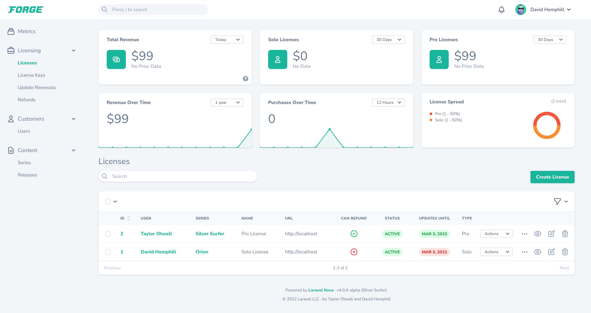

# Installation

[[toc]]

## Requirements

Laravel Nova has a few requirements you should be aware of before installing:

- Composer
- Laravel Framework 8.0+
- Laravel Mix 6
- Node.js (Version 14)
- NPM

## Browser Support

Nova supports modern versions of the following browsers:

- Apple Safari
- Google Chrome
- Microsoft Edge
- Mozilla Firefox

## Installing Nova Via Composer

:::warning Zip Downloads

Previous releases of Laravel Nova allowed Nova to be installed by downloading Zip archives of the source code; however, Nova 4 installation is always performed via Composer.
:::

You may install Nova as a Composer package via our private Satis repository. To get started, add the Nova repository to your application's `composer.json` file:

```json
"repositories": [
    {
        "type": "composer",
        "url": "https://nova.laravel.com"
    }
],
```

Or, you may use the following CLI command to add the Composer repository to your `composer.json` file:

```bash
composer config repositories.nova '{"type": "composer", "url": "https://nova.laravel.com"}' --file composer.json
```

Next, you may add `laravel/nova` to your list of required packages in your `composer.json` file:

```json
"require": {
    "php": "^8.0",
    "laravel/framework": "^9.0",
    "laravel/nova": "~4.0"
},
```

After your `composer.json` file has been updated, run the `composer update` command in your console terminal:

```bash
composer update --prefer-dist
```

When running `composer update`, you will be prompted to provide a username and password. You should use your Nova website email for the username and a [license key](https://nova.laravel.com/licenses) should be used as the password. These credentials will authenticate your Composer session as having permission to download the Nova source code.

To avoid manually typing these credentials, you may create a [Composer auth.json file](https://getcomposer.org/doc/articles/http-basic-authentication.md) while using your [license key](https://nova.laravel.com/licenses) in place of your password:

```bash
composer config http-basic.nova.laravel.com your-nova-account-email@your-domain.com your-license-key
```

Finally, run the `nova:install` and `migrate` Artisan commands. The `nova:install` command will install Nova's service provider and public assets within your application:

```bash
php artisan nova:install

php artisan migrate
```

After running this command, verify that the `App\Providers\NovaServiceProvider` was added to the `providers` array in your `app` configuration file. If it wasn't, you should add it manually. Of course, if your application does not use the `App` namespace, you should update the provider class name as needed.

The default `App\Nova\User` Nova resource references the `App\Models\User` model. If you place your models in a different directory or namespace, you should adjust this value within the resource:

```php
public static $model = 'App\\Models\\User';
```

If you don't have a Nova admin user yet in your `users` table, you can add one by running the `nova:user` Artisan command and following the prompts:

```bash
php artisan nova:user
```

That's it! Next, you may navigate to your application's `/nova` path in your browser and you should be greeted with the Nova dashboard which includes links to various parts of this documentation.

## Registering a Nova License Key and Production URL

Nova requires a license key and a production URL to be used in production environments. Nova will check your license key and the current host against the values from the license details found in your Nova account.

You can generate license keys and register the production URL for your project inside the license's page on your Nova account at [https://nova.laravel.com/licenses](https://nova.laravel.com/licenses):


:::tip Wildcard subdomains
You can register a wildcard subdomain for your production URL for use in multi-tenant scenarios (e.g. `*.laravel.com`).
:::

You can register your license key by setting the `license_key` option in your `config/nova.php` configuration file:

```php
'license_key' => env('NOVA_LICENSE_KEY', ''),
```

### Verifying Your Nova License Key Configuration

To verify everything has been configured correctly, you should run the `nova:check-license` command:

```bash
php artisan nova:check-license
```

## Authenticating Nova In CI Environments

It's not recommended to store your Composer `auth.json` file inside your project's source control repository. However, there may be times you wish to download Nova inside a CI environment like [CodeShip](https://codeship.com/). For instance, you may wish to run tests for any custom tools you create.

To authenticate Nova in these situations, you can use Composer's `config` command to set the configuration option inside your CI system's pipeline, injecting environment variables containing your Nova username and license key:

```bash
composer config http-basic.nova.laravel.com ${NOVA_USERNAME} ${NOVA_LICENSE_KEY}
```

## Using Nova on Development & Staging Domains

Since Nova can be used in local and staging development environments, Nova will not check your license key when used on `localhost` or local TLDs like those specified in [IETF RFC 2606](https://datatracker.ietf.org/doc/html/rfc2606#page-2):

- `.test`
- `.example`
- `.invalid`
- `.localhost`
- `.local`

Nova will also not check the current license key when the hostname contains commonly-used staging subdomains:

- `staging.`
- `stage.`
- `test.`
- `testing.`
- `dev.`
- `development.`

## Authorizing Access To Nova

Within your `app/Providers/NovaServiceProvider.php` file, there is a `gate` method. This authorization gate controls access to Nova in **non-local** environments. By default, any user can access the Nova dashboard when the current application environment is `local`. You are free to modify this gate as needed to restrict access to your Nova installation:

```php
/**
 * Register the Nova gate.
 *
 * This gate determines who can access Nova in non-local environments.
 *
 * @return void
 */
protected function gate()
{
    Gate::define('viewNova', function ($user) {
        return in_array($user->email, [
            'taylor@laravel.com',
        ]);
    });
}
```

## Customization

### Branding

Although Nova's interface is intended to be an isolated part of your application that is managed by Nova, you can make some small customizations to the branding logo and color used by Nova to make the interface more cohesive with the rest of your application.



#### Brand Logo

To customize the logo used at the top left of the Nova interface, you may specify a configuration value for the `brand.logo` configuration item within your application's `config/nova.php` configuration file. This configuration value should contain an absolute path to the SVG file of the logo you would like to use:

```php
'brand' => [
    'logo' => resource_path('/img/example-logo.svg'),

    // ...
],
```

:::tip SVG Sizing

You may need to adjust the size and width of your SVG logo by modifying its width in the SVG file itself.
:::

#### Brand Color

To customize the color used as the "primary" color within the Nova interface, you may specify a value for the `brand.colors` configuration item within your application's `config/nova.php` configuration file. This color will be used as the primary button color as well as the color of various emphasized items throughout the Nova interface. This configuration value should be a valid RGB, RGBA, or HSL string value:

```php
'brand' => [
    // ...

    'colors' => [
        "400" => "24, 182, 155, 0.5",
        "500" => "24, 182, 155",
        "600" => "24, 182, 155, 0.75",
    ]
],
```

### Customizing Nova's Footer

There are times you may wish to customize Nova's default footer text to include relevant information for your users, such as your application version, IP addresses, or other information. Using the `Nova::footer` method, you may customize the footer text of your Nova installation. Typically, the `footer` method should be called within the `boot` method of your application's `App\Providers\NovaServiceProvider` class:

```php
use Laravel\Nova\Nova;
use Illuminate\Support\Facades\Blade;

/**
 * Boot any application services.
 *
 * @return void
 */
public function boot()
{
    parent::boot();

    Nova::footer(function ($request) {
        return Blade::render('
            @env(\'prod\')
                This is production!
            @endenv
        ');
    });
}
```

### Customizing Nova's Authentication Guard

Nova uses the default authentication guard defined in your `auth` configuration file. If you would like to customize this guard, you may set the `guard` value within Nova's configuration file:

```php
'guard' => env('NOVA_GUARD', null),
```

### Customizing Nova's Password Reset Functionality

Nova uses the default password reset broker defined in your `auth` configuration file. If you would like to customize this broker, you may set the `passwords` value within Nova's configuration file:

```php
'passwords' => env('NOVA_PASSWORDS', null),
```

### Customizing Nova's Storage Disk Driver

Nova uses the default storage disk driver defined in your `filesystems` configuration file. If you would like to customize this disk, you may set the `storage_disk` value within Nova's configuration file:

```php
'storage_disk' => env('NOVA_STORAGE_DISK', 'public'),
```

### Customizing Nova's Initial Path

When visiting Nova, the `Main` dashboard is typically loaded by default. However, you are free to define a different initial path that should be loaded using Nova's `initialPath` method. Typically, this method may be invoked from the `register` method of your application's `App\Providers\NovaServiceProvider` service provider:

```php
use Laravel\Nova\Nova;

/**
 * Register any application services.
 *
 * @return void
 */
public function register()
{
    Nova::initialPath('/resources/users');

    // ...
}
```

### Enabling Breadcrumbs

If you would like Nova to display a "breadcrumb" menu as you navigate your Nova dashboard, you may invoke the `Nova::withBreadcrumbs` method. This method should be invoked from within the `boot` method of you application's `App\Providers\NovaServiceProvider` class:

```php
use Laravel\Nova\Nova;

/**
 * Boot any application services.
 *
 * @return void
 */
public function boot()
{
    parent::boot();

    Nova::withBreadcrumbs();
}
```

The `withBreadcrumbs` method also accepts a closure that allows you to enable breadcrumbs for specific users or other custom scenarios:

```php
use Laravel\Nova\Http\Requests\NovaRequest;
use Laravel\Nova\Nova;

Nova::withBreadcrumbs(function (NovaRequest $request) {
    return $request->user()->wantsBreadcrumbs();
});
```

### Enabling RTL Support

If you wish to display Nova's content "right-to-left" (RTL), you can enable this behavior by calling the `enableRTL` method from your `App\Providers\NovaServiceProvider` service provider:

```php
use Laravel\Nova\Nova;

/**
 * Boot any application services.
 *
 * @return void
 */
public function boot()
{
    parent::boot();

    Nova::enableRTL();
}
```

The `enableRTL` method also accept a closure that allows you to enable RTL support for specific users or in other custom scenarios:

```php
use Illuminate\Http\Request;
use Laravel\Nova\Nova;

Nova::enableRTL(fn (Request $request) => $request->user()->wantsRTL());
```

### Disabling Nova's Theme Switcher

If you wish to completely hide Nova's light/dark mode switcher and instead have Nova honor the system preference only, you can call the `withoutThemeSwitcher` method from your `App/Providers/NovaServiceProvider`:

```php
use Laravel\Nova\Nova;

/**
 * Boot any application services.
 *
 * @return void
 */
public function boot()
{
    parent::boot();

    Nova::withoutThemeSwitcher();
}
```

## Error Reporting

Nova uses its own internal exception handler instead of using the default `App\Exceptions\ExceptionHandler`. If you need to integrate third-party error reporting tools with your Nova installation, you should use the `Nova::report` method. Typically, this method should be invoked from the `register` method of your application's `App\Providers\NovaServiceProvider` class:

```php
use Laravel\Nova\Nova;

Nova::report(function ($exception) {
    if (app()->bound('sentry')) {
        app('sentry')->captureException($exception);
    }
});
```

## Updating Nova

To update your Nova installation, you may run the `composer update` command:

```bash
composer update
```

### Updating Nova's Assets

After updating to a new Nova release, you should be sure to update Nova's JavaScript and CSS assets using the `nova:publish` Artisan command and clear any cached views using the `view:clear` Artisan command. This will ensure the newly-updated Nova version is using the latest versions of Nova's assets and views:

```bash
php artisan nova:publish
php artisan view:clear
```

The `nova:publish` command will re-publish Nova's public assets, configuration, views, and language files. This command will not overwrite any existing configuration, views, or language files. If you would like the command to overwrite existing files, you may use the `--force` flag when executing the command:

```bash
php artisan nova:publish --force
```

### Keeping Nova's Assets Updated

To ensure Nova's assets are updated when a new version is downloaded, you may add a Composer hook inside your project's `composer.json` file to automatically publish Nova's latest assets:

```json
"scripts": {
    "post-update-cmd": [
        "@php artisan nova:publish"
    ]
}
```

## Code Distribution

Nova's license does not allow the public distribution of its source code. So, you may not build an application using Nova and distribute that application public via open source repository hosting platforms or any other code distribution platform.

If you would like to develop a third party package that augments Nova's functionality, you are free to do so. However, you may not distribute the Nova source code along with your package.
