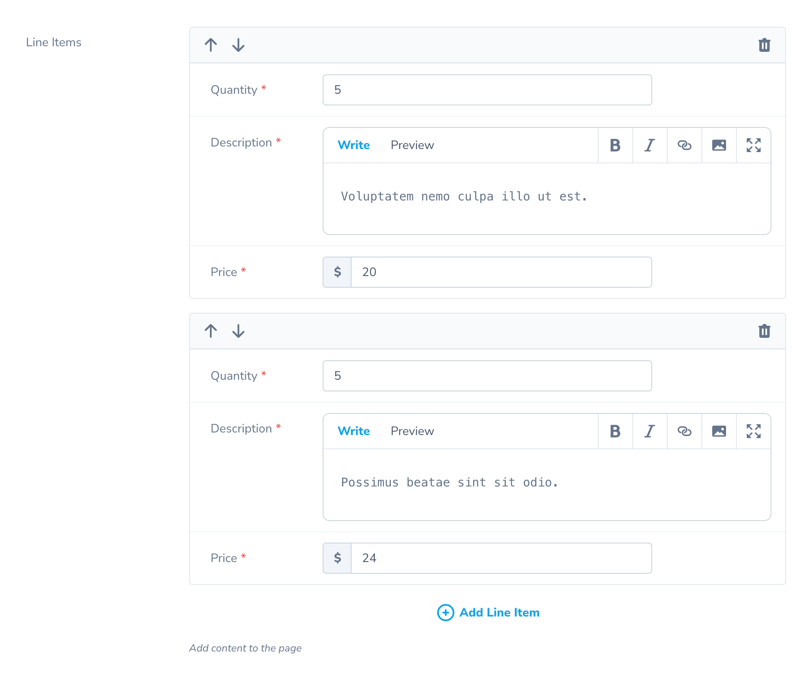

# Repeater Field 

[[toc]]

::: warning Beta
This field is currently in beta. The API, while stable, is subject to change while in the beta period.
:::

## Overview

The `Repeater` field allows you to create and edit repeatable structured data and store it in a JSON column or HasMany relationships: 

```php
<?php

namespace App\Nova;

use Laravel\Nova\Fields\ID;
use Laravel\Nova\Fields\Repeater;
use Laravel\Nova\Http\Requests\NovaRequest;
 
class Invoice extends Resource
{
	/**  
	 * Get the fields displayed by the resource. 
	 * 
	 * @param  \Laravel\Nova\Http\Requests\NovaRequest  $request  
	 * @return array  
	 */
	public function fields(NovaRequest $request)
	{
		return [
			ID::make(),
			Repeater::make('Line Items')
				->repeatables([
					\App\Nova\Repeater\LineItem::make(),
				]),
		];
	}
}
```
When using a `Repeater` inside Nova, you will be presented with an elegant interface for adding and editing repeatable items in the field:



## Repeatables

A `Repeatable` represents the repeatable data for a `Repeater` field. It defines the set of fields used for the repeatable item. It also optionally defines an Eloquent `Model` class when using the `HasMany` and `HasManyMorphable` presets. 

The `Repeater` field is not limited to a single type of repeatable. It also supports multiple "repeatable" types, which contain their own unique field sets and models. These repeatables could be used to create interfaces for editing flexible content areas, similar to those offered by content management systems and other similar uses.

### Generating Repeatables

To generate a new `Repeatable`, call the `nova:repeatable` Artisan command from the CLI:

```sh
php artisan nova:repeatable LineItem
```

Nova will generate a new file inside your application at `app/Nova/Repeater/LineItem.php`. This file has a `fields` method which can take any supported Nova field.

 For example, here is a `Repeatable` representing a line item for an invoice:

```php
<?php

namespace App\Nova\Repeater;

use Laravel\Nova\Http\Requests\NovaRequest;
use Laravel\Nova\Fields\Repeater\Repeatable;

class LineItem extends Repeatable
{
	public function fields(NovaRequest $request)
	{
		return [
			Number::make('Quantity')->rules('required', 'number'),
			Textarea::make('Description')->rules('required', 'max:255'),
			Currency::make('Price')->rules('required', 'number'),
		];
	}
}
```

### Confirming Removal of Repeatables

You may also instruct Nova to present a confirmation modal before removing a repeatable by using the `confirmRemoval` method:

```php
Repeater::make('Attachments')->repeatables([
	\App\Nova\Repeater\File::make()->confirmRemoval(),
	\App\Nova\Repeater\Note::make(),
	\App\Nova\Repeater\Video::make()->confirmRemoval(),
]),
```

## Repeater Fields

While a `Repeatable` can use many of the same fields as your normal Nova resources and actions, they do not behave the same way. For instance, methods like `creationRules`, and `updateRules` do not work because the validation rules are the same for both creation and edit modes. Also, fields inside a `Repeatable` do not support dependent field (`dependsOn`) functionality.

### Supported Fields for Repeatables
The `Repeater` field allows for every field supported by Nova, except for the following:

- HasOne
- MorphOne
- HasMany
- MorphMany
- BelongsTo
- MorphTo
- BelongsToMany
- MorphToMany

### Partially-supported Fields for Repeatables
The following fields are partially supported. We are looking into adding full support for these fields soon.

- File Field
- Vapor File Field
- Markdown Field
- Trix Field

The `Markdown`, and `Trix` fields support being used for text, but do not currently support attachments.


## Repeater Presets

The Repeater field comes with three presets out-of-the-box: `Json`, `HasMany`, and `HasManyMorphable`. Each preset defines specific functionality for saving and retrieving repeatables from storage.

For example, your `Invoice` Nova resource could use a `Repeater` field to edit the line items for an invoice. Using the `Laravel\Nova\Fields\Repeater\JSON` preset, those line items could be stored in a `line_items` JSON column. Alternatively, using the `HasMany` preset, the line items could be stored in a separate 'line_items' database table, with fields corresponding to each database column. 

In addition to the `JSON` and `HasMany` presets, the `Repeater` field also supports an additional preset, `HasManyMorphable`, which allows for storing repeatables in a `HasMany` relationship, while allowing for the related models to be polymorphic.

### JSON Preset

The `JSON` preset stores repeatables in a `JSON` column in your database. For example, the line items for and invoice could be store in a `line_items` column. When a resource with a `Repeater` field using the `JSON` preset is saved, the repeatables are serialized and saved to the column. 

To use the `JSON` preset, simply call the `asJson` method on your `Repeater` instance:

```php
Repeater::make('Line Items', 'line_items')
	->repeatables([
		\App\Nova\Repeater\LineItem::make(),
	])
	->asJson()
```

Before using this preset, you should ensure that the underlying Eloquent attribute for the resource's repeater column is configured to cast to an `array` (or equivalent) within your Eloquent model class:

```php
protected $casts = [
    'line_items' => 'array'
];
```

### HasMany Preset

The `HasMany` preset stores repeatables using Eloquent's `HasMany` relationships. For example, instead of storing the line items for an invoice in JSON format, you could opt to save them in a separate `line_items` database table, complete with dedicated columns mapping to each field in the repeatable. The `Repeater` field will manage these relations when editing your resources.

To use the `HasMany` preset, simply call the `asHasMany` method on your `Repeater` instance:

```php
Repeater::make('Line Items', 'lineItems')
	->repeatables([
		\App\Nova\Repeater\LineItem::make(),
	])
	->asHasMany()
```

Note that the `HasMany` preset requires each repeatable to specify the underlying model it represents by setting the `model` property on the `Repeatable`. For example, a `LineItem` repeatable would need to specify the underlying `\App\Models\LineItem` model it represents:

```php
class LineItem extends Repeatable
{
	/**  
	 * The underlying model the repeatable represents. 
	 * 
	 * @var class-string
	 */
	public static $model = \App\Models\LineItem::class;
}
```

### HasManyMorphable Preset

The `HasManyMorphable` preset saves data using Eloquent `HasMany` relationships, but each repeatable item can be of multiple object types. To use the `HasManyMorphable` preset, call the `asHasManyMorphable` method on the `Repeater` instance:

```php
Repeater::make('Attachments')
	->repeatables([
		\App\Nova\Repeater\Link::make(),
		\App\Nova\Repeater\File::make(),
		\App\Nova\Repeater\Note::make(),
	])
	->asHasManyMorphable('attachable', 'attachment')
```

Notice how the `HasManyMorphable` preset requires two parameters. The first parameter is the method name used when defining the `MorphTo` relationship of your related parent model, and the second is the method name used when defining the reverse 'MorphOne' relationship. These correspond to the relationship method names used inside your application's models:

```php
// \App\Models\Attachment.php
public function attachable()
{
	return $this->morphTo();
}

// \App\Models\Link.php
public function attachment()
{
	return $this->morphOne(Attachment::class, 'attachable');
}
```

## Upserting Repeatables Using Unique Fields

By default, when editing your repeatables configured with the `HasMany` and `HasManyMorphable` presets, Nova will delete all of the related items and recreate them every time you save your resource. To instruct Nova to upsert the repeatable instead, ensure you have a unique column on your related models. Typically this would be an autoincrementing column or a column containing some other unique identifier. You may then use the `uniqueField` method to specify which column contains the unique key for the database table:

```php
/**  
 * Get the fields displayed by the resource. 
 * 
 * @param  \Laravel\Nova\Http\Requests\NovaRequest  $request  
 * @return array  
 */
public function fields(NovaRequest $request)
{
	return [
		ID::make(),
		
		Repeater::make('Line Items')
			->asHasMany()
			->uniqueField('uuid')
			->repeatables([
				\App\Nova\Repeater\LineItem::make()
			])
	];
}
```

In addition, the `fields` method for the `Repeatable` must contain a field matching the `uniqueField`. In this example, the `LineItem` block might look like this:

```php
use Laravel\Nova\Fields\ID;

/**  
 * Get the fields displayed by the repeatable. 
 * 
 * @param  \Laravel\Nova\Http\Requests\NovaRequest  $request  
 * @return array  
 */
public function fields()
{
	return [
		ID::hidden('uuid'), // The unique ID field
		// Other fields...
	];
}
```

Note the use of the `ID::hidden` method, which prevents Nova from showing the `ID` field to the user but still passes its value to Nova when saving and updating.