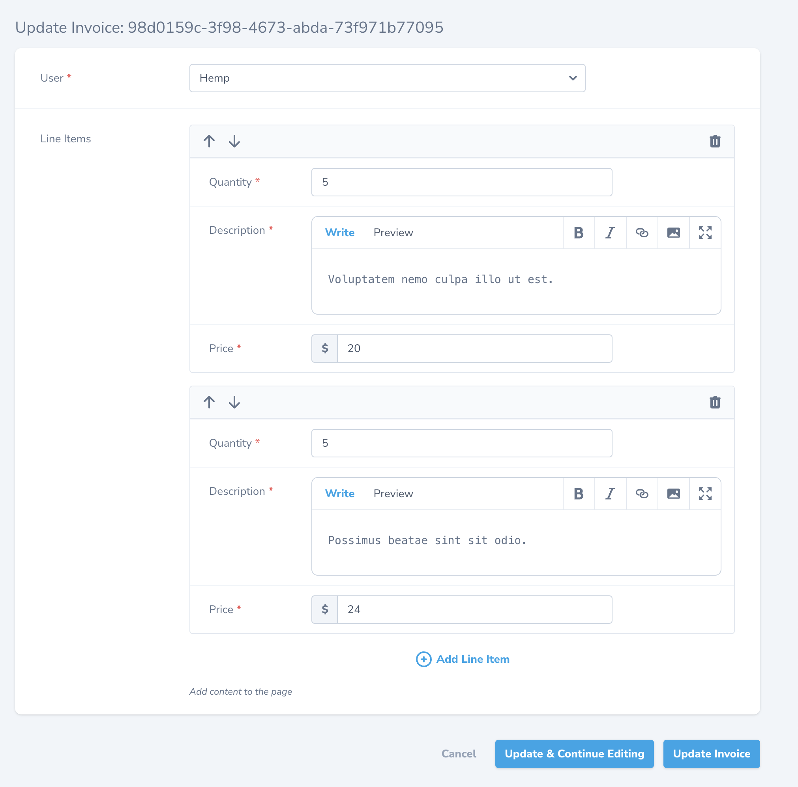
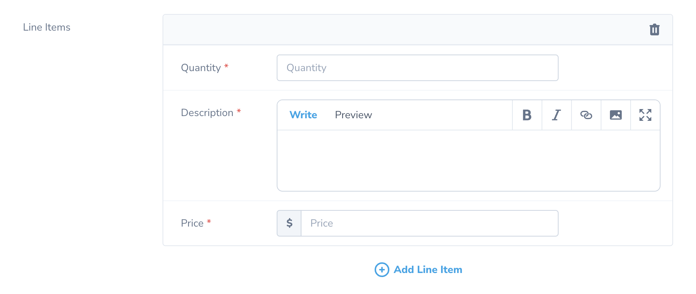

# Repeater Field

## Overview

The `Repeater` field allows you to create, store and edit repeatable data in JSON format, and HasMany or HasManyMorphable relationships.

For example, you may use a `Repeater` field to edit the line items for an invoice. Using the `Laravel\Nova\Fields\Repeater\Json` preset, those line items could be stored in a `line_items` JSON column. Using the `HasMany` preset, the line items could be stored in a separate 'line_items' database table, with fields corresponding to each database column.

To illustrate the behavior of the Repeater field, let's assume our Nova application has an `Invoice` resource. Each Invoice has many Line Items, with `quantity`, `description`, and `price` fields.

## Defining the Repeater Field

Next, let's attach the Repeater field to our `Invoice` resource. By default, Nova will use the `Laravel\Nova\Fields\Repeater\JSON` to store data in a JSON database column. You may also explicitly use the `JSON`preset by calling the `preset` method on the `Repeater` instance:

```php
<?

class Invoice extends Resource
{
	/**  
	 * Get the fields displayed by the resource. 
	 * 
	 * @param  \Laravel\Nova\Http\Requests\NovaRequest  $request  
	 * @return array  
	 */
	public function fields(NovaRequest $request)
	{
		return [
			ID::make(),
			
			Repeater::make('Line Items')
				->preset(new \Laravel\Nova\Fields\Repeater\JSON),
		];
	}
}
```

Next, we need to create a `Block` to represent the line items for our invoice.  To generate a new `Block`, call the `nova:block` Artisan command from the CLI:

```sh
php artisan nova:block LineItem
```

Nova will generate a new file (`app/Nova/Blocks/LineItem.php`). In this file we can define the `quantity`, `description`, and `price` fields:

```php
<?

namespace App\Nova\Blocks;

use Laravel\Nova\Fields\Currency;
use Laravel\Nova\Fields\Number;
use Laravel\Nova\Fields\Textarea;
use Laravel\Nova\Fields\Repeater\Block;
use Laravel\Nova\Http\Requests\NovaRequest;

class LineItem extends Block
{
	/**  
	 * Get the fields displayed by the block. 
	 * 
	 * @param  \Laravel\Nova\Http\Requests\NovaRequest  $request  
	 * @return array  
	 */
	public function fields(NovaRequest $request)
	{
		return [
			Number::make('Quantity')->rules('required', 'numeric'),
			Textarea::make('Description')->rules('required', 'string'),
			Currency::make('Price')->rules('required', 'numeric'),
		];
	}
}
```

## Confirming Removal of Items

You may also instruct each block to confirm with the user before removing a block by using the `confirmRemoval` method on the `Block`:

```php
Repeater::make('Attachments')->blocks([
	\App\Nova\Blocks\File::make()->confirmRemoval(),
	\App\Nova\Blocks\Note::make(),
	\App\Nova\Blocks\Video::make()->confirmRemoval(),
]),
```

## Using the Repeater Field

When creating Invoices inside Nova, you will be presented a with an interface for adding and editing items in the field:



## Repeater Presets

The Repeater field supports 3 presets out-of-the-box: `Json`, `HasMany`, and `HasManyMorphable`. Each preset defines specific functionality for saving and retrieving repeater items from storage.

### JSON Preset

The `JSON` preset saves data in a `json` column. To use the `JSON` preset, create a new preset instance and pass it to the `preset` method on the Repeater:

```php
Repeater::make('Line Items')
	->preset(new \Laravel\Nova\Fields\Repeater\Presets\JSON)
```

Nova saves repeater data in the corresponding `json` column in the following format:

```php
[
	[
		'type' => 'line-item',
		'fields' => [
			 'quantity' => 69,
			 'description' => 'Goods and services',
			 'price' => 420,
		]
	],
	[
		'type' => 'line-item',
		'fields' => [
			 'quantity' => 13,
			 'description' => 'Admin fees',
			 'price' => 101,
		]
	],
]
```

Before using this preset, you should ensure that the underlying Eloquent attribute is configured to cast to an `array` (or equivalent) within your Eloquent model class:

```php
protected $casts = [
    'line_items' => 'array'
];
```

### HasMany Preset

The `HasMany` preset saves data using Eloquent `HasMany` relationships. To use the `HasMany` preset, pass a new instance into the `preset` helper:

```php
Repeater::make('Line Items')
	->preset(new \Laravel\Nova\Fields\Repeater\Presets\HasMany)
```

Nova will use the data from the repeater to create and update the related models. This would be similar to using the update method on the related instance:

```php
$lineItem = LineItem::first();

$lineItem->update([
	 'quantity' => 69,
	 'description' => 'Goods and services',
	 'price' => 420,
]);
```

!!!warning 
The `HasMany` preset
!!!

### HasManyMorphable Preset

The `HasManyMorphable` preset saves data using Eloquent `HasMany` relationships, but each repeatable item can be of multiple types. To use the `HasManyMorphable` preset, pass a new instance into the `preset` helper:

```php
Repeater::make('Attachments')
	->preset(new \Laravel\Nova\Fields\Repeater\Presets\HasManyMorphable('attachable', 'attachment'))
```

Notice how the `HasManyMorphable` preset takes two parameters in its constructor...`attachable` and `attachment`. The first parameter is the method name used when defining the `HasManyMorphable` relationship, and the second is the method name used when defining the reverse relation.

Similarly to the `HasMany` preset, Nova will update the related models with the data from the repeater. This would be similar to updating the related models yourself:

```php
use \App\Models\File;
use \App\Models\Note;

$project = Project::first();

$project->attachments->each(function ($attachment) {
	if ($attachment->attachable instance of File)
	{
		// Upload the file and save the path to the model.
		$path = $request->file->store('images', 's3');
		
		$attachment->attachable->update([
			'path' => $path,
		]);
	}

	if ($attachment->attachable instance of Note)
	{
		$attachment->attachable->update([
			'content' => $request->newContent,
		]);
	}

})

```

## Unique Fields

By default, when editing your Repeater items Nova will delete all of the related items and recreate them every time you save your resource. To instruct Nova to upsert the data instead, ensure you have a unique column on the related model. Typically this would be an autoincrementing column or a column containing some other unique identifier. You may then use the `uniqueField` method to specify which column contains the unique key for the database table:

```php
<?

class Invoice extends Resource
{
	/**  
	 * Get the fields displayed by the resource. 
	 * 
	 * @param  \Laravel\Nova\Http\Requests\NovaRequest  $request  
	 * @return array  
	 */
	public function fields(NovaRequest $request)
	{
		return [
			ID::make(),
			
			Repeater::make('Line Items')
				->preset(new \Laravel\Nova\Fields\Repeater\HasMany)
				->uniqueField('uuid')
				->blocks([
					\App\Nova\Blocks\LineItem::make()
				])
		];
	}
}
```

In addition, the `fields` method for the `Block` must contain a field matching the `uniqueField`. In this example, the `LineItem` block might look like this:

```php
<?

namespace App\Nova\Blocks;

use Laravel\Nova\Fields\ID;
use Laravel\Nova\Fields\Repeater\Block;

class LineItem extends Block
{
	public static $model;

	public function fields()
	{
		return [
			ID::hidden('uuid'), // The unique ID field
			// Other fields...
		];
	}
}
```


## Field Blocks

A `Block` defines a set of fields and/or an Eloquent `Model` class used for specifying the schema of a particular repeater item. For example, here is a Block representing a line item for an invoice:

```php
<?

namespace App\Nova\Blocks;

use Laravel\Nova\Fields\Repeater\Block;

class LineItem extends Block
{
	public static $model;

	public function fields()
	{
		return [
			Number::make('Quantity'),
			Textarea::make('Description'),
			Currency::make('Price'),
		];
	}
}
```

When creating Repeater items, you will be presented with a form similar to the one presented when creating Nova resources:



### Limitations of Fields Inside Blocks

While a `Block`  can use many of the same fields as your normal Nova resources and actions, they do not behave the same way. For instance, methods like `creationRules`, and `updateRules` do not work because the validation rules are the same for both creation and edit modes. Also, Block fields also do not support `dependsOn` (dependent field) functionality.

#### Unsupported Field Types

The following field types are not currently supported for use within Blocks:

- Markdown Field
- File Field
- Vapor File Field

### Using 

To use the `HasMany` and `HasManyMorphable` preset with your blocks, you must set the static `$model` property to match the underlying Eloquent model it represents:

```php
<?

namespace App\Nova\Blocks;

use Laravel\Nova\Fields\Repeater\Block;

class LineItem extends Block
{
	/**  
	 * The model the block corresponds to. 
	 * 
	 * @var class-string<\App\Models\Project>  
	 */
	public static $model = \App\Models\LineItem::class;

	/**  
	 * Get the fields displayed by the block. 
	 * 
	 * @param  \Laravel\Nova\Http\Requests\NovaRequest  $request  
	 * @return array  
	 */
	public function fields(NovaRequest $request)
	{
		return [
			// Fields
		];
	}
}

```

## Custom Repeater Presets

If the built-in presets don't work for you needs, you can build your own to match the requirements of your application.

Repeater presets implement the `Laravel\Nova\Fields\Repeater\RepeaterPreset` interface, which defines both a `get` and a `set` method. The `get` method tells the repeater how to resolve a value from the database and the `set` method tells the repeater how to save the value to the database.

For example, the `JSONPreset` returns raw data from a single JSON column and formats it for use with the `Repeater`. The `HasManyPreset` returns Eloquent models from a `HasMany` relation and maps them into the format the `Repeater` field expects.

### Generating Custom Repeater Presets

To generate a custom repeater preset, call the `nova:repeater` Artisan command from the CLI:

```
php artisan nova:repeater-preset YAMLPreset
```

This will generate a file (`app/Nova/Repeater/YAMLPreset`) implementing the `Laravel\Nova\Fields\Repeater\Presets\Preset` interface:

```php
namespace App\Nova\Repeater;  
  
use Illuminate\Database\Eloquent\Model;  
use Laravel\Nova\Fields\Repeater\BlockCollection;  
use Laravel\Nova\Fields\Repeater\Presets\Preset;
use Laravel\Nova\Http\Requests\NovaRequest;  
  
class YAMLPreset implements Preset  
{
	/**  
	 * Save the field value to permanent storage. *
	 * @param  \Laravel\Nova\Http\Requests\NovaRequest  $request  
	 * @param  \Illuminate\Database\Eloquent\Model  $model  
	 * @param  string  $attribute  
	 * @param  \Laravel\Nova\Fields\Repeater\BlockCollection  $blocks  
	 * @param  string|null  $uniqueField  
	 * @return \Closure|void  
	 */
	 public function set(NovaRequest $request, Model $model, string $attribute,   BlockCollection $blocks, mixed $uniqueField) 
	 {  
	    return function () use ($uniqueField, $request, $model, $blocks, $attribute) {  
			// Save the value to YAML format.
	    };  
	}  
	  
	/**  
	 * Retrieve the value from storage and hydrate the field's value. 
	 * 
	 * @param  \Laravel\Nova\Http\Requests\NovaRequest  $request  
	 * @param  mixed  $model  
	 * @param  string  $attribute  
	 * @param  \Laravel\Nova\Fields\Repeater\BlockCollection  $blocks  
	 * @return \Illuminate\Support\Collection  
	 */
	 public function get(NovaRequest $request, $model, string $attribute, BlockCollection $blocks)  
	{  
		// Retrieve the value from YAML format.
	}
}
```

From here, you may implement your repeater preset in whatever way makes sense for your application.

### Returning the format used by the Repeater

To properly display the repeater items inside of Nova, you must return a `Laravel\Nova\Fields\Repeater\BlockCollection` instance containing `Laravel\Nova\Fields\Repeater\Block` instances, with the field's values resolved. For example, take let's take a look at the `get` method found inside `Laravel\Nova\Fields\Repeater\JSON`:

```php
/**  
 * Retrieve the value from storage and hydrate the field's value. 
 * 
 * @param  \Laravel\Nova\Http\Requests\NovaRequest  $request  
 * @param  \Illuminate\Database\Eloquent\Model  $model  
 * @param  string  $attribute  
 * @param  \Laravel\Nova\Fields\Repeater\BlockCollection  $blocks  
 * @return \Illuminate\Support\Collection  
 */
 public function get(NovaRequest $request, Model $model, string $attribute, BlockCollection $blocks)  
{  
    return BlockCollection::make($model->{$attribute})  
        ->map(function ($block) use ($blocks) {  
			return $blocks->newClassByKey($block['type'], $block['fields']);
        });  
}
```

When resolving the values from the database, the preset creates a new `BlockCollection` instance, mapping through each value


