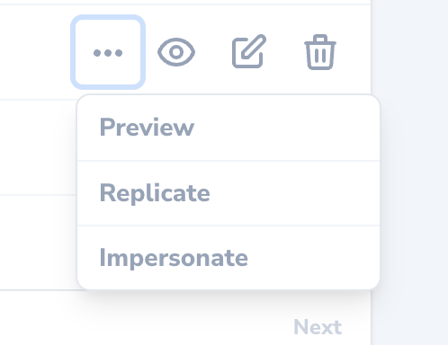
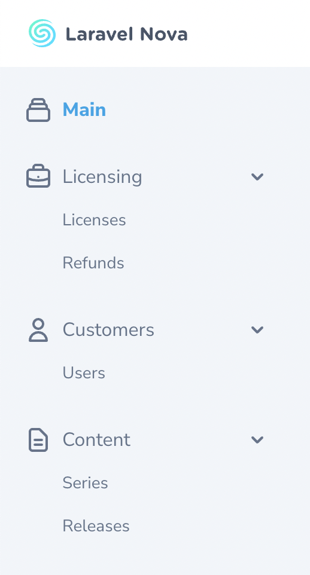
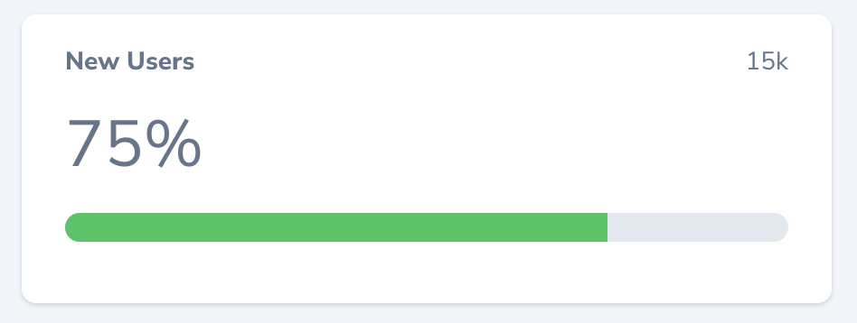
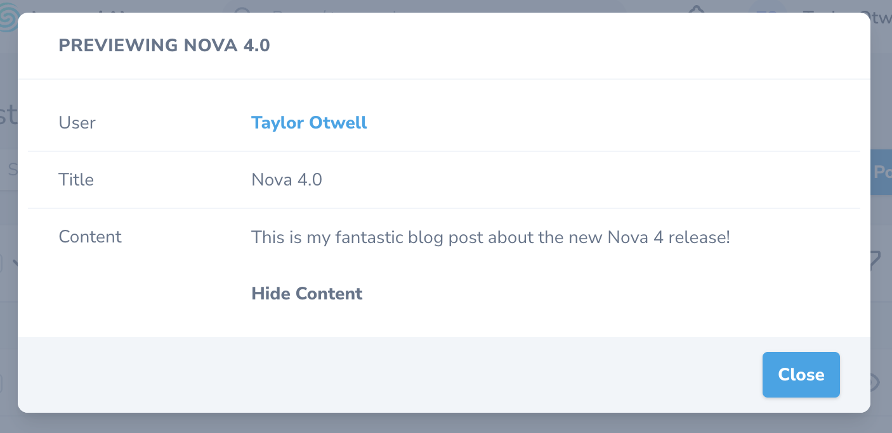

Nova 4 continues the improvements made in Nova 3.x by introducing a thoroughly updated responsive design built on Tailwind 2, Vue 3, and Inertia.js. **Don't worry - it supports dark mode**.

In addition, Nova 4 introduces support for collapsable relations, painless branding, notifications, action callbacks, new fields, dependent fields, filterable fields, custom menus, new metrics, batchable actions, search improvements, and much more.

### Responsive Design

Nova 4 introduces a thoroughly refreshed user interface that is now fully responsive, so you can manage your data on the go:

<Frame>

</Frame>

And, by popular demand, the Nova interface now supports "dark mode":

<Frame>

</Frame>

### Painless Branding

A new `brand` configuration option has been added to the `nova` configuration file, allowing you to easily customize the "primary color" and logo used within the Nova interface without the need to create a custom Nova "theme":

<Frame>

</Frame>

To learn more, check out [branding documentation](./installation#branding).

### Collapsable Relations

Nova 4 allows you to collapse relations for a given resource type so that they are no longer loaded by default when viewing the relation. Nova will store your collapsed relations in your browser's local storage so that Nova can remember your preferences. **We think you will find that collapsable relationships lead to drastic performance improvements when viewing resource types that have dozens of relationships**:

<Frame>

</Frame>

### Action Callbacks

The new `Action::then` method allows you to easily execute code after an action has finished executing against all of its selected resources. This feature allows you to easily generate reports or send notifications when an action has finished executing:

```php
/**
 * Get the actions available for the resource.
 *
 * @param  \Laravel\Nova\Http\Requests\NovaRequest  $request
 * @return array
 */
public function actions(NovaRequest $request)
{
    return [
        (new Actions\EmailAccountProfile)->then(function ($models) {
            $models->each(function ($model) {
                //
            });
        }),
    ];
}
```

### Batchable Actions

Actions may now take advantage of Laravel's [job batching](https://laravel.com/docs/queues#job-batching) functionality, offering the ability to register batch callbacks that perform additional tasks once the entire batch of actions has finished executing:

```php
use Illuminate\Bus\Batch;
use Throwable;

/**
 * Prepare the given batch for execution.
 *
 * @param  \Laravel\Nova\Fields\ActionFields  $fields
 * @param  \Illuminate\Bus\PendingBatch  $batch
 * @return void
 */
public function withBatch(ActionFields $fields, PendingBatch $batch)
{
    $batch->then(function (Batch $batch) {
        // All jobs completed successfully...

        $selectedModels = $batch->resourceIds;
    })->catch(function (Batch $batch, Throwable $e) {
        // First batch job failure detected...
    })->finally(function (Batch $batch) {
        // The batch has finished executing...
    });
}
```

To learn more about making actions batchable, please consult the [action batching documentation](./actions/defining-actions#job-batching).

### New Fields

Nova 4 introduces several new field types, including `Color`, `UiAvatar`, `MultiSelect`, and `URL`. For more information on using these fields, please consult the [field documentation](./resources/fields).

<Frame>

</Frame>

### Dependent Fields

Nova 4 also introduces support for "dependent" fields. The new `dependsOn` method allows you to specify that a field's configuration depends on one or more other field's values. The `dependsOn` method accepts an `array` of dependent field attributes and a closure that modifies the configuration of the current field instance.

Dependent fields allow advanced customization, such as toggling read-only mode, validation rules, and more based on the state of another field:

```php
use Laravel\Nova\Fields\FormData;
use Laravel\Nova\Fields\Select;
use Laravel\Nova\Fields\Text;
use Laravel\Nova\Http\Requests\NovaRequest;

Select::make('Purchase Type', 'type')
    ->options([
        'personal' => 'Personal',
        'gift' => 'Gift',
    ]),

// Recipient field configuration is customized based on purchase type...
Text::make('Recipient')
    ->readonly()
    ->dependsOn(
        ['type'],
        function (Text $field, NovaRequest $request, FormData $formData) {
            if ($formData->type === 'gift') {
                $field->readonly(false)->rules(['required', 'email']);
            }
        }
    ),
```

To learn more, please consult the [Dependent Fields documentation](./resources/fields#dependent-fields).

### Filterable Fields

Nova 4 introduces a new `filterable` method that allows you to enable convenient, automatic [filtering](./filters/defining-filters) functionality for a given field on resources, relationships, and lenses without creating a custom filter. The Nova generated filter will automatically be made available via the resource filter menu on the resource's index:

```php
DateTime::make('Created At')->filterable(),
```

<Frame>

</Frame>

To learn more, please consult the [Filterable Fields documentation](./resources/fields#filterable-fields).

### Notifications

Nova 4 also introduces support for "Nova notifications", a brand new notification menu within Nova that you may use to display information for your Nova users. For example, you could use this menu to notify users that a report has been generated or that an invoice needs attention:

<Frame>

</Frame>

To send a Nova notification, you simply need to pass a `NovaNotification` instance to a notifiable user:

```php
use Laravel\Nova\Notifications\NovaNotification;

$request->user()->notify(
    NovaNotification::make()
        ->message('Your report is ready to download.')
        ->action('Download', 'https://example.com/report.pdf')
        ->icon('download')
        ->type('info')
);
```

To learn more about Nova notifications, please consult the comprehensive [notification documentation](./customization/notifications).

### Impersonation

After deploying your application to production, you may occasionally need to "impersonate" another user of your application in order to debug problems your customers are reporting. Thankfully, Nova now includes built-in functionality to handle this exact scenario.

To enable user impersonation, add the `Laravel\Nova\Auth\Impersonatable` trait to your application's `User` model:

```php
class User extends Authenticatable
{
    use HasApiTokens, HasFactory, Impersonatable, Notifiable;

    // ...
}
```

Once the `Impersonatable` trait has been added to your application's `User` model, an "Impersonate" action will be available via the inline action menu for the corresponding resource:

<Frame>

</Frame>

### Custom Menus

In addition, Nova now supports totally custom side-bar and user menus. In fact, you can fully customize every link entry in Nova's left-side navigation bar, including the creation of menu sections, menu groups, and more:

<Frame>

</Frame>

To learn more about building your own custom menus, please consult the [custom menu documentation](./customization/menus).

### Progress Metric

The new "progress" metric allows you to track your progress towards a given goal. For example, you may wish to track your new user registrations for the month against a target goal. It's a cinch with the new progress metric:

<Frame>

</Frame>

To learn more about building and defining metrics, please consult the [metric documentation](./metrics/defining-metrics).

### Resource Replication

Sometimes, you may want to create a new resource while using all of the data from an existing resource as a starting point. Nova's new resource replication feature does just that. After clicking the replicate button, you'll be whisked away to a resource creation form with all of the replicated resource's data hydrated into the form and ready for tweaking:

<Frame>

</Frame>

### Resource Preview Modal

The brand new resource preview modal gives you a sneak peek at the resource's data without leaving the resource index page, providing a great way to learn more about a resource without interrupting your flow:

<Frame>

</Frame>

To learn more about adding fields to the resource preview modal, check out the [field documentation](./resources/fields#resource-preview-modal).

### HasOne::ofMany Support

The `HasOne` relationship field can now be transformed into an "has one of many" Eloquent relationship using the `ofMany` method. For example, let's assume a `User` model `hasMany` `Post` models. We may add the "has one of many" relationship to our `User` Nova resource like so:

```php
use App\Nova\Post;
use Laravel\Nova\Fields\HasOne;

HasOne::ofMany('Latest Post', 'latestPost', Post::class),
```

Of course, "morph one of many" relationships are also supported:

```php
use App\Nova\Comment;
use Laravel\Nova\Fields\MorphOne;

MorphOne::ofMany('Latest Comment', 'latestComment', Comment::class),
```

### Inline HasOne Creation

Resources that have `HasOne` relationships may now create the data for those relationships directly in the parent resource's creation form. This new ability makes it a breeze to create the parent resource and its child in one, convenient operation:

<Frame>

</Frame>

### Search Improvements

Typically, Nova searches your database columns using simple `LIKE` clauses. However, if you are using MySQL or Postgres, you may now take advantage of any full-text indexes you have defined:

```php
use Laravel\Nova\Query\Search\SearchableText;

/**
 * Get the searchable columns for the resource.
 *
 * @return array
 */
public static function searchableColumns()
{
    return ['id', new SearchableText('title')];
}
```

In addition, Nova 4 even allows you to search within a resource's relationships and JSON columns:

```php
use Laravel\Nova\Query\Search\SearchableJson;
use Laravel\Nova\Query\Search\SearchableRelation;

public static function searchableColumns()
{
    return [
        'id',
        new SearchableRelation('author', 'name')
        new SearchableJson('meta->tag')
    ];
}
```

To learn more about Nova's search features, please consult the [comprehensive search documentation](./search/the-basics).
