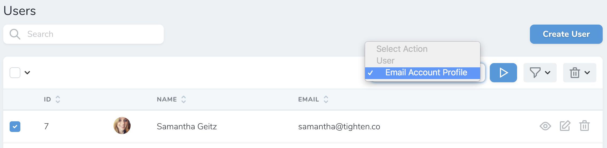
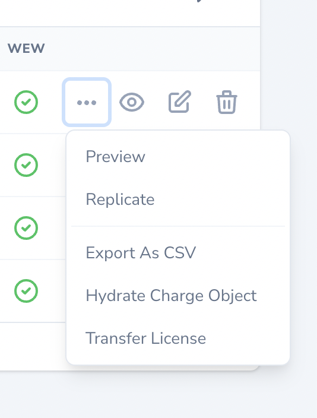
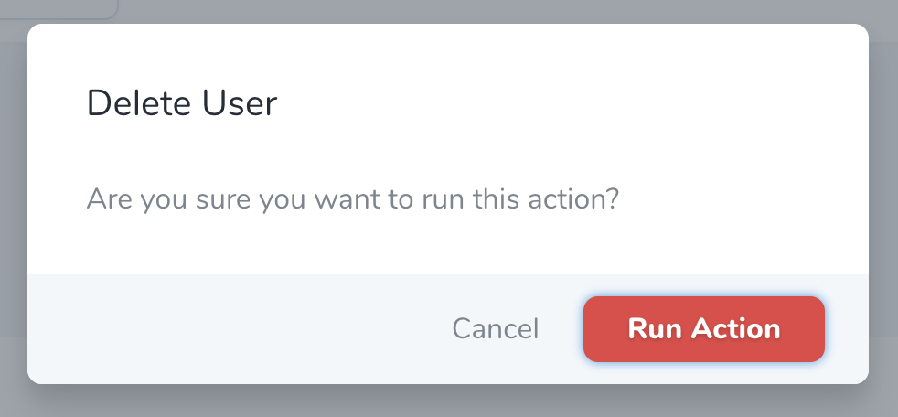
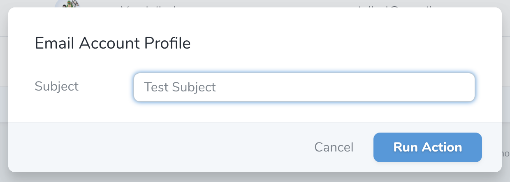
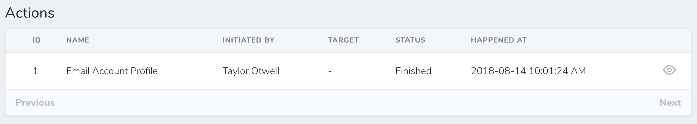

# Defining Actions

[[toc]]

Nova actions allow you to perform custom tasks on one or more Eloquent models. For example, you might write an action that sends an email to a user containing account data they have requested. Or, you might write an action to transfer a group of records to another user.

Once an action has been attached to a resource definition, you may initiate it from the resource's index or detail pages:



If an action is enabled for display on the resource's table row, you may also initiate the action from the resource's action dropdown menu via the resource index page. These actions are referred to as "Inline Actions":



## Overview

Nova actions may be generated using the `nova:action` Artisan command. By default, all actions are placed in the `app/Nova/Actions` directory:

```bash
php artisan nova:action EmailAccountProfile
```

You may generate a [destructive action](#destructive-actions) by passing the `--destructive` option:

```bash
php artisan nova:action DeleteUserData --destructive
```

To learn how to define Nova actions, let's look at an example. In this example, we'll define an action that sends an email message to a user or group of users:

```php
namespace App\Nova\Actions;

use App\Models\AccountData;
use Illuminate\Bus\Queueable;
use Illuminate\Contracts\Queue\ShouldQueue;
use Illuminate\Queue\InteractsWithQueue;
use Illuminate\Support\Collection;
use Laravel\Nova\Actions\Action;
use Laravel\Nova\Http\Requests\NovaRequest;
use Laravel\Nova\Fields\ActionFields;

class EmailAccountProfile extends Action # [!code focus:29]
{
    use InteractsWithQueue, Queueable;

    /**
     * Perform the action on the given models.
     *
     * @return mixed
     */
    public function handle(ActionFields $fields, Collection $models)
    {
        foreach ($models as $model) { # [!code ++:3]
            (new AccountData($model))->send();
        }
    }

    /**
     * Get the fields available on the action.
     *
     * @return array<int, \Laravel\Nova\Fields\Field>
     */
    public function fields(NovaRequest $request): array
    {
        return [];
    }
}
```

The most important method of an action is the `handle` method. The `handle` method receives the values for any fields attached to the action, as well as a collection of selected models. The `handle` method **always** receives a `Collection` of models, even if the action is only being performed against a single model.

Within the `handle` method, you may perform whatever tasks are necessary to complete the action. You are free to update database records, send emails, call other services, etc. The sky is the limit!

#### Action Titles

Typically, Nova utilizes the action's class name to determine the displayable name of the action that should be shown in the action selection menu. If you would like to change the displayable name of the action, you may define a `name` property on the action class:

```php
namespace App\Nova\Actions;

use Laravel\Nova\Actions\Action;

class EmailAccountProfile extends Action
{
    /**
     * The displayable name of the action.
     *
     * @var string
     */
    public $name = 'Send Account Profile via E-mail'; # [!code ++] # [!code focus]
}
```

### Destructive Actions

You may designate an action as destructive or dangerous by defining an action class that extends `Laravel\Nova\Actions\DestructiveAction`. This will change the color of the action's confirm button to red:



::: warning Destructive Actions & Policies

When a destructive action is added to a resource that has an associated authorization policy, the policy's `delete` method must return `true` in order for the action to run.
:::

### Action Callbacks

:::warning Queued Action Callbacks

The `Action::then` method should not be utilized if your action is queued. To achieve similar functionality when using queued actions, you should leverage Nova's [action batching callbacks](#job-batching).
:::

When running an action against multiple resources, you may wish to execute some code after the action has completed executing against all of the resources. For example, you may wish to generate a report detailing all of the changes for the selected resources. To accomplish this, you may invoke the `then` method when [registering your action](./registering-actions.md).

The `then` methods accepts a closure which will be invoked when the action has finished executing against all of the selected resources. The closure will receive a flattened Laravel [collection](https://laravel.com/docs/collections) containing the values that were returned by the action.

For example, note that the following action's `handle` method returns the `$models` it receives:

```php
use App\Models\AccountData;
use Illuminate\Support\Collection;
use Laravel\Nova\Fields\ActionFields;

/**
 * Perform the action on the given models.
 *
 * @return mixed
 */
public function handle(ActionFields $fields, Collection $models) # [!code focus:8]
{
    foreach ($models as $model) { # [!code ++:3]
        (new AccountData($model))->send();
    }

    return $models; # [!code ++]
}
```

When registering this action on a resource, we may use the `then` callback to access the returned models and interact with them after the action has finished executing:

```php
use App\Nova\Actions\EmailAccountProfile;
use Laravel\Nova\Http\Requests\NovaRequest;

/**
 * Get the actions available for the resource.
 *
 * @param  \Laravel\Nova\Http\Requests\NovaRequest  $request
 * @return array<int, \Laravel\Nova\Actions\Action>
 */
public function actions(NovaRequest $request): array 
{
    return [
        EmailAccountProfile::make() # [!code focus:6]
            ->then(function ($models) { # [!code ++:5]
                $models->each(function ($model) {
                    //
                });
            }),
    ];
}
```

## Action Fields

Sometimes you may wish to gather additional information from the user before dispatching an action. For this reason, Nova allows you to attach most of Nova's supported [fields](./../resources/fields.md) directly to an action. When the action is initiated, Nova will prompt the user to provide input for the fields:



To add a field to an action, add the field to the array of fields returned by the action's `fields` method:

```php
use Laravel\Nova\Fields\Text; # [!code ++]
use Laravel\Nova\Http\Requests\NovaRequest;

/**
 * Get the fields available on the action.
 *
 * @return array<int, \Laravel\Nova\Fields\Field>
 */
public function fields(NovaRequest $request): array # [!code focus:6]
{
    return [
        Text::make('Subject'), # [!code ++]
    ];
}
```

Finally, within your action's `handle` method, you may access your fields using dynamic accessors on the provided `ActionFields` instance:

```php
use App\Models\AccountData;
use Illuminate\Support\Collection;
use Laravel\Nova\Fields\ActionFields;

/**
 * Perform the action on the given models.
 * 
 * @return mixed
 */
public function handle(ActionFields $fields, Collection $models)
{
    foreach ($models as $model) { # [!code focus:3]
        (new AccountData($model))->send($fields->subject); # [!code ++]
    }
}
```

#### Action Fields Default Values

You may use the `default` method to set the default value for an action field:

```php
use Laravel\Nova\Fields\Text;
use Laravel\Nova\Http\Requests\NovaRequest;

/**
 * Get the fields available on the action.
 *
 * @return array<int, \Laravel\Nova\Fields\Field>
 */
public function fields(NovaRequest $request): array
{
    return [
        Text::make('Subject') # [!code focus:2]
            ->default(fn ($request) => 'Test: Subject'), # [!code ++]
    ];
}
```

## Action Responses

Typically, when an action is executed, a generic "success" messages is displayed in the Nova UI. However, you are free to customize this response using a variety of methods available via the `ActionResponse` class. To display a custom "success" message, you may invoke the `ActionResponse::message` method from your `handle` method:

```php
use Illuminate\Support\Collection;
use Laravel\Nova\Actions\ActionResponse; # [!code ++]
use Laravel\Nova\Fields\ActionFields;

/**
 * Perform the action on the given models.
 *
 * @return mixed
 */
public function handle(ActionFields $fields, Collection $models) # [!code focus:6]
{
    // ...

    return ActionResponse::message('It worked!'); # [!code ++]
}
```

To return a red, "danger" message, you may invoke the `ActionResponse::danger` method:

```php
use Illuminate\Support\Collection;
use Laravel\Nova\Actions\ActionResponse; # [!code ++]
use Laravel\Nova\Fields\ActionFields;

/**
 * Perform the action on the given models.
 *
 * @return mixed
 */
public function handle(ActionFields $fields, Collection $models) # [!code focus:6]
{
    // ...

    return ActionResponse::danger('Something went wrong!'); # [!code ++]
}
```

### Redirect Responses

To redirect the user to an entirely new location after the action is executed, you may use the `ActionResponse::redirect` method:

```php
use Illuminate\Support\Collection;
use Laravel\Nova\Actions\ActionResponse; # [!code ++]
use Laravel\Nova\Fields\ActionFields;

/**
 * Perform the action on the given models.
 *
 * @return mixed
 */
public function handle(ActionFields $fields, Collection $models) # [!code focus:6]
{
    // ...

    return ActionResponse::redirect('https://example.com'); # [!code ++]
}
```

To redirect the user to another location within Nova, you may use the `ActionResponse::visit` method:

```php
use Illuminate\Support\Collection;
use Laravel\Nova\Actions\ActionResponse; # [!code ++]
use Laravel\Nova\Fields\ActionFields;

/**
 * Perform the action on the given models.
 *
 * @return mixed
 */
public function handle(ActionFields $fields, Collection $models) # [!code focus:10]
{
    // ...

    return ActionResponse::visit('/resources/posts/new', [ # [!code ++:5]
        'viaResource' => 'users',
        'viaResourceId' => 1,
        'viaRelationship' => 'posts'
    ]);
}
```

To redirect the user to a new location in a new browser tab, you may use the `ActionResponse::openInNewTab` method:

```php
use Illuminate\Support\Collection;
use Laravel\Nova\Actions\ActionResponse; # [!code ++]
use Laravel\Nova\Fields\ActionFields;

/**
 * Perform the action on the given models.
 *
 * @return mixed
 */
public function handle(ActionFields $fields, Collection $models) # [!code focus:6]
{
    // ...

    return ActionResponse::openInNewTab('https://example.com'); # [!code ++]
}
```

### Download Responses

To initiate a file download after the action is executed, you may use the `ActionResponse::download` method. The `download` method accepts the desired name of the file as its first argument, and the URL of the file to be downloaded as its second argument:

```php
use Illuminate\Support\Collection;
use Laravel\Nova\Actions\ActionResponse; # [!code ++]
use Laravel\Nova\Fields\ActionFields;

/**
 * Perform the action on the given models.
 *
 * @return mixed
 */
public function handle(ActionFields $fields, Collection $models) # [!code focus:9]
{
    // ...

    return ActionResponse::download( # [!code ++:3]
        'Invoice.pdf', 'https://example.com/invoice.pdf'
    ); 
}
```

### Custom Modal Responses

In addition to the customization options provided before and during an action's execution, Nova also supports the ability to present a custom modal response to the user. This allows you to provide additional context or follow-up actions to the user, customized to your use-case.

For example, let's imagine you have defined an action named `GenerateApiToken`, which creates unique tokens for use with a REST API. Using a custom action response modal, you could show the user running the action a modal allowing them to copy the newly-generated API token to their clipboard.

Using the `nova:asset` Artisan command, you may [generate a custom asset](./../customization/assets.md) and register the custom modal with Nova's Vue instance:

```js
import ApiTokenCopier from "./components/ApiTokenCopier";

Nova.booting(app => {
  app.component("api-token-copier", ApiTokenCopier);
});
```

Next, you may use the `modal` method within your action's `handle` method, which will instruct Nova to show the modal after running the action, passing the Vue component's name and any additional data you specify to the component. The data will be made available to the custom modal's Vue component as props:

```php
use Illuminate\Support\Collection;
use Laravel\Nova\Actions\ActionResponse; # [!code ++]
use Laravel\Nova\Fields\ActionFields;

/**
 * Perform the action on the given models.
 *
 * @return mixed
 */
public function handle(ActionFields $fields, Collection $models)
{
    if ($models->count() > 1) { # [!code focus:10]
        return Action::danger('Please run this on only one user resource.');
    }

    $models->first()->update(['api_token' => $token = Str::random(32)]);

    return Action::modal('api-token-copier', [ # [!code ++:4]
        'message' => 'The API token was generated!',
        'token' => $token,
    ]);
}
```

## Queued Actions

Occasionally, you may have actions that take a while to finish running. For this reason, Nova makes it a cinch to [queue](https://laravel.com/docs/queues) your actions. To instruct Nova to queue an action instead of running it synchronously, mark the action with the `ShouldQueue` interface:

```php
namespace App\Nova\Actions;

use Illuminate\Bus\Queueable;
use Illuminate\Contracts\Queue\ShouldQueue; # [!code ++]
use Illuminate\Queue\InteractsWithQueue;
use Laravel\Nova\Actions\Action;

class EmailAccountProfile extends Action # [!code --] # [!code focus:4]
class EmailAccountProfile extends Action implements ShouldQueue # [!code ++]
{
    use InteractsWithQueue, Queueable;

    // ...
}
```

You may quickly create a queued Nova action by providing the `--queued` option when executing the `nova:action` Artisan command:

```bash
php artisan nova:action EmailAccountProfile --queued
```

When using queued actions, don't forget to configure and start [queue workers](https://laravel.com/docs/queues) for your application. Otherwise, your actions won't be processed.

:::danger Queued Action Files

At this time, Nova does not support attaching `File` fields to a queued action. If you need to attach a `File` field to an action, the action must be run synchronously.
:::

### Customizing the Connection and Queue

You may customize the queue connection and queue name that the action is queued on by setting the `$connection` and `$queue` properties within the action's constructor:

```php
use Illuminate\Bus\Queueable;
use Illuminate\Contracts\Queue\ShouldQueue;
use Illuminate\Queue\InteractsWithQueue;
use Illuminate\Queue\InteractsWithQueue;
use Laravel\Nova\Actions\Action;

class EmailAccountProfile extends Action implements ShouldQueue
{
    use InteractsWithQueue, Queueable;

    /**
     * Create a new action instance.
     */
    public function __construct() # [!code focus:4]
    {
        $this->connection = 'redis'; # [!code ++:2]
        $this->queue = 'emails';
    }
}
```

### Job Batching

You may also instruct Nova to queue actions as a [batch](https://laravel.com/docs/queues#job-batching) by marking the action with the `Laravel\Nova\Contracts\BatchableAction` interface. In addition, the action should use the `Illuminate\Bus\Batchable` trait.

When an action is batchable, you should define a `withBatch` method that will be responsible for configuring the action's [batch callbacks](https://laravel.com/docs/queues#dispatching-batches). This allows you to define code that should run after an entire batch of actions finishes executing against multiple selected resources. In fact, you can even access the model IDs for all of the resources that were selected when the batched action was executed:

```php
namespace App\Nova\Actions;

use Illuminate\Bus\Batch; # [!code ++]
use Illuminate\Bus\Batchable; # [!code ++]
use Illuminate\Bus\PendingBatch; # [!code ++]
use Illuminate\Bus\Queueable;
use Illuminate\Contracts\Queue\ShouldQueue;
use Illuminate\Queue\InteractsWithQueue;
use Laravel\Nova\Actions\Action;
use Laravel\Nova\Contacts\BatchableAction; # [!code ++]
use Laravel\Nova\Fields\ActionFields;
use Throwable;

class EmailAccountProfile extends Action implements ShouldQueue # [!code --] # [!code focus:5]
class EmailAccountProfile extends Action implements BatchableAction, ShouldQueue # [!code ++]
{
    use InteractsWithQueue, Queueable; # [!code --]
    use Batchable, InteractsWithQueue, Queueable; # [!code ++]

    /**
     * Prepare the given batch for execution.
     *
     * @param  \Laravel\Nova\Fields\ActionFields  $fields
     * @param  \Illuminate\Bus\PendingBatch  $batch
     * @return void
     */
    public function withBatch(ActionFields $fields, PendingBatch $batch) # [!code ++:12] # [!code focus:12]
    {
        $batch->then(function (Batch $batch) {
            // All jobs completed successfully...

            $selectedModels = $batch->resourceIds;
        })->catch(function (Batch $batch, Throwable $e) {
            // First batch job failure detected...
        })->finally(function (Batch $batch) {
            // The batch has finished executing...
        });
    }
}
```

## Action Log

It is often useful to view a log of the actions that have been run against a particular resource. Additionally, when queueing actions, it's often important to know when the queued actions have actually finished executing. Thankfully, Nova makes it a breeze to add an action log to a resource by attaching the `Laravel\Nova\Actions\Actionable` trait to the resource's corresponding Eloquent model.

For example, we may attach the `Laravel\Nova\Actions\Actionable` trait to the `User` Eloquent model:

```php
namespace App\Models;

use Laravel\Nova\Actions\Actionable; # [!code ++]
use Illuminate\Notifications\Notifiable;
use Illuminate\Foundation\Auth\User as Authenticatable;

class User extends Authenticatable # [!code focus:5]
{
    use Notifiable; # [!code --]
    use Actionable, Notifiable; # [!code ++]

    // ...
}
```

Once the trait has been attached to the model, Nova will automatically begin displaying an action log at the bottom of the resource's detail page:



### Disabling the Action Log

If you do not want to record an action in the action log, you may disable this behavior by adding a `withoutActionEvents` property on your action class:

```php
namespace App\Nova\Actions;

use Laravel\Nova\Actions\Action;

class EmailAccountProfile extends Action
{
    /**
     * Disables action log events for this action.
     *
     * @var bool
     */
    public $withoutActionEvents = true; # [!code ++] # [!code focus]
}
```

Or, using the `withoutActionEvents` method, you may disable the action log for an action when the action is attached to a resource. Disabling the action log is often particularly helpful when an action is often executed against thousands of resources at once, since it allows you to avoid thousands of slow, sequential action log database inserts:

```php
use App\Nova\Actions\SomeAction;
use Laravel\Nova\Http\Requests\NovaRequest;

/**
 * Get the actions available for the resource.
 *
 * @return array<int, \Laravel\Nova\Actions\Action>
 */
public function actions(NovaRequest $request): array
{
    return [
        SomeAction::make() # [!code focus:2]
            ->withoutActionEvents(), # [!code ++]
    ];
}
```

### Queued Action Statuses

While a queued action is running, you may update the action's "status" for any of the models that were passed to the action via its model collection. For example, you may use the action's `markAsFinished` method to indicate that the action has completed processing a particular model:

```php
use Illuminate\Support\Collection;
use Laravel\Nova\Fields\ActionFields;

/**
 * Perform the action on the given models.
 *
 * @return mixed
 */
public function handle(ActionFields $fields, Collection $models)
{
    foreach ($models as $model) { # [!code focus:5]
        (new AccountData($model))->send($fields->subject);

        $this->markAsFinished($model); # [!code ++]
    }
}
```

Or, if you would like to indicate that an action has "failed" for a given model, you may use the `markAsFailed` method:

```php
use Illuminate\Support\Collection;
use Laravel\Nova\Fields\ActionFields;

/**
 * Perform the action on the given models.
 *
 * @return mixed
 */
public function handle(ActionFields $fields, Collection $models)
{
    foreach ($models as $model) { # [!code focus:7]
        try {
            (new AccountData($model))->send($fields->subject);
        } catch (Exception $e) {
            $this->markAsFailed($model, $e); # [!code ++]
        }
    }
}
```

## Action Modal Customization

By default, actions will ask the user for confirmation before running. You can customize the confirmation message, confirm button, and cancel button to give the user more context before running the action. This is done by calling the `confirmText`, `confirmButtonText`, and `cancelButtonText` methods when defining the action:

```php
use App\Nova\Actions\ActivateUser;
use Laravel\Nova\Http\Requests\NovaRequest;

/**
 * Get the actions available for the resource.
 *
 * @return array<int, \Laravel\Nova\Actions\Action>
 */
public function actions(NovaRequest $request): array
{
    return [
        ActivateUser::make() # [!code focus:4]
            ->confirmText('Are you sure you want to activate this user?') # [!code ++:3]
            ->confirmButtonText('Activate')
            ->cancelButtonText("Don't activate"),
    ];
}
```
