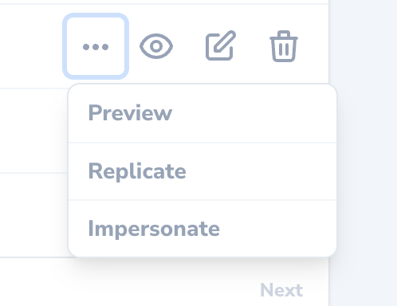

# Impersonation

[[toc]]

## Overview

After deploying your application to production, you may occasionally need to "impersonate" another user of your application in order to debug problems your customers are reporting. Thankfully, Nova includes built-in functionality to handle this exact scenario.

## Enabling Impersonation

To enable user impersonation, add the `Laravel\Nova\Auth\Impersonatable` trait to your application's `User` model:

```php
namespace App\Models;

use Illuminate\Contracts\Auth\MustVerifyEmail;
use Illuminate\Database\Eloquent\Factories\HasFactory;
use Illuminate\Foundation\Auth\User as Authenticatable;
use Illuminate\Notifications\Notifiable;
use Laravel\Nova\Auth\Impersonatable; # [!code ++]

class User extends Authenticatable # [!code focus:4]
{
    use HasFactory, Notifiable; # [!code --]
    use HasFactory, Impersonatable, Notifiable; # [!code ++]

    // ...
}
```

Once the `Impersonatable` trait has been added to your application's `User` model, an "Impersonate" action will be available via the inline action menu for the corresponding resource:



### Customizing Impersonation Authorization

By default, any user that has permission to view the Nova dashboard can impersonate any other user. However, you may customize who can impersonate other users and what users can be impersonated by defining `canImpersonate` and `canBeImpersonated` methods on your application's `Impersonatable` model:

```php
use Illuminate\Foundation\Auth\User as Authenticatable;
use Illuminate\Support\Facades\Gate; # [!code ++]

class User extends Authenticatable
{
    /**
     * Determine if the user can impersonate another user.
     *
     * @return bool
     */
    public function canImpersonate() # [!code ++:4] # [!code focus:4]
    {
        return Gate::forUser($this)->check('viewNova');
    }

    /**
     * Determine if the user can be impersonated.
     *
     * @return bool
     */
    public function canBeImpersonated() # [!code ++:4] # [!code focus:4]
    {
        return true;
    }
}
```

## Inspecting Impersonation State

By resolving an implementation of the `Laravel\Nova\Contracts\ImpersonatesUsers` interface via Laravel's service container, you can inspect the current impersonation state of the application:

```php
use App\Models\User;
use Illuminate\Http\Request;
use Illuminate\Support\Facades\Route;
use Laravel\Nova\Contracts\ImpersonatesUsers;

Route::get('/impersonation', function (Request $request, ImpersonatesUsers $impersonator) { # [!code ++:5] # [!code focus:5]
    if ($impersonator->impersonating($request)) {
        $impersonator->stopImpersonating($request, Auth::guard(), User::class);
    }
});
```

## Impersonation Events

By default, you add additional customisation by using available events for Impersonations:

- `Laravel\Nova\Events\StartedImpersonating`
- `Laravel\Nova\Events\StoppedImpersonating`

For example, you may want to log impersonation events, which you can register listeners for in the `boot` method of your application's `AppServiceProvider`:

```php
namespace App\Providers;

use Illuminate\Support\Facades\Event;
use Illuminate\Support\ServiceProvider;
use Laravel\Nova\Events\StartedImpersonating;
use Laravel\Nova\Events\StoppedImpersonating;

class AppServiceProvider extends ServiceProvider
{
    /**
     * Bootstrap any application services.
     */
    public function boot(): void
    {
        Event::listen(StartedImpersonating::class, function ($event) { # [!code ++:3] # [!code focus:3]
            logger("User {$event->impersonator->name} started impersonating {$event->impersonated->name}");
        });

        Event::listen(StoppedImpersonating::class, function ($event) { # [!code ++:3] # [!code focus:3]
            logger("User {$event->impersonator->name} stopped impersonating {$event->impersonated->name}");
        });
    }
}
```
