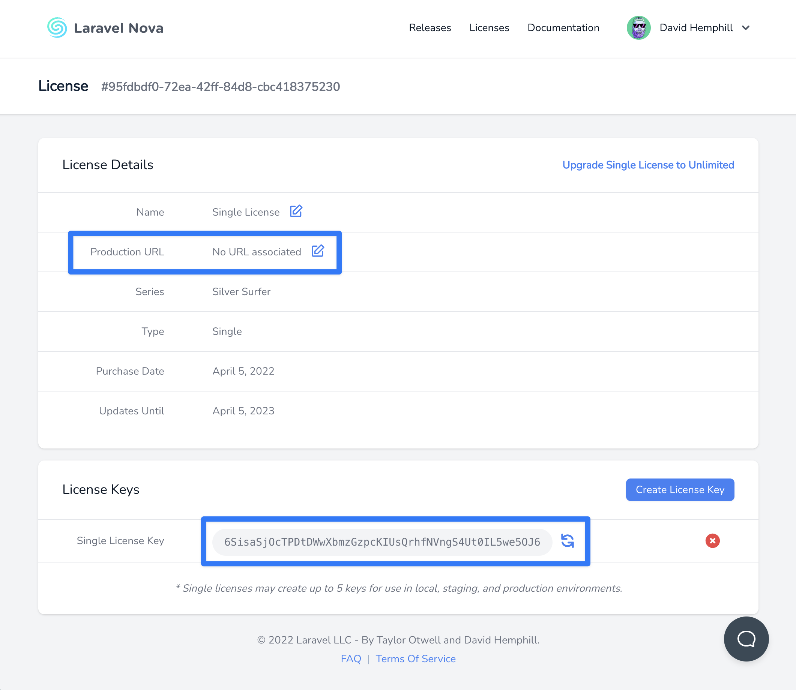
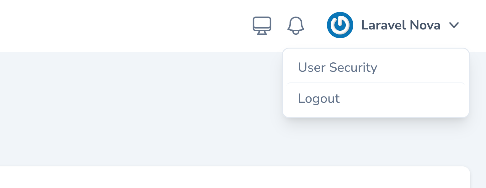
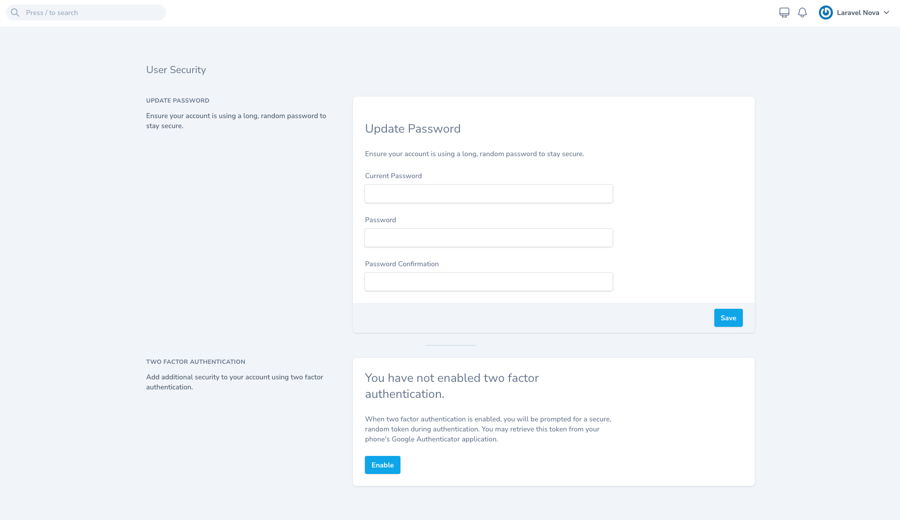
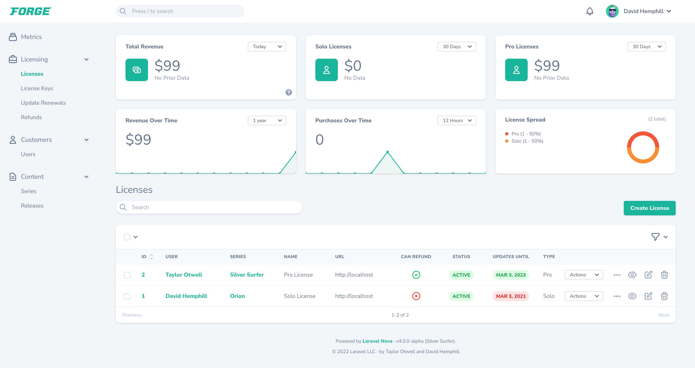

# Installation

[[toc]]

## Requirements

Laravel Nova has a few requirements you should be aware of before installing:

- Composer 2
- Laravel Framework 10.x, or 11.x
- Laravel Mix 6
- Node.js (Version 18.x+)
- NPM 9

## Browser Support

Nova supports modern versions of the following browsers:

- Apple Safari
- Google Chrome
- Microsoft Edge
- Mozilla Firefox

## Installing Nova via Composer

:::warning Zip Downloads

Previous releases of Laravel Nova allowed Nova to be installed by downloading Zip archives of the source code; however, Nova 5 installation is always performed via Composer.
:::

You may install Nova as a Composer package via our private Satis repository. To get started, add the Nova repository to your application's `composer.json` file:

```json
"repositories": [
    {
        "type": "composer",
        "url": "https://nova.laravel.com"
    }
],
```

Or, you may use the following CLI command to add the Composer repository to your `composer.json` file:

```bash
composer config repositories.nova '{"type": "composer", "url": "https://nova.laravel.com"}' --file composer.json
```

Next, you may add `laravel/nova` to your list of required packages in your `composer.json` file:

```json
"require": { // [!code focus]
    "php": "^8.2",
    "laravel/framework": "^11.9",
    "laravel/nova": "^5.0", // [!code ++] // [!code focus]
    "laravel/tinker": "^2.9"
}, // [!code focus]
```

After your `composer.json` file has been updated, run the `composer update` command in your console terminal:

```bash
composer update --prefer-dist
```

When running `composer update`, you will be prompted to provide a username and password. You should use your Nova website email for the username and a [license key](https://nova.laravel.com/licenses) should be used as the password. These credentials will authenticate your Composer session as having permission to download the Nova source code.

To avoid manually typing these credentials, you may create a [Composer auth.json file](https://getcomposer.org/doc/articles/http-basic-authentication.md) while using your [license key](https://nova.laravel.com/licenses) in place of your password:

```bash
composer config http-basic.nova.laravel.com your-nova-account-email@your-domain.com your-license-key
```

Finally, run the `nova:install` and `migrate` Artisan commands. The `nova:install` command will install Nova's service provider and public assets within your application:

```bash
php artisan nova:install

php artisan migrate
```

The default `App\Nova\User` Nova resource references the `App\Models\User` model. If you place your models in a different directory or namespace, you should adjust this value within the resource:

```php
namespace App\Nova;

class User extends Resource # [!code focus]
{
    /**
     * The model the resource corresponds to.
     *
     * @var class-string<\App\Models\User>
     */
    public static $model = \App\Models\User::class; # [!code focus]
}
```

If you don't have a Nova admin user yet in your `users` table, you can add one by running the `nova:user` Artisan command and following the prompts:

```bash
php artisan nova:user
```

That's it! Next, you may navigate to your application's `/nova` path in your browser and you should be greeted with the Nova dashboard which includes links to various parts of this documentation.

## Registering a Nova License Key and Production URL

Nova requires a license key and a production URL to be used in production environments. Nova will check your license key and the current host against the values from the license details found in your Nova account.

You can generate license keys and register the production URL for your project inside the license's page on your Nova account at [https://nova.laravel.com/licenses](https://nova.laravel.com/licenses):



:::tip Wildcard subdomains
You can register a wildcard subdomain for your production URL for use in multi-tenant scenarios (e.g. `*.laravel.com`).
:::

You can register your license key by setting the `NOVA_LICENSE_KEY` option in your `.env` environment variables file:

```ini
NOVA_LICENSE_KEY=
```

### Verifying Your Nova License Key Configuration

To verify everything has been configured correctly, you should run the `nova:check-license` command:

```bash
php artisan nova:check-license
```

## Authenticating Nova in CI Environments

It's not recommended to store your Composer `auth.json` file inside your project's source control repository. However, there may be times you wish to download Nova inside a CI environment like [CodeShip](https://codeship.com/). For instance, you may wish to run tests for any custom tools you create.

To authenticate Nova in these situations, you can use Composer's `config` command to set the configuration option inside your CI system's pipeline, injecting environment variables containing your Nova username and license key:

```bash
composer config http-basic.nova.laravel.com "${NOVA_USERNAME}" "${NOVA_LICENSE_KEY}"
```

## Using Nova on Development and Staging Domains

Since Nova can be used in local and staging development environments, Nova will not check your license key when used on `localhost` or local TLDs like those specified in [IETF RFC 2606](https://datatracker.ietf.org/doc/html/rfc2606#page-2):

- `.test`
- `.example`
- `.invalid`
- `.localhost`
- `.local`

Nova will also not check the current license key when the subdomain is one of these commonly-used staging subdomains:

- `staging.`
- `stage.`
- `test.`
- `testing.`
- `dev.`
- `development.`

## Authentication & Security

Nova utilizes [Laravel Fortify](https://laravel.com/docs/fortify) and offers Two Factor Authentication, E-mail Verification and Password Confirmation. By default, this feature is not enabled but can be enabled with just a few changes within your `app/Providers/NovaServiceProvider.php` file.

### Using Nova as a Secondary Login

It is common to have a separate frontend login for normal users and a backend login specifically for admin and Nova will internally determine if Fortify's routes should be loaded by checking if the application is loaded with either `App\Providers\FortifyServiceProvider` or `App\Providers\JetstreamServiceProvider`. 

To skip the additional checks and force enabled Fortify's routes you can update `routes()` method in `App\Providers\NovaServiceProvider` class:

```php
namespace App\Providers;

use Laravel\Nova\Nova;
use Laravel\Nova\NovaApplicationServiceProvider;

class NovaServiceProvider extends NovaApplicationServiceProvider
{
    /**
     * Register the Nova routes.
     */
    protected function routes(): void # [!code focus:8]
    {
        Nova::routes()
            ->withAuthenticationRoutes()
            ->withPasswordResetRoutes()
            ->register() # [!code --]
            ->register(fortify: true); # [!code ++]
    }
}
```

Alternatively, if for example you're using **Laravel Breeze** for frontend authentication and would like to skip the additional checks you can also set `fortify: false` instead:

```php
use Laravel\Nova\Nova;

// ...

protected function routes(): void
{
    Nova::routes() # [!code focus:5]
        ->withAuthenticationRoutes()
        ->withPasswordResetRoutes()
        ->register() # [!code --]
        ->register(fortify: false); # [!code ++]
}
```

### Using Nova as Application Default Login

Alternatively, there are scenarios where Nova is used as the default authentication UI for the application for normal users and admins. To utilize Nova as the default authentication UI you can configure this within `routes()` method in `App\Providers\NovaServiceProvider` class:

```php
namespace App\Providers;

use Laravel\Nova\Nova;
use Laravel\Nova\NovaApplicationServiceProvider;

class NovaServiceProvider extends NovaApplicationServiceProvider
{
    /**
     * Register the Nova routes.
     */
    protected function routes(): void # [!code focus:8]
    {
        Nova::routes()
            ->withAuthenticationRoutes() # [!code --]
            ->withAuthenticationRoutes(default: true) # [!code ++]
            ->withPasswordResetRoutes()
            ->register();
    }
}
```

### Using Custom Authentication Routes

Alternatively, you can also disable Nova's authentication and password reset routes and instead use [Laravel Jetstream](https://jetstream.laravel.com/) or [Laravel Breeze](https://laravel.com/docs/starter-kits#laravel-breeze) by updating `routes()` method within `App\Providers\NovaServiceProvider` class:

```php
namespace App\Providers;

use Laravel\Nova\Nova;
use Laravel\Nova\NovaApplicationServiceProvider;

class NovaServiceProvider extends NovaApplicationServiceProvider
{
    /**
     * Register the Nova routes.
     */
    protected function routes(): void # [!code focus:15]
    {
        Nova::routes()
            ->withAuthenticationRoutes() # [!code --]
            ->withoutAuthenticationRoutes( # [!code ++:4]
                login: '/login', 
                logout: '/logout',
            )
            ->withPasswordResetRoutes() # [!code --]
            ->withoutPasswordResetRoutes( # [!code ++:4]
                forgotPassword: '/forgot-password', 
                resetPassword: '/reset-password',
            )
            ->register();
    }
}
```


### Authorizing Access to Nova

Within your `App\Providers\NovaServiceProvider` class, there is a `gate` method. This authorization gate controls access to Nova in **non-local** environments. Users can access the Nova dashboard by default when the current application environment is `local`. You are free to modify this gate as needed to restrict access to your Nova installation:

```php
namespace App\Providers;

use App\Models\User; # [!code focus]
use Illuminate\Support\Facades\Gate;
use Laravel\Nova\NovaApplicationServiceProvider;

class NovaServiceProvider extends NovaApplicationServiceProvider
{
    /**
     * Register the Nova gate.
     *
     * This gate determines who can access Nova in non-local environments.
     */
    protected function gate(): void # [!code focus:8]
    {
        Gate::define('viewNova', function (User $user) { 
            return in_array($user->email, [ 
                // # [!code --]
                'taylor@laravel.com', # [!code ++]
            ]);
        }); 
    }
}
```

### Enables Two Factor Authentication

To allow your users to authenticate with Two Factor Authentication you need to update your `User` model and `App\Providers\NovaServiceProvider` class. 

First, we need to add `Laravel\Fortify\TwoFactorAuthenticatable` trait to the application's `User` model, here we will use `App\Models\User` as an example:

```php
namespace App\Models;
 
use Illuminate\Foundation\Auth\User as Authenticatable;
use Illuminate\Notifications\Notifiable;
use Laravel\Fortify\TwoFactorAuthenticatable; # [!code ++] # [!code focus]
 
class User extends Authenticatable # [!code focus:5]
{
    use Notifiable; # [!code --]
    use Notifiable, TwoFactorAuthenticatable; # [!code ++]

    // ...
}
```

Next, we need to update `routes()` method in `App\Providers\NovaServiceProvider` class to enable Two Factor Authentication:

```php
namespace App\Providers;

use Laravel\Fortify\Features; # [!code focus]
use Laravel\Nova\Nova;
use Laravel\Nova\NovaApplicationServiceProvider;

class NovaServiceProvider extends NovaApplicationServiceProvider
{
    /**
     * Register the Nova routes.
     */
    protected function routes(): void # [!code focus:13]
    {
        Nova::routes()
            ->withFortifyFeatures([
                Features::updatePasswords(),
                // Features::emailVerification(),
                // Features::twoFactorAuthentication(['confirm' => true, 'confirmPassword' => true]), # [!code --]
                Features::twoFactorAuthentication(['confirm' => true, 'confirmPassword' => true]), # [!code ++]
            ])
            ->withAuthenticationRoutes()
            ->withPasswordResetRoutes()
            ->register();
    }
}
```

Once `User` model and `NovaServiceProvider` class have been updated users of Nova should be able to access a new **User Security** page from the User Menu:





Please refer to Fortify's [Two Factor Authentication](https://laravel.com/docs/fortify#two-factor-authentication) documentation for additional reading.

### Enables E-mail Verifications

Nova includes support for requiring that a newly registered user verify their email address. However, support for this feature is disabled by default. To enable this feature, you should uncomment the relevant entry in the features configuration item in the `routes()` method in `App\Provider\NovaServiceProvider` class:

```php
namespace App\Providers;

use Laravel\Fortify\Features; # [!code focus]
use Laravel\Nova\Nova;
use Laravel\Nova\NovaApplicationServiceProvider;

class NovaServiceProvider extends NovaApplicationServiceProvider
{
    /**
     * Register the Nova routes.
     */
    protected function routes(): void # [!code focus:13]
    {
        Nova::routes()
            ->withFortifyFeatures([
                Features::updatePasswords(),
                // Features::emailVerification(), # [!code --]
                Features::emailVerification(), # [!code ++]
                // Features::twoFactorAuthentication(['confirm' => true, 'confirmPassword' => true]),
            ])
            ->withAuthenticationRoutes()
            ->withPasswordResetRoutes()
            ->register();
    }
}
```

Next, you should ensure that your `User` model implements the `Illuminate\Contracts\Auth\MustVerifyEmail` interface. This interface is already imported into this model for you:

```php
namespace App\Models;

// use Illuminate\Contracts\Auth\MustVerifyEmail; # [!code --] # [!code focus]
use Illuminate\Contracts\Auth\MustVerifyEmail; # [!code ++] # [!code focus]
use Illuminate\Foundation\Auth\User as Authenticatable;
use Illuminate\Notifications\Notifiable;

class User extends Authenticatable # [!code --] # [!code focus]
class User extends Authenticatable implements MustVerifyEmail # [!code ++] # [!code focus]
{
    use Notifiable;

    // ...
}
```

Finally, to secure the Nova page from being used by an unverified users, you can add `Laravel\Nova\Http\Middleware\EnsureEmailIsVerified` middleware to `api_middleware` configuration key in `config/nova.php`:

```php
// use Laravel\Nova\Http\Middleware\EnsureEmailIsVerified; # [!code --] # [!code focus]
use Laravel\Nova\Http\Middleware\EnsureEmailIsVerified; # [!code ++] # [!code focus]

return [

    // ...

    'api_middleware' => [ # [!code focus:7]
        'nova',
        Authenticate::class,
        // EnsureEmailIsVerified::class, # [!code --]
        EnsureEmailIsVerified::class, # [!code ++]
        Authorize::class,
    ],

];
```

### Customizing Nova's Authentication Guard

Nova uses the default authentication guard defined in your `auth` configuration file. If you would like to customize this guard, you may set the `guard` value within Nova's configuration file:

```php
return [

    // ...

    'guard' => env('NOVA_GUARD', null), # [!code focus]

];
```

### Customizing Nova's Password Reset Functionality

Nova uses the default password reset broker defined in your `auth` configuration file. If you would like to customize this broker, you may set the `passwords` value within Nova's configuration file:

```php
return [

    // ...

    'passwords' => env('NOVA_PASSWORDS', null), # [!code focus]

];
```

## Customization

### Branding

Although Nova's interface is intended to be an isolated part of your application that is managed by Nova, you can make some small customizations to the branding logo and color used by Nova to make the interface more cohesive with the rest of your application.



#### Brand Logo

To customize the logo used at the top left of the Nova interface, you may specify a configuration value for the `brand.logo` configuration item within your application's `config/nova.php` configuration file. This configuration value should contain an absolute path to the SVG file of the logo you would like to use:

```php
return [

    'brand' => [ # [!code focus]

        // 'logo' => resource_path('/img/example-logo.svg'), # [!code --] # [!code focus]
        'logo' => resource_path('/assets/logo.svg'), # [!code ++] # [!code focus]

        // 'colors' => [
        //     "400" => "24, 182, 155, 0.5",
        //     "500" => "24, 182, 155",
        //     "600" => "24, 182, 155, 0.75",
        // ],

    ], # [!code focus]

];
```

:::tip SVG Sizing

You may need to adjust the size and width of your SVG logo by modifying its width in the SVG file itself.
:::

#### Brand Color

To customize the color used as the "primary" color within the Nova interface, you may specify a value for the `brand.colors` configuration item within your application's `config/nova.php` configuration file. This color will be used as the primary button color as well as the color of various emphasized items throughout the Nova interface. This configuration value should be a valid RGB, RGBA, or HSL string value:

```php
return [

    // ...

    'brand' => # [!code focus]

        // 'logo' => resource_path('/img/example-logo.svg'),

        // 'colors' => [ # [!code --:5] # [!code focus:5]
        //     "400" => "24, 182, 155, 0.5",
        //     "500" => "24, 182, 155",
        //     "600" => "24, 182, 155, 0.75",
        // ],
        'colors' => [ # [!code ++:5] # [!code focus:5]
            "400" => "24, 182, 155, 0.5", 
            "500" => "24, 182, 155", 
            "600" => "24, 182, 155, 0.75", 
        ], 

    ], # [!code focus]

];
```

### Customizing Nova's Footer

There are times you may wish to customize Nova's default footer text to include relevant information for your users, such as your application version, IP addresses, or other information. Using the `Nova::footer` method, you may customize the footer text of your Nova installation. Typically, the `footer` method should be called within the `boot` method of your application's `App\Providers\NovaServiceProvider` class:

```php
namespace App\Providers;

use Illuminate\Support\Facades\Blade; # [!code ++]
use Laravel\Nova\Nova;
use Laravel\Nova\NovaApplicationServiceProvider;

class NovaServiceProvider extends NovaApplicationServiceProvider
{
    /**
     * Boot any application services.
     */
    public function boot(): void
    {
        parent::boot();

        Nova::footer(function ($request) { # [!code ++:7] # [!code focus:7]
            return Blade::render('
                @env(\'prod\')
                    This is production!
                @endenv
            ');
        });

        //
    }
}
```

### Customizing Nova's Storage Disk Driver

Nova uses the default storage disk driver defined in your `filesystems` configuration file. If you would like to customize this disk, you may set the `storage_disk` value within Nova's configuration file:

```php
return [

    // ...

    'storage_disk' => env('NOVA_STORAGE_DISK', 'public'), # [!code focus]

];
```

### Customizing Nova's Initial Path

When visiting Nova, the `Main` dashboard is typically loaded by default. However, you are free to define a different initial path that should be loaded using Nova's `initialPath` method. Typically, this method may be invoked from the `register` method of your application's `App\Providers\NovaServiceProvider` service provider:

```php
namespace App\Providers;

use Laravel\Nova\Nova;
use Laravel\Nova\NovaApplicationServiceProvider;

class NovaServiceProvider extends NovaApplicationServiceProvider
{
    /**
     * Register any application services.
     */
    public function register(): void
    {
        parent::register();
        
        Nova::initialPath('/resources/users'); # [!code ++] # [!code focus]

        //
    }
}
```

In addition to a string path, the `initialPath` method also accepts a closure that returns the path that should be loaded. This allows you to dynamically determine the initial path based on the incoming request:

```php
use Illuminate\Http\Request; # [!code ++]
use Laravel\Nova\Nova;

/**
 * Register any application services.
 */
public function register(): void
{
    parent::register();

    Nova::initialPath('/resources/users'); # [!code --] # [!code focus]
    Nova::initialPath( # [!code ++:3] # [!code focus:3]
        fn (Request $request) => $request->user()->initialPath()
    );

    //
}
```

### Enabling Breadcrumbs

If you would like Nova to display a "breadcrumb" menu as you navigate your Nova dashboard, you may invoke the `Nova::withBreadcrumbs` method. This method should be invoked from within the `boot` method of your application's `App\Providers\NovaServiceProvider` class:

```php
namespace App\Providers;

use Laravel\Nova\Nova;
use Laravel\Nova\NovaApplicationServiceProvider;

class NovaServiceProvider extends NovaApplicationServiceProvider
{
    /**
     * Boot any application services.
     */
    public function boot(): void
    {
        parent::boot();

        Nova::withBreadcrumbs(); # [!code ++] # [!code focus]

        //
    }
}
```

The `withBreadcrumbs` method also accepts a closure that allows you to enable breadcrumbs for specific users or other custom scenarios:

```php
use Laravel\Nova\Http\Requests\NovaRequest; # [!code ++]
use Laravel\Nova\Nova;

/**
 * Boot any application services.
 */
public function boot(): void
{
    parent::boot();

    Nova::withBreadcrumbs(); # [!code --] # [!code focus]
    Nova::withBreadcrumbs(  # [!code ++:3] # [!code focus:3]
        fn (NovaRequest $request) => $request->user()->wantsBreadcrumbs()
    );

    //
}
```

### Enabling RTL Support

If you wish to display Nova's content "right-to-left" (RTL), you can enable this behavior by calling the `enableRTL` method from your `App\Providers\NovaServiceProvider` service provider:

```php
namespace App\Providers;

use Laravel\Nova\Nova;
use Laravel\Nova\NovaApplicationServiceProvider;

class NovaServiceProvider extends NovaApplicationServiceProvider
{
    /**
     * Boot any application services.
     */
    public function boot(): void
    {
        parent::boot();

        Nova::enableRTL(); # [!code ++] # [!code focus]

        //
    }
}
```

The `enableRTL` method also accept a closure that allows you to enable RTL support for specific users or in other custom scenarios:

```php
use Illuminate\Http\Request; # [!code ++]
use Laravel\Nova\Nova;

/**
 * Boot any application services.
 */
public function boot(): void
{
    parent::boot();

    Nova::enableRTL(); # [!code --] # [!code focus]
    Nova::enableRTL( # [!code ++:3] # [!code focus:3]
        fn (Request $request) => $request->user()->wantsRTL() 
    );

    //
}
```

### Disabling Nova's Theme Switcher

If you wish to completely hide Nova's light/dark mode switcher and instead have Nova honor the system preference only, you can call the `withoutThemeSwitcher` method from your `App/Providers/NovaServiceProvider`:

```php
namespace App\Providers;

use Laravel\Nova\Nova;
use Laravel\Nova\NovaApplicationServiceProvider;

class NovaServiceProvider extends NovaApplicationServiceProvider
{
    /**
     * Boot any application services.
     */
    public function boot(): void
    {
        parent::boot();

        Nova::withoutThemeSwitcher(); # [!code ++] # [!code focus]

        //
    }
}
```

## Error Reporting

Nova uses its own internal exception handler instead of using the default `App\Exceptions\ExceptionHandler`. If you need to integrate third-party error reporting tools with your Nova installation, you should use the `Nova::report` method. Typically, this method should be invoked from the `register` method of your application's `App\Providers\NovaServiceProvider` class:

```php
namespace App\Providers;

use Laravel\Nova\Nova;
use Laravel\Nova\NovaApplicationServiceProvider;

class NovaServiceProvider extends NovaApplicationServiceProvider
{
    /**
     * Register any application services.
     */
    public function register(): void
    {
        parent::register();

        Nova::report(function ($exception) { # [!code ++:5] # [!code focus:5]
            if (app()->bound('sentry')) {
                app('sentry')->captureException($exception);
            }
        });

        //
    }
}
```

## Updating Nova

To update your Nova installation, you may run the `composer update` command:

```bash
composer update
```

### Updating Nova's Assets

After updating to a new Nova release, you should be sure to update Nova's JavaScript and CSS assets using the `nova:publish` Artisan command and clear any cached views using the `view:clear` Artisan command. This will ensure the newly-updated Nova version is using the latest versions of Nova's assets and views:

```bash
php artisan nova:publish
php artisan view:clear
```

The `nova:publish` command will re-publish Nova's public assets, configuration, views, and language files. This command will not overwrite any existing configuration, views, or language files. If you would like the command to overwrite existing files, you may use the `--force` flag when executing the command:

```bash
php artisan nova:publish --force
```

### Keeping Nova's Assets Updated

To ensure Nova's assets are updated when a new version is downloaded, you may add a Composer hook inside your project's `composer.json` file to automatically publish Nova's latest assets:

```json
"scripts": { // [!code focus:2]
    "post-update-cmd": [ 
        "@php artisan vendor:publish --tag=laravel-assets --ansi --force",
        "@php artisan nova:publish" // [!code ++] // [!code focus:3]
    ] 
}
```

## Code Distribution

Nova's license does not allow the public distribution of its source code. So, you may not build an application using Nova and distribute that application public via open source repository hosting platforms or any other code distribution platform.

If you would like to develop a third party package that augments Nova's functionality, you are free to do so. However, you may not distribute the Nova source code along with your package.
