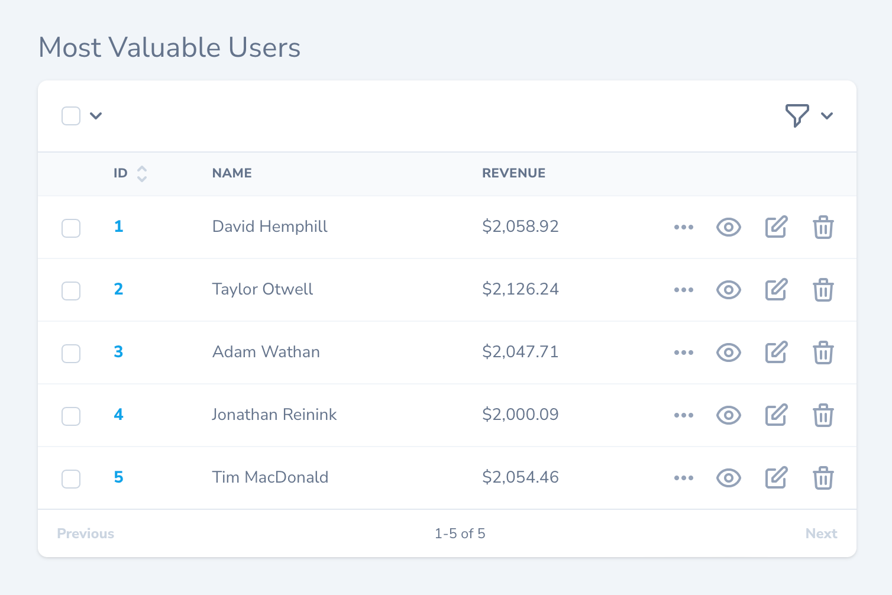

# Defining Lenses

[[toc]]

While similar to filters, Nova lenses allow you to fully customize the underlying resource Eloquent query. For example, you may want to list of all your application's users sorted by their total lifetime revenue:



Creating such a list may require you to join to additional tables and perform aggregate functions within the query. If it sounds complicated, don't worry - this is exactly the type of situation lenses are designed to solve.

## Overview

To create a lens, you may use the `nova:lens` Artisan command. By default, Nova will place newly generated lenses in the `app/Nova/Lenses` directory:

```bash
php artisan nova:lens MostValuableUsers
```

Each lens generated by Nova contains several methods. However, the two methods we are currently concerned with are the `query` and `fields` methods. The `query` method is responsible for building the Eloquent query that is needed to retrieve the desired data, while the `fields` method returns an array of fields that should be displayed when viewing the lens.

To learn more, let's take a look at a complete lens definition that displays users and their lifetime revenue. As you can see in the example below, the `query` method will take advantage of the `withFilters` and `withOrdering` methods offered by the `LensRequest` in order to instruct Nova to also apply any selected filters and ordering constraints to the query:

```php
namespace App\Nova\Lenses;

use Illuminate\Contracts\Database\Eloquent\Builder;
use Illuminate\Contracts\Pagination\Paginator;
use Illuminate\Support\Facades\DB;
use Laravel\Nova\Fields\ID;
use Laravel\Nova\Fields\Number;
use Laravel\Nova\Fields\Text;
use Laravel\Nova\Http\Requests\LensRequest;
use Laravel\Nova\Http\Requests\NovaRequest;
use Laravel\Nova\Lenses\Lens;
use Laravel\Nova\Nova;

class MostValuableUsers extends Lens # [!code focus:84]
{
    /**
     * Get the query builder / paginator for the lens.
     */
    public static function query(LensRequest $request, Builder $query): Builder|Paginator
    {
        return $request->withOrdering($request->withFilters(
            $query->select(self::columns())
                ->join('licenses', 'users.id', '=', 'licenses.user_id')
                ->groupBy('users.id', 'users.name')
                ->withCasts([
                    'revenue' => 'float',
                ])
        ), fn ($query) => $query->orderBy('revenue', 'desc'));
    }

    /**
     * Get the columns that should be selected.
     */
    protected static function columns(): array
    {
        return [
            'users.id',
            'users.name',
            DB::raw('sum(licenses.price) as revenue'),
        ];
    }

    /**
     * Get the fields available to the lens.
     *
     * @return array<int, \Laravel\Nova\Fields\Field>
     */
    public function fields(NovaRequest $request): array
    {
        return [
            ID::make(Nova::__('ID'), 'id')->sortable(),
            Text::make('Name', 'name'),

            Number::make(
                'Revenue', 'revenue', fn ($value) => '$'.number_format($value, 2)
            ),
        ];
    }

    /**
     * Get the cards available on the lens.
     *
     * @return array<int, \Laravel\Nova\Card>
     */
    public function cards(NovaRequest $request): array
    {
        return [];
    }

    /**
     * Get the filters available for the lens.
     *
     * @return array<int, \Laravel\Nova\Filters\Filter>
     */
    public function filters(NovaRequest $request): array
    {
        return [];
    }

    /**
     * Get the actions available on the lens.
     *
     * @return array<int, \Laravel\Nova\Actions\Action>
     */
    public function actions(NovaRequest $request): array
    {
        return parent::actions($request);
    }

    /**
     * Get the URI key for the lens.
     */
    public function uriKey(): string
    {
        return 'most-profitable-users';
    }
}
```

As you can see in the example above, the `query` method has full control of the Eloquent query used to retrieve the lens data. The `fields` method may leverage any of Nova's fields in order to appropriately display the data retrieved by the query.

:::tip Columns Method

In this example, the `columns` method has been extracted from the `query` method for readability. It is not "required" and is not a "feature" of lenses.
:::

:::warning Lens Column Selection

When writing your lens query, you should always try to include the resource's ID as a selected column. If the ID is not included, Nova will not be able to display the "Select All Matching" option for the lens. In addition, the resource deletion menu will not be available.
:::

#### Query Helpers

The `withOrdering` and `withFilters` methods are used to apply orderings and filters to lens queries and should always be applied in the `query` method. Both methods accept the `$query` as the first parameter, and the `withOrdering` method accepts a closure as its second parameter. The closure passed to the `withOrdering` method should apply the default ordering to the query that will be applied if no other ordering has been selected from the Nova dashboard:

```php
use Illuminate\Contracts\Database\Eloquent\Builder;
use Illuminate\Contracts\Pagination\Paginator;
use Laravel\Nova\Http\Requests\LensRequest;

/**
 * Get the query builder / paginator for the lens.
 */
public static function query(LensRequest $request, Builder $query): Builder|Paginator
{
    return $request->withOrdering( # [!code focus:4]
        $request->withFilters($query),
        fn ($query) => $query->latest()
    );
}
```

## Lens Polling

Nova can automatically fetch the latest records for a lens at a specified interval via polling. To enable polling, overwrite the `polling` property of your lens class:

```php
namespace App\Nova\Lenses;

use Laravel\Nova\Lenses\Lens;

class MostValuableUsers extends Lens
{
    /**
     * Indicates whether the lens should automatically poll for new records.
     *
     * @var bool
     */
    public static $polling = true; # [!code ++] # [!code focus]
}
```

To customize the polling interval, you may override the `pollingInterval` property on your lens class. The `pollingInterval` defines the number of seconds Nova should wait before fetching new records:

```php
namespace App\Nova\Lenses;

use Laravel\Nova\Lenses\Lens;

class MostValuableUsers extends Lens
{
    /**
     * The interval (in seconds) at which Nova should poll for new lens.
     *
     * @var int
     */
    public static $pollingInterval = 5; # [!code ++] # [!code focus]
}
```

### Toggling Lens Polling

By default, when lens polling is enabled, there is no way to disable polling once the page has loaded. However, you can instruct Nova to display a start / stop polling toggle button by defining a `showPollingToggle` property on your lens class as `true`:

```php
namespace App\Nova\Lenses;

use Laravel\Nova\Lenses\Lens;

class MostValuableUsers extends Lens
{
    /**
     * Indicates whether to show the polling toggle button inside Nova.
     *
     * @var bool
     */
    public static $showPollingToggle = true; # [!code ++] # [!code focus]
}
```

## Lens Filters

Each Nova lens also contains a `filters` method. This method allows you to attach any of your existing [filters](./../filters/defining-filters.md) to the lens:

```php
use App\Nova\Filters\UserType;
use Laravel\Nova\Http\Requests\NovaRequest;

/**
 * Get the filters available for the lens.
 *
 * @return array<int, \Laravel\Nova\Filters\Filter>
 */
public function filters(NovaRequest $request): array # [!code focus:7]
{
    return []; # [!code --]
    return [ # [!code ++:3]
        new UserType(),
    ];
}
```

## Lens Actions

Each Nova lens also contains an `actions` method. This method allows you to attach any of your existing [actions](./../actions/defining-actions.md) to the lens:

```php
use App\Nova\Actions\Export;
use Laravel\Nova\Http\Requests\NovaRequest;

/**
 * Get the actions available on the lens.
 *
 * @return array<int, \Laravel\Nova\Actions\Action>
 */
public function actions(NovaRequest $request): array # [!code focus:8]
{
    return parent::actions($request); # [!code --]
    return [ # [!code ++:4]
        ...parent::actions($request),
        new Export(),
    ];
}
```

:::warning Resource Actions

By default, lenses will inherit the actions of their associated resource. However, you may override the `actions` method on the lens to define a custom set of actions that should be available to the lens.
:::

## Lens Metrics

Each Nova lens also contains a `cards` method. This method allows you to attach any of your existing [metrics](./../metrics/defining-metrics.md) to the lens:

```php
use App\Nova\Metrics\NewUsers;
use Laravel\Nova\Http\Requests\NovaRequest;

/**
 * Get the cards available on the lens.
 *
 * @return array<int, \Laravel\Nova\Card>
 */
public function cards(NovaRequest $request): array # [!code focus:7]
{
    return []; # [!code --]
    return [ # [!code ++:3]
        new NewUsers(),
    ];
}
```
