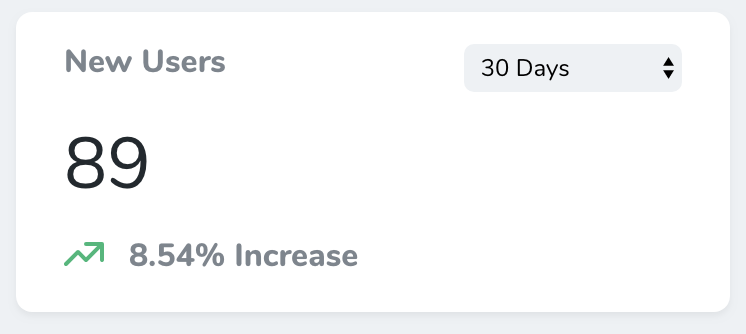
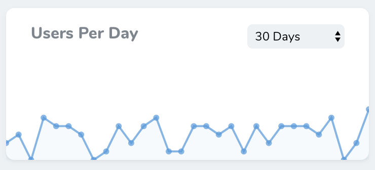
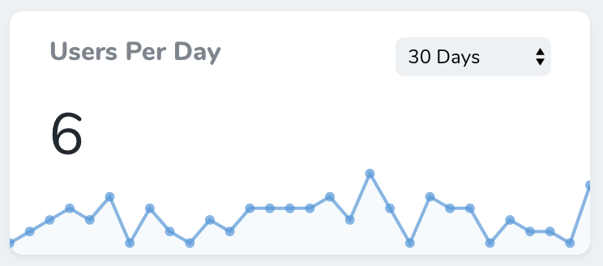
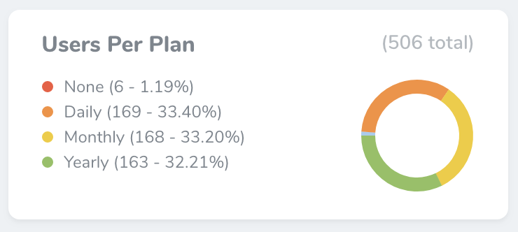
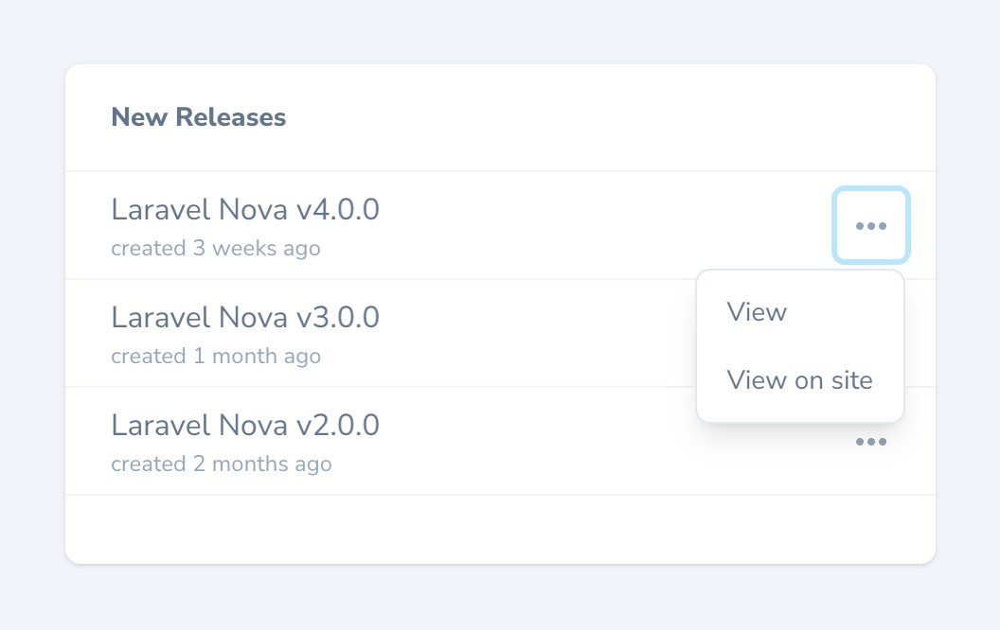

# Defining Metrics

[[toc]]

Nova metrics allow you to quickly gain insight on key business indicators for your application. For example, you may define a metric to display the total number of users added to your application per day, or the amount of weekly sales for a given product.

Nova offers several types of built-in metrics: value, trend, partition, and progress. We'll examine each type of metric and demonstrate their usage below.

## Value Metrics

Value metrics display a single value and, if desired, its change compared to a previous time interval. For example, a value metric might display the total number of users created in the last thirty days compared with the previous thirty days:



Value metrics may be generated using the `nova:value` Artisan command. By default, all new metrics will be placed in the `app/Nova/Metrics` directory:

```bash
php artisan nova:value NewUsers
```

Once your value metric class has been generated, you're ready to customize it. Each value metric class contains a `calculate` method. This method should return a `Laravel\Nova\Metrics\ValueResult` instance. Don't worry, Nova ships with a variety of helpers for quickly generating metric results.

In this example, we are using the `count` helper, which will automatically perform a `count` query against the specified Eloquent model for the selected range, as well as automatically retrieve the count for the "previous" range:

```php
namespace App\Nova\Metrics;

use App\Models\User;
use Laravel\Nova\Http\Requests\NovaRequest;
use Laravel\Nova\Metrics\Value;
use Laravel\Nova\Metrics\ValueResult;

class NewUsers extends Value
{
    /**
     * Calculate the value of the metric.
     */
    public function calculate(NovaRequest $request): ValueResult # [!code focus:4]
    {
        return $this->count($request, User::class);
    }

    /**
     * Get the ranges available for the metric.
     *
     * @return array
     */
    public function ranges()
    {
        return [
            30 => Nova::__('30 Days'),
            60 => Nova::__('60 Days'),
            365 => Nova::__('365 Days'),
            'TODAY' => Nova::__('Today'),
            'MTD' => Nova::__('Month To Date'),
            'QTD' => Nova::__('Quarter To Date'),
            'YTD' => Nova::__('Year To Date'),
        ];
    }
}
```

### Value Query Types

Value metrics don't only ship with a `count` helper. You may also use a variety of other aggregate functions when building your metric. Let's explore each of them now.

#### Average

The `average` method may be used to calculate the average of a given column compared to the previous time interval / range:

```php
use App\Models\Post;

return $this->average($request, Post::class, 'word_count'); # [!code focus]
```

#### Sum

The `sum` method may be used to calculate the sum of a given column compared to the previous time interval / range:

```php
use App\Models\Order;

return $this->sum($request, Order::class, 'price'); # [!code focus]
```

#### Max

The `max` method may be used to calculate the maximum value of a given column compared to the previous time interval / range:

```php
use App\Models\Order;

return $this->max($request, Order::class, 'total'); # [!code focus]
```

#### Min

The `min` method may be used to calculate the minimum value of a given column compared to the previous time interval / range:

```php
use App\Models\Order;

return $this->min($request, Order::class, 'total'); # [!code focus]
```

### Value Ranges

Every value metric class contains a `ranges` method. This method determines the ranges that will be available in the value metric's range selection menu. The array's keys determine the number of days that should be included in the query, while the values determine the "human readable" text that will be placed in the range selection menu. Of course, you are not required to define any ranges at all:

```php
/**
 * Get the ranges available for the metric.
 *
 * @return array<int|string, string>
 */
public function ranges(): array # [!code focus:14]
{
    return [
        30 => Nova::__('30 Days'),
        60 => Nova::__('60 Days'),
        365 => Nova::__('365 Days'),
        'TODAY' => Nova::__('Today'),
        'YESTERDAY' => Nova::__('Yesterday'), # [!code ++]
        'MTD' => Nova::__('Month To Date'),
        'QTD' => Nova::__('Quarter To Date'),
        'YTD' => Nova::__('Year To Date'),
        'ALL' => Nova::__('All Time'), # [!code ++]
    ];
}
```

:::danger TODAY / YESTERDAY / MTD / QTD / YTD / ALL Range Keys

You may customize these ranges to suit your needs; however, if you are using the built-in "Today", "Yesterday", "Month To Date", "Quarter To Date", "Year To Date", or "All Time" ranges, you should not change their keys.
:::

### Zero Result Values

By default, Nova will handle results of `0` as a result containing no data. This may not always be correct, which is why you can use the `allowZeroResult` method to indicate that `0` is a valid value result:

```php
use Laravel\Nova\Http\Requests\NovaRequest;
use Laravel\Nova\Metrics\ValueResult;

/**
 * Calculate the value of the metric.
 */
public function calculate(NovaRequest $request): ValueResult
{
    return $this->result(0) # [!code focus:2]
        ->allowZeroResult(); # [!code ++]
}
```

### Formatting the Value

You can add a prefix and / or suffix to the Value metric's result by invoking the `prefix` and `suffix` methods when returning the `ValueResult` instance:

```php
use App\Models\Order;
use Laravel\Nova\Http\Requests\NovaRequest;
use Laravel\Nova\Metrics\ValueResult;

/**
 * Calculate the value of the metric.
 */
public function calculate(NovaRequest $request): ValueResult
{
    return $this->max($request, Order::class, 'total') # [!code focus:3]
        ->prefix('$') # [!code ++:2]
        ->suffix('per unit');
}
```

You may also use the `currency` method to specify that a given value result represents a currency value:

```php
use App\Models\Order;
use Laravel\Nova\Http\Requests\NovaRequest;
use Laravel\Nova\Metrics\ValueResult;

/**
 * Calculate the value of the metric.
 */
public function calculate(NovaRequest $request): ValueResult
{
    return $this->max($request, Order::class, 'total') # [!code focus:2]
        ->currency(); # [!code ++]
}
```

By default, the currency symbol will be `$`, but you may also specify your own currency symbol by passing the symbol as an argument to the `currency` method:

```php
use App\Models\Order;
use Laravel\Nova\Http\Requests\NovaRequest;
use Laravel\Nova\Metrics\ValueResult;

/**
 * Calculate the value of the metric.
 */
public function calculate(NovaRequest $request): ValueResult
{
    return $this->max($request, Order::class, 'total') # [!code focus:2]
        ->currency('£'); # [!code ++]
}
```

To customize the display format of a value result, you may use the `format` method. The format must be one of the formats supported by [Numbro](http://numbrojs.com):

```php
use Laravel\Nova\Http\Requests\NovaRequest;
use Laravel\Nova\Metrics\ValueResult;

// Numbro v2.0+ (http://numbrojs.com/format.html) # [!code focus]
public function calculate(NovaRequest $request): ValueResult
{
    return $this->count($request, User::class) # [!code focus:5]
        ->format([ # [!code ++:4]
            'thousandSeparated' => true,
            'mantissa' => 2,
        ]);
}

// Numbro < v2.0 (http://numbrojs.com/old-format.html) # [!code focus]
public function calculate(NovaRequest $request): ValueResult
{
    return $this->count($request, User::class) # [!code focus:2]
        ->format('0,0'); # [!code ++]
}
```

### Transforming a Value Result

There may be times you need to "transform" a value result before it is displayed to the user. For example, let's say you have a "Total Revenue" metric which calculates the total revenue for a product in cents. You may wish to present this value to the user in dollars versus cents. To transform the value before it's displayed, you can use the `transform` helper:

```php
use App\Models\Invoice;
use Laravel\Nova\Http\Requests\NovaRequest;
use Laravel\Nova\Metrics\ValueResult;

/**
 * Calculate the value of the metric.
 */
public function calculate(NovaRequest $request): ValueResult
{
    return $this->sum($request, Invoice::class, 'amount') # [!code focus:2]
        ->transform(fn($value) => $value / 100); # [!code ++]
}
```

### Manually Building Value Results

If you are not able to use the included query helpers for building your value metric, you may easily manually provide the final values to the metric using the `result` and `previous` methods, giving you full control over the calculation of these values:

```php
use Laravel\Nova\Http\Requests\NovaRequest;
use Laravel\Nova\Metrics\ValueResult;

/**
 * Calculate the value of the metric.
 */
public function calculate(NovaRequest $request): ValueResult
{   
    return $this->result(100)->previous(50); # [!code ++] # [!code focus]
}
```

## Trend Metrics

Trend metrics display values over time via a line chart. For example, a trend metric might display the number of new users created per day over the previous thirty days:



Trend metrics may be generated using the `nova:trend` Artisan command. By default, all new metrics will be placed in the `app/Nova/Metrics` directory:

```bash
php artisan nova:trend UsersPerDay
```

Once your trend metric class has been generated, you're ready to customize it. Each trend metric class contains a `calculate` method. This method should return a `Laravel\Nova\Metrics\TrendResult` object. Don't worry, Nova ships with a variety of helpers for quickly generating results.

In this example, we are using the `countByDays` helper, which will automatically perform a `count` query against the specified Eloquent model for the selected range and for the selected interval unit (in this case, days):

```php
namespace App\Nova\Metrics;

use App\Models\User;
use Laravel\Nova\Http\Requests\NovaRequest;
use Laravel\Nova\Metrics\Trend;
use Laravel\Nova\Metrics\TrendResult;
use Laravel\Nova\Nova;

class UsersPerDay extends Trend
{
    /**
     * Calculate the value of the metric.
     */
    public function calculate(NovaRequest $request): TrendResult # [!code focus:4]
    {
        return $this->countByDays($request, User::class);
    }

    /**
     * Get the ranges available for the metric.
     *
     * @return array<int, string>
     */
    public function ranges(): array
    {
        return [
            30 => Nova::__('30 Days'),
            60 => Nova::__('60 Days'),
            90 => Nova::__('90 Days'),
        ];
    }
}
```

### Trend Query Types

Trend metrics don't only ship with a `countByDays` helper. You may also use a variety of other aggregate functions and time intervals when building your metric.

#### Count

The `count` methods may be used to calculate the count of a given column over time:

```php
use App\Models\User;

return $this->countByMonths($request, User::class); # [!code focus:5]
return $this->countByWeeks($request, User::class);
return $this->countByDays($request, User::class);
return $this->countByHours($request, User::class);
return $this->countByMinutes($request, User::class);
```

#### Average

The `average` methods may be used to calculate the average of a given column over time:

```php
use App\Models\Post;

return $this->averageByMonths($request, Post::class, 'word_count'); # [!code focus:5]
return $this->averageByWeeks($request, Post::class, 'word_count');
return $this->averageByDays($request, Post::class, 'word_count');
return $this->averageByHours($request, Post::class, 'word_count');
return $this->averageByMinutes($request, Post::class, 'word_count');
```

#### Sum

The `sum` methods may be used to calculate the sum of a given column over time:

```php
use App\Models\Order;

return $this->sumByMonths($request, Order::class, 'price'); # [!code focus:5]
return $this->sumByWeeks($request, Order::class, 'price');
return $this->sumByDays($request, Order::class, 'price');
return $this->sumByHours($request, Order::class, 'price');
return $this->sumByMinutes($request, Order::class, 'price');
```

#### Max

The `max` methods may be used to calculate the maximum value of a given column over time:

```php
use App\Models\Order;

return $this->maxByMonths($request, Order::class, 'total'); # [!code focus:5]
return $this->maxByWeeks($request, Order::class, 'total');
return $this->maxByDays($request, Order::class, 'total');
return $this->maxByHours($request, Order::class, 'total');
return $this->maxByMinutes($request, Order::class, 'total');
```

#### Min

The `min` methods may be used to calculate the minimum value of a given column over time:

```php
use App\Models\Order;

return $this->minByMonths($request, Order::class, 'total'); # [!code focus:5]
return $this->minByWeeks($request, Order::class, 'total');
return $this->minByDays($request, Order::class, 'total');
return $this->minByHours($request, Order::class, 'total');
return $this->minByMinutes($request, Order::class, 'total');
```

### Trend Ranges

Every trend metric class contains a `ranges` method. This method determines the ranges that will be available in the trend metric's range selection menu. The array's keys determine the number of time interval units (months, weeks, days, etc.) that should be included in the query, while the values determine the "human readable" text that will be placed in the range selection menu. Of course, you are not required to define any ranges at all:

```php
/**
 * Get the ranges available for the metric.
 *
 * @return array<int, string>
 */
public function ranges(): array # [!code focus:8]
{
    return [
        30 => Nova::__('30 Days'),
        60 => Nova::__('60 Days'),
        90 => Nova::__('90 Days'),
    ];
}
```

### Displaying the Current Value

Sometimes, you may wish to emphasize the value for the latest trend metric time interval. For example, in this screenshot, six users have been created during the last day:



To accomplish this, you may use the `showLatestValue` method:

```php
use App\Models\User;
use Laravel\Nova\Http\Requests\NovaRequest;
use Laravel\Nova\Metrics\TrendResult;

/**
 * Calculate the value of the metric.
 */
public function calculate(NovaRequest $request): TrendResult
{
    return $this->countByDays($request, User::class) # [!code focus:2]
        ->showLatestValue(); # [!code ++]
}
```

To customize the display format of a value result, you may use the `format` method. The format must be one of the formats supported by [Numbro](http://numbrojs.com):

```php
use App\Models\User;
use Laravel\Nova\Http\Requests\NovaRequest;
use Laravel\Nova\Metrics\TrendResult;

// Numbro v2.0+ (http://numbrojs.com/format.html)  # [!code focus]
public function calculate(NovaRequest $request): TrendResult
{
    return $this->count($request, User::class)  # [!code focus:5]
        ->format([ # [!code ++:4]
            'thousandSeparated' => true,
            'mantissa' => 2,
        ]);
}

// Numbro < v2.0 (http://numbrojs.com/old-format.html) # [!code focus]
public function calculate(NovaRequest $request): TrendResult
{
    return $this->count($request, User::class)  # [!code focus:2]
        ->format('0,0'); # [!code ++]
}
```

#### Displaying the Trend Sum

By default, Nova only displays the last value of a trend metric as the emphasized, "current" value. However, sometimes you may wish to show the total count of the trend instead. You can accomplish this by invoking the `showSumValue` method when returning your values from a trend metric:

```php
use App\Models\User;
use Laravel\Nova\Http\Requests\NovaRequest;
use Laravel\Nova\Metrics\TrendResult;

/**
 * Calculate the value of the metric.
 */
public function calculate(NovaRequest $request): TrendResult
{
    return $this->countByDays($request, User::class) # [!code focus:2]
        ->showSumValue(); # [!code ++]
}
```

### Formatting the Trend Value

Sometimes you may wish to add a prefix or suffix to the emphasized, "current" trend value. To accomplish this, you may use the `prefix` and `suffix` methods:

```php
use App\Models\Order;
use Laravel\Nova\Http\Requests\NovaRequest;
use Laravel\Nova\Metrics\TrendResult;

/**
 * Calculate the value of the metric.
 */
public function calculate(NovaRequest $request): TrendResult
{
    return $this->sumByDays($request, Order::class, 'price') # [!code focus:2]
        ->prefix('$'); # [!code ++]
}
```

If your trend metric is displaying a monetary value, you may use the `dollars` and `euros` convenience methods for quickly prefixing a Dollar or Euro sign to the trend values:

```php
use App\Models\Order;
use Laravel\Nova\Http\Requests\NovaRequest;
use Laravel\Nova\Metrics\TrendResult;

/**
 * Calculate the value of the metric.
 */
public function calculate(NovaRequest $request): TrendResult
{
    return $this->sumByDays($request, Order::class, 'price') # [!code focus:2]
        ->dollars(); # [!code ++]
}
```

### Manually Building Trend Results

If you are not able to use the included query helpers for building your trend metric, you may manually construct the `Laravel\Nova\Metrics\TrendResult` object and return it from your metric's `calculate` method. This approach to calculating trend data gives you total flexibility when building the data that should be graphed:

```php
use Laravel\Nova\Http\Requests\NovaRequest;
use Laravel\Nova\Metrics\TrendResult;

/**
 * Calculate the value of the metric.
 */
public function calculate(NovaRequest $request): TrendResult # [!code focus:8]
{
    return (new TrendResult)->trend([ # [!code ++:5]
        'July 1' => 100,
        'July 2' => 150,
        'July 3' => 200,
    ]);
}
```

## Partition Metrics

Partition metrics displays a pie chart of values. For example, a partition metric might display the total number of users for each billing plan offered by your application:



Partition metrics may be generated using the `nova:partition` Artisan command. By default, all new metrics will be placed in the `app/Nova/Metrics` directory:

```bash
php artisan nova:partition UsersPerPlan
```

Once your partition metric class has been generated, you're ready to customize it. Each partition metric class contains a `calculate` method. This method should return a `Laravel\Nova\Metrics\PartitionResult` object. Don't worry, Nova ships with a variety of helpers for quickly generating results.

In this example, we are using the `count` helper, which will automatically perform a `count` query against the specified Eloquent model and retrieve the number of models belonging to each distinct value of your specified "group by" column:

```php
namespace App\Nova\Metrics;

use App\Models\User;
use Laravel\Nova\Http\Requests\NovaRequest;
use Laravel\Nova\Metrics\Partition;
use Laravel\Nova\Metrics\PartitionResult;

class UsersPerPlan extends Partition
{
    /**
     * Calculate the value of the metric.
     */
    public function calculate(NovaRequest $request): PartitionResult # [!code focus:4]
    {
        return $this->count($request, User::class, 'stripe_plan');
    }

    /**
     * Get the URI key for the metric.
     */
    public function uriKey(): string
    {
        return 'users-by-plan';
    }
}
```

### Partition Query Types

Partition metrics don't only ship with a `count` helper. You may also use a variety of other aggregate functions when building your metric.

#### Average

The `average` method may be used to calculate the average of a given column within distinct groups. For example, the following call to the `average` method will display a pie chart with the average order price for each department of the company:

```php
use App\Models\Order;
use Laravel\Nova\Http\Requests\NovaRequest;
use Laravel\Nova\Metrics\PartitionResult;

/**
 * Calculate the value of the metric.
 */
public function calculate(NovaRequest $request): PartitionResult
{
    return $this->average($request, Order::class, 'price', 'department'); # [!code focus]
}
```

#### Sum

The `sum` method may be used to calculate the sum of a given column within distinct groups. For example, the following call to the `sum` method will display a pie chart with the sum of all order prices for each department of the company:

```php
use App\Models\Order;
use Laravel\Nova\Http\Requests\NovaRequest;
use Laravel\Nova\Metrics\PartitionResult;

/**
 * Calculate the value of the metric.
 */
public function calculate(NovaRequest $request): PartitionResult
{
    return $this->sum($request, Order::class, 'price', 'department'); # [!code focus]
}
```

#### Max

The `max` method may be used to calculate the max of a given column within distinct groups. For example, the following call to the `max` method will display a pie chart with the maximum order price for each department of the company:

```php
use App\Models\Order;
use Laravel\Nova\Http\Requests\NovaRequest;
use Laravel\Nova\Metrics\PartitionResult;

/**
 * Calculate the value of the metric.
 */
public function calculate(NovaRequest $request): PartitionResult
{
    return $this->max($request, Order::class, 'price', 'department'); # [!code focus]
}
```

#### Min

The `min` method may be used to calculate the min of a given column within distinct groups. For example, the following call to the `min` method will display a pie chart with the minimum order price for each department of the company:

```php
use App\Models\Order;
use Laravel\Nova\Http\Requests\NovaRequest;
use Laravel\Nova\Metrics\PartitionResult;

/**
 * Calculate the value of the metric.
 */
public function calculate(NovaRequest $request): PartitionResult
{
    return $this->min($request, Order::class, 'price', 'department'); # [!code focus]
}
```

### Customizing Partition Labels

Often, the column values that divide your partition metrics into groups will be simple keys, and not something that is "human readable". Or, if you are displaying a partition metric grouped by a column that is a boolean, Nova will display your group labels as "0" and "1". For this reason, Nova allows you to provide a Closure that formats the label into something more readable:

```php
use App\Models\User;
use Laravel\Nova\Http\Requests\NovaRequest;
use Laravel\Nova\Metrics\PartitionResult;

/**
 * Calculate the value of the metric.
 */
public function calculate(NovaRequest $request): PartitionResult
{
    return $this->count($request, User::class, 'stripe_plan') # [!code focus:5]
        ->label(fn ($value) => match ($value) { # [!code ++:4]
            null => 'None',
            default => ucfirst($value)
        });
}
```

### Customizing Partition Colors

By default, Nova will choose the colors used in a partition metric. Sometimes, you may wish to change these colors to better match the type of data they represent. To accomplish this, you may call the `colors` method when returning your partition result from the metric:

```php
use App\Models\Post;
use Laravel\Nova\Http\Requests\NovaRequest;
use Laravel\Nova\Metrics\PartitionResult;

/**
 * Calculate the value of the metric.
 */
public function calculate(NovaRequest $request): PartitionResult
{
    // This metric has `audio`, `video`, and `photo` types...
    return $this->count($request, Post::class, 'type') # [!code focus:6]
        ->colors([ # [!code ++:5]
            'audio' => '#6ab04c',
            'video' => 'rgb(72,52,212)',
            // Since it is unspecified, "photo" will use a default color from Nova...
        ]);
}
```

### Manually Building Partition Results

If you are not able to use the included query helpers for building your partition metric, you may manually provide the final values to the metric using the `result` method, providing maximum flexibility:

```php
use Laravel\Nova\Http\Requests\NovaRequest;
use Laravel\Nova\Metrics\PartitionResult;

/**
 * Calculate the value of the metric.
 */
public function calculate(NovaRequest $request): PartitionResult # [!code focus:8]
{
    return $this->result([ # [!code ++:5]
        'Group 1' => 100,
        'Group 2' => 200,
        'Group 3' => 300,
    ]);
}
```

## Progress Metric

Progress metrics display current progress against a target value within a bar chart. For example, a progress metric might display the number of users registered for the given month compared to a target goal:


Progress metrics may be generated using the `nova:progress` Artisan command. By default, all new metrics will be placed in the `app/Nova/Metrics` directory:

```bash
php artisan nova:progress NewUsers
```

Once your progress metric class has been generated, you're ready to customize it. Each progress metric class contains a `calculate` method. This method should return a `Laravel\Nova\Metrics\ProgressResult` object. Don't worry, Nova ships with a variety of helpers for quickly generating results.

In this example, we are using the `count` helper to determine if we have reached our new user registration goal for the month. The `count` helper will automatically perform a `count` query against the specified Eloquent model:

```php
namespace App\Nova\Metrics;

use App\Models\User;
use Laravel\Nova\Http\Requests\NovaRequest;
use Laravel\Nova\Metrics\Progress;
use Laravel\Nova\Metrics\ProgressResult;

class NewUsers extends Progress
{
    /**
     * Calculate the value of the metric.
     */
    public function calculate(NovaRequest $request): ProgressResult # [!code focus:12]
    {
        return $this->count(
            $request, 
            model: User::class, 
            progress: function ($query) {
                return $query; # [!code --]
                return $query->where('created_at', '>=', now()->startOfMonth()); # [!code ++]
            }, 
            target: 100,
        );
    }

    /**
     * Get the URI key for the metric.
     */
    public function uriKey(): string
    {
        return 'new-users';
    }
}
```

#### Sum

Progress metrics don't only ship with a `count` helper. You may also use the `sum` aggregate method when building your metric. For example, the following call to the `sum` method will display a progress metric with the sum of the completed transaction amounts against a target sales goal:

```php
use App\Models\Transaction;
use Laravel\Nova\Http\Requests\NovaRequest;
use Laravel\Nova\Metrics\ProgressResult;

/**
 * Calculate the value of the metric.
 */
public function calculate(NovaRequest $request): ProgressResult
{
    return $this->sum( # [!code focus:7]
        $request, 
        model: Transaction::class, 
        progress: fn ($query) => $query->where('completed', '=', 1), 
        column: 'amount', 
        target: 2000,
    );
}
```

#### Unwanted Progress

Sometimes you may be tracking progress towards a "goal" you would rather avoid, such as the number of customers that have cancelled in a given month. In this case, you would typically want the color of the progress metric to no longer be green as you approach your "goal".

When using the `avoid` method to specify that the metric is something you wish to avoid, Nova will use green to indicate lack of progress towards the "goal", while using yellow to indicate the approaching completion of the "goal":

```php
use App\Models\Transaction;
use Laravel\Nova\Http\Requests\NovaRequest;
use Laravel\Nova\Metrics\ProgressResult;

/**
 * Calculate the value of the metric.
 */
public function calculate(NovaRequest $request): ProgressResult
{
    return $this->count(  # [!code focus:8]
        $request, 
        model: User::class, 
        progress: fn ($query) => $query->where(
            'cancelled_at', '>=', now()->startOfMonth()
        ), 
        target: 200
    )->avoid(); # [!code ++]
}
```

### Formatting the Progress Value

Sometimes you may wish to add a prefix or suffix to the current progress value. To accomplish this, you may use the `prefix` and `suffix` methods:

```php
use App\Models\Transaction;
use Laravel\Nova\Http\Requests\NovaRequest;
use Laravel\Nova\Metrics\ProgressResult;

/**
 * Calculate the value of the metric.
 */
public function calculate(NovaRequest $request): ProgressResult
{
    return $this->count(  # [!code focus:7]
        $request, 
        model: Transaction::class, 
        progress: fn ($query) => $query->where('completed', '=', 1),
        column: 'amount', 
        target: 2000,
    )->prefix('$'); # [!code ++]
}
```

If your progress metric is displaying a monetary value, you may use the `dollars` and `euros` convenience methods for quickly prefixing a Dollar or Euro sign to the progress values:

```php
use App\Models\Transaction;
use Laravel\Nova\Http\Requests\NovaRequest;
use Laravel\Nova\Metrics\ProgressResult;

/**
 * Calculate the value of the metric.
 */
public function calculate(NovaRequest $request): ProgressResult
{
    return $this->sum( # [!code focus:7]
        $request, 
        model: Transaction::class, 
        progress: fn ($query) => $query->where('completed', '=', 1),
        column: 'amount', 
        target: 2000,
    )->dollars(); # [!code ++]
}
```

### Manually Building Progress Results

If you are not able to use the included query helpers for building your progress metric, you may manually provide the final values to the metric using the `result` method:

```php
use App\Models\Transaction;
use Laravel\Nova\Http\Requests\NovaRequest;
use Laravel\Nova\Metrics\ProgressResult;

/**
 * Calculate the value of the metric.
 */
public function calculate(NovaRequest $request): ProgressResult # [!code focus:7]
{
    return $this->result( # [!code ++:4]
        value: 80, 
        target: 100,
    );
}
```

## Table Metrics

Table metrics allow you to display custom lists of links along with a list of actions, as well as an optional icon.

Table metrics may be generated using the `nova:table` Artisan command. By default, all new metrics will be placed in the `app/Nova/Metrics` directory:

```php
php artisan nova:table NewReleases
```

Once your table metric class has been generated, you're ready to customize it. Each table metric class contains a `calculate` method. This method should return an array of `Laravel\Nova\Metrics\MetricTableRow` objects. Each metric row allows you to specify a title and subtitle, which will be displayed stacked on the row:

```php
namespace App\Nova\Metrics;

use Laravel\Nova\Http\Requests\NovaRequest;
use Laravel\Nova\Metrics\MetricTableRow;
use Laravel\Nova\Metrics\Table;

class NewReleases extends Table
{
    /**
     * Calculate the value of the metric.
     *
     * @param  \Laravel\Nova\Http\Requests\NovaRequest  $request
     * @return array<int, \Laravel\Nova\Metrics\MetricTableRow>
     */
    public function calculate(NovaRequest $request): array # [!code focus:12]
    {
        return [
            MetricTableRow::make() # [!code ++:3]
                ->title('v1.0')
                ->subtitle('Initial release of Laravel Nova'),

            MetricTableRow::make() # [!code ++:3]
                ->title('v2.0')
                ->subtitle('The second major series of Laravel Nova'),
        ];
    }
}
```

### Adding Actions to Table Rows

While table metrics are great for showing progress, documentation links, or recent entries to your models, they become even more powerful by attaching actions to them.



You can use the `actions` method to return an array of `Laravel\Nova\Menu\MenuItem` instances, which will be displayed in a dropdown menu:

```php
use Laravel\Nova\Http\Requests\NovaRequest;
use Laravel\Nova\Metrics\MetricTableRow;

/**
 * Calculate the value of the metric.
 *
 * @param  \Laravel\Nova\Http\Requests\NovaRequest  $request
 * @return array<int, \Laravel\Nova\Metrics\MetricTableRow>
 */
public function calculate(NovaRequest $request): array
{
    return [
        MetricTableRow::make() # [!code focus:7]
            ->title('v1.0')
            ->subtitle('Initial release of Laravel Nova')
            ->actions(fn () => [ # [!code ++:4]
                MenuItem::externalLink('View release notes', '/releases/1.0'),
                MenuItem::externalLink('Share on Twitter', 'https://twitter.com/intent/tweet?text=Check%20out%20the%20new%20release'),
            ]),

        MetricTableRow::make() # [!code focus:7]
            ->title('v2.0 (pre-release)')
            ->subtitle('The second major series of Laravel Nova')
            ->actions(fn () => [ # [!code ++:4]
                MenuItem::externalLink('View release notes', '/releases/2.0'),
                MenuItem::externalLink('Share on Twitter', 'https://twitter.com/intent/tweet?text=Check%20out%20the%20new%20release'),
            ]),
    ];
}
```

:::tip Customizing Menu Items

You can learn more about menu customization by reading the [menu item customization documentation](/5.0/customization/menus.html#menu-items).
:::

### Displaying Icons on Table Rows

Table metrics also support displaying an icon to the left of the title and subtitle for each row. You can use this information to visually delineate different table rows by type, or by using them to show progress on an internal process.


To show an icon on your table metric row, use the `icon` method and pass in the key for the icon you wish to use:

```php
use Laravel\Nova\Http\Requests\NovaRequest;
use Laravel\Nova\Metrics\MetricTableRow;

/**
 * Calculate the value of the metric.
 *
 * @param  \Laravel\Nova\Http\Requests\NovaRequest  $request
 * @return array<int, \Laravel\Nova\Metrics\MetricTableRow>
 */
public function calculate(NovaRequest $request): array
{
    return [
        MetricTableRow::make() # [!code focus:5]
            ->icon('check-circle') # [!code ++]
            ->iconClass('text-green-500')
            ->title('Get your welcome kit from HR')
            ->subtitle('Includes a Macbook Pro and swag!'),

        MetricTableRow::make() # [!code focus:5]
            ->icon('check-circle') # [!code ++]
            ->iconClass('text-green-500')
            ->title('Bootstrap your development environment')
            ->subtitle('Install the repository and get your credentials.'),

        MetricTableRow::make() # [!code focus:5]
            ->icon('check-circle') # [!code ++]
            ->iconClass('text-gray-400 dark:text-gray-700')
            ->title('Make your first production deployment')
            ->subtitle('Push your first code change to our servers.'),
    ];
}
```

You may customize the icon's color via CSS by using the `iconClass` method to add the needed classes to the icon:

```php
use Laravel\Nova\Http\Requests\NovaRequest;
use Laravel\Nova\Metrics\MetricTableRow;

/**
 * Calculate the value of the metric.
 *
 * @param  \Laravel\Nova\Http\Requests\NovaRequest  $request
 * @return array<int, \Laravel\Nova\Metrics\MetricTableRow>
 */
public function calculate(NovaRequest $request): array
{
    return [
        MetricTableRow::make() # [!code focus:5]
            ->icon('check-circle')
            ->iconClass('text-gray-400 dark:text-gray-700') # [!code ++]
            ->title('Make your first production deployment')
            ->subtitle('Push your first code change to our servers.'),
    ];
}
```

:::tip Heroicons

Nova utilizes the free icon set [Heroicons UI](https://v1.heroicons.com/) from designer [Steve Schoger](https://twitter.com/steveschoger). Feel free to use these icons to match the look and feel of Nova's built-in icons.
:::

### Customizing Table Metric Empty Text

If you're dynamically generating rows for your table metric, there may be times where there are no results to display. By default, Nova will show the user "No Results Found...".

But, sometimes you may wish to customize this text to give the user more context. For example, a metric named "Recent Users" may not have any users to display because there are no recent users. In these situations, you may customize the "no results" message using the `emptyText` method:

```php
use App\Nova\Metrics\RecentUsers;
use Laravel\Nova\Http\Requests\NovaRequest;

/**
 * Get the cards available for the resource.
 *
 * @param  \Laravel\Nova\Http\Requests\NovaRequest  $request
 * @return array<int, \Laravel\Nova\Card>
 */
public function cards(NovaRequest $request): array
{
    return [
        RecentUsers::make() # [!code focus:2]
            ->emptyText('There are no recent users.'), # [!code ++]
    ];
}
```

## Caching

Occasionally the calculation of a metric's values can be slow and expensive. For this reason, all Nova metrics contain a `cacheFor` method which allows you to specify the duration the metric result should be cached:

```php
/**
 * Determine the amount of time the results of the metric should be cached.
 *
 * @return \DateTimeInterface|\DateInterval|float|int|null
 */
public function cacheFor() # [!code ++:4] # [!code focus:4]
{
    return now()->addMinutes(5);
}
```

## Customizing Metric Names

By default, Nova will use the metric class name as the displayable name of your metric. You may customize the name of the metric displayed on the metric card by overriding the `name` method within your metric class:

```php
/**
 * Get the displayable name of the metric
 *
 * @return \Stringable|string
 */
public function name() # [!code ++:4] # [!code focus:4]
{
    return 'Users Created';
}
```
