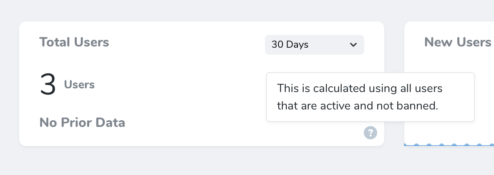

# Registering Metrics

[[toc]]

## Overview

Once you have defined a metric, you are ready to attach it to a resource. Each resource generated by Nova contains a `cards` method. To attach a metric to a resource, you should simply add it to the array of metrics / cards returned by this method:

```php
use App\Nova\Metrics\UsersPerDay; # [!code ++]
use Laravel\Nova\Http\Requests\NovaRequest;

/**
 * Get the cards available for the resource.
 *
 * @return array<int, \Laravel\Nova\Card>
 */
public function cards(NovaRequest $request): array # [!code focus:7]
{
    return []; # [!code --]
    return [ # [!code ++:3]
        new UsersPerDay(),
    ];
}
```

Alternatively, you may use the `make` method to instantiate your metric:

```php
use App\Nova\Metrics\UsersPerDay; # [!code ++]
use Laravel\Nova\Http\Requests\NovaRequest;

/**
 * Get the cards available for the resource.
 *
 * @return array<int, \Laravel\Nova\Card>
 */
public function cards(NovaRequest $request): array # [!code focus:7]
{
    return []; # [!code --]
    return [ # [!code ++:3]
        UsersPerDay::make(),
    ];
}
```

Any arguments passed to the `make` method will be passed to the constructor of your metric.

### Detail Metrics

In addition to placing metrics on the resource index page, you may also attach a metric to the resource detail page. For example, if you are building a podcasting application, you may wish to display the total number of podcasts created by a specific user over time. To instruct a metric to be displayed on the detail page instead of the index page, invoke the `onlyOnDetail` method when registering your metric:

```php
use App\Nova\Metrics\PodcastCount;
use Laravel\Nova\Http\Requests\NovaRequest;

/**
 * Get the cards available for the request.
 *
 * @param  \Laravel\Nova\Http\Requests\NovaRequest  $request
 * @return array
 */
public function cards(NovaRequest $request)
{
    return [
        PodcastCount::make() # [!code focus:2]
            ->onlyOnDetail(), # [!code ++]
    ];
}
```

Of course, you will need to modify your metric's query to only gather metric data on the resource for which it is currently being displayed. To accomplish this, your metric's `calculate` method may access the `resourceId` property on the incoming `$request`:

```php
use App\Models\Podcast;
use Laravel\Nova\Http\Requests\NovaRequest;
use Laravel\Nova\Metrics\TrendResult;

/**
 * Calculate the value of the metric.
 */
public function calculate(NovaRequest $request): TrendResult
{
    return $this->count( # [!code focus:3]
        $request, Podcast::where('user_id' $request->resourceId)
    );
}
```

### Dashboard Metrics

You are also free to add metrics to your primary Nova "dashboard", which is the default page that Nova displays after login. By default, this page displays some helpful links to the Nova documentation via the built-in `Help` card. To add a metric to your dashboard, add the metric to the array of cards returned by the `cards` method of your `app/Nova/Dashboards/Main` class:

```php
namespace App\Nova\Dashboards;

use App\Nova\Metrics\NewUsers; # [!code ++]
use Laravel\Nova\Dashboards\Main as Dashboard;

class Main extends Dashboard
{
    /**
     * Get the cards that should be displayed on the Nova dashboard.
     *
     * @return array<int, \Laravel\Nova\Card>
     */
    public function cards(): array # [!code focus:6]
    {
        return [
            new NewUsers(), # [!code ++]
        ];
    }
}
```

## Authorization

If you would like to only expose a given metric to certain users, you may invoke the `canSee` method when registering your metric. The `canSee` method accepts a closure which should return `true` or `false`. The closure will receive the incoming HTTP request:

```php
use App\Models\User;
use App\Nova\Metrics\UsersPerDay;
use Laravel\Nova\Http\Requests\NovaRequest;

/**
 * Get the cards available for the resource.
 *
 * @param  \Laravel\Nova\Http\Requests\NovaRequest  $request
 * @return array<int, \Laravel\Nova\Card>
 */
public function cards(NovaRequest $request): array
{
    return [
        UsersPerDay::make() # [!code focus:4]
            ->canSee(function ($request) { # [!code ++:3]
                return $request->user()->can('viewUsersPerDay', User::class);
            }),
    ];
}
```

In the example above, we are using Laravel's `Authorizable` trait's `can` method on our `User` model to determine if the authorized user is authorized for the `viewUsersPerDay` action. However, since proxying to authorization policy methods is a common use-case for `canSee`, you may use the `canSeeWhen` method to achieve the same behavior. The `canSeeWhen` method has the same method signature as the `Illuminate\Foundation\Auth\Access\Authorizable` trait's `can` method:

```php
use App\Models\User;
use App\Nova\Metrics\UsersPerDay;
use Laravel\Nova\Http\Requests\NovaRequest;

/**
 * Get the cards available for the resource.
 *
 * @param  \Laravel\Nova\Http\Requests\NovaRequest  $request
 * @return array<int, \Laravel\Nova\Card>
 */
public function cards(NovaRequest $request): array
{
    return [
        UsersPerDay::make() # [!code focus:4]
            ->canSeeWhen( # [!code ++:3]
                'viewUsersPerDay', User::class
            ),
    ];
}
```

## Default Metric Range

You may wish to initially load a certain metric range by default. You can pass the range's array key to the `defaultRange` method of the metric to accomplish this:

```php
use App\Nova\Metrics\NewUsers;
use Laravel\Nova\Http\Requests\NovaRequest;

/**
 * Get the cards available for the resource.
 *
 * @param  \Laravel\Nova\Http\Requests\NovaRequest  $request
 * @return array<int, \Laravel\Nova\Card>
 */
public function cards(NovaRequest $request): array
{
    return [
        NewUsers::make() # [!code focus:2]
            ->defaultRange('YTD'), # [!code ++]
    ];
}
```

## Metric Sizes

By default, metrics take up one-third of the Nova content area. However, you are free to make them larger. To accomplish this, call the `width` method when registering the metric:

```php
use App\Nova\Metrics\UsersPerDay;
use Laravel\Nova\Http\Requests\NovaRequest;

/**
 * Get the cards available for the resource.
 *
 * @param  \Laravel\Nova\Http\Requests\NovaRequest  $request
 * @return array<int, \Laravel\Nova\Card>
 */
public function cards(NovaRequest $request): array
{
    return [
        // Two-thirds of the content area... # [!code focus:3]
        UsersPerDay::make()
            ->width('2/3'), # [!code ++]

        // Full width... # [!code focus:3]
        UsersPerDay::make()
            ->width('full'), # [!code ++]
    ];
}
```

When the metric width is set to `full`, the height of the card will become dynamic. You may explicitly define this behaviour by calling the `fixedHeight` or `dynamicHeight` methods:

```php
use App\Nova\Metrics\UsersPerDay;
use Laravel\Nova\Http\Requests\NovaRequest;

/**
 * Get the cards available for the resource.
 *
 * @param  \Laravel\Nova\Http\Requests\NovaRequest  $request
 * @return array<int, \Laravel\Nova\Card>
 */
public function cards(NovaRequest $request): array
{
    return [
        UsersPerDay::make() # [!code focus:3]
            ->width('full')
            ->fixedHeight(), # [!code ++]
            
        UsersPerDay::make() # [!code focus:3]
            ->width('full')
            ->dynamicHeight(), # [!code ++]
    ];
}
```

## Metric Help Text / Tooltips

Sometimes a metric needs to offer the user more context about how the value is calculated or other details related to the metric's value. To provide this context, Nova allows you to define a help text "tooltip", which can be registered similarly to [Field Help Text](/5.0/resources/fields.html#field-help-text):



To enable the tooltip, invoke the `help` method while registering your metric. The `help` method receives the help text as its only argument:

```php
use App\Nova\Metrics\TotalUsers;
use Laravel\Nova\Http\Requests\NovaRequest;

/**
 * Get the cards available for the resource.
 *
 * @param  \Laravel\Nova\Http\Requests\NovaRequest  $request
 * @return array<int, \Laravel\Nova\Card>
 */
public function cards(NovaRequest $request): array
{
    return [
        TotalUsers::make() # [!code focus:4]
            ->help( # [!code ++:3]
                'This is calculated using all users that are active and not banned.'
            ),
    ];
}
```

You may also use HTML when defining your help text. For example, you may pass a rendered Blade template to the `help` method:

```php
use App\Nova\Metrics\TotalUsers;
use Laravel\Nova\Http\Requests\NovaRequest;

/**
 * Get the cards available for the resource.
 *
 * @param  \Laravel\Nova\Http\Requests\NovaRequest  $request
 * @return array<int, \Laravel\Nova\Card>
 */
public function cards(NovaRequest $request): array
{
    return [
        TotalUsers::make() # [!code focus:4]
            ->help( # [!code ++:3]
                view('nova.metrics.total-users.tooltip')->render()
            ),
    ];
}
```

## Refreshing Metrics

Laravel Nova will automatically fetch updated results (without requiring the user to refresh the page) for metrics attached to a resource based on following events:

| Event             | Behaviour                                                                                                                     |
| :---------------- | :---------------------------------------------------------------------------------------------------------------------------- |
| Resource Deleted  | Automatic Update                                                                                                              |
| Resource Restored | Automatic Update                                                                                                              |
| Action Executed   | [Only update if the metric's `refreshWhenActionsRun` method is invoked during registration](#refresh-after-actions)           |
| Filter Change     | [Only update if the metric's `refreshWhenFiltersChange` method is invoked during registration](#refresh-after-filter-changes) |

### Refresh After Actions

By default, Nova does not automatically update metric results after an action is executed without the user manually refreshing the page; however, you may indicate that metrics should automatically refresh after actions have executed by invoking the `refreshWhenActionsRun` method when registering your metric:

```php
use App\Nova\Metrics\TotalUsers;
use Laravel\Nova\Http\Requests\NovaRequest;

/**
 * Get the cards available for the resource.
 *
 * @param  \Laravel\Nova\Http\Requests\NovaRequest  $request
 * @return array<int, \Laravel\Nova\Card>
 */
public function cards(NovaRequest $request): array
{
    return [
        TotalUsers::make() # [!code focus:2]
            ->refreshWhenActionsRun(), # [!code ++]
    ];
}
```

### Refresh After Filter Changes

Likewise, Laravel Nova will only automatically update a metric's value when a page's selected filters change if the metric's `refreshWhenFiltersChange` method is invoked when the metric is registered:

```php
use App\Nova\Metrics\TotalUsers;
use Laravel\Nova\Http\Requests\NovaRequest;

/**
 * Get the cards available for the resource.
 *
 * @param  \Laravel\Nova\Http\Requests\NovaRequest  $request
 * @return array<int, \Laravel\Nova\Card>
 */
public function cards(NovaRequest $request): array
{
    return [
        TotalUsers::make() # [!code focus:2]
            ->refreshWhenFiltersChange(), # [!code ++]
    ];
}
```
