# Fields

[[toc]]

## Defining Fields

Each Nova resource contains a `fields` method. This method returns an array of fields, which generally extend the `Laravel\Nova\Fields\Field` class. Nova ships with a variety of fields out of the box, including fields for text inputs, booleans, dates, file uploads, Markdown, and more.

To add a field to a resource, you may simply add it to the resource's `fields` method. Typically, fields may be created using their static `make` method. This method accepts several arguments; however, you usually only need to pass the "human readable" name of the field. Nova will automatically "snake case" this string to determine the underlying database column:

```php
use Laravel\Nova\Fields\ID;
use Laravel\Nova\Fields\Text; # [!code ++]
use Laravel\Nova\Http\Requests\NovaRequest;

/**
 * Get the fields displayed by the resource.
 *
 * @return array<int, \Laravel\Nova\Fields\Field>
 */
public function fields(NovaRequest $request): array # [!code focus:7]
{
    return [
        ID::make()->sortable(),
        Text::make('Name')->sortable(), # [!code ++]
    ];
}
```

### Field Column Conventions

As noted above, Nova will "snake case" the displayable name of the field to determine the underlying database column. However, if necessary, you may pass the column name as the second argument to the field's `make` method:

```php
use Laravel\Nova\Fields\Text;

// ...

return [
    Text::make('Name'), # [!code --]  # [!code focus]
    Text::make('Name', 'name_column'), # [!code ++] # [!code focus]
];
```

If the field has a JSON, `ArrayObject`, or array cast assigned to it, you may use the `->` operator to specify nested properties within the field:

```php
use Laravel\Nova\Fields\Timezone;

// ...

return [
    Timezone::make('User Timezone'), # [!code --] # [!code focus]
    Timezone::make('User Timezone', 'settings->timezone'), # [!code ++] # [!code focus]
];
```

## Showing / Hiding Fields

Often, you will only want to display a field in certain situations. For example, there is typically no need to show a `Password` field on a resource index listing. Likewise, you may wish to only display a `Created At` field on the creation / update forms. Nova makes it a breeze to hide / show fields on certain pages.

The following methods may be used to show / hide fields based on the display context:

- `showOnIndex`
- `showOnDetail`
- `showOnCreating`
- `showOnUpdating`
- `showOnPreview`
- `showWhenPeeking`
- `hideFromIndex`
- `hideFromDetail`
- `hideWhenCreating`
- `hideWhenUpdating`
- `onlyOnIndex`
- `onlyOnDetail`
- `onlyOnForms`
- `exceptOnForms`

You may chain any of these methods onto your field's definition in order to instruct Nova where the field should be displayed:

```php
use Laravel\Nova\Fields\Text;

// ...

return [
    Text::make('Name') # [!code focus:2]
        ->hideFromIndex(), # [!code ++]
];
```

Alternatively, you may pass a callback to the following methods.

- `showOnIndex`
- `showOnDetail`
- `showOnCreating`
- `showOnUpdating`
- `showWhenPeeking`
- `hideFromIndex`
- `hideFromDetail`
- `hideWhenCreating`
- `hideWhenUpdating`
- `showOnPreview`
- `onlyOnPreview`

For `show*` methods, the field will be displayed if the given callback returns `true`:

```php
use Laravel\Nova\Fields\Text;
use Laravel\Nova\Http\Requests\NovaRequest;

// ...

return [
    Text::make('Name') # [!code focus:4]
        ->showOnIndex(function (NovaRequest $request, $resource) { # [!code ++:3]
            return $this->name === 'Taylor Otwell';
        }),
];
```

For `hide*` methods, the field will be hidden if the given callback returns `true`:

```php
use Laravel\Nova\Fields\Text;
use Laravel\Nova\Http\Requests\NovaRequest;

// ...

return [
    Text::make('Name') # [!code focus:4]
        ->hideFromIndex(function (NovaRequest $request, $resource) { # [!code ++:3]
            return $this->name === 'Taylor Otwell';
        }),
];
```

### Showing Fields When Peeking

You may allow a field to be visible [when peeking at the resource](/5.0/resources/relationships.html#peeking-at-belongsto-relationships) by invoking the `showWhenPeeking` method when defining the field:

```php
use Laravel\Nova\Fields\Text;

// ...

return [
    Text::make('Name') # [!code focus:2]
        ->showWhenPeeking(), # [!code ++]
];
```

### Resource Preview Modal

You may also define which fields should be included in the resource's "preview" modal. This modal can be displayed for a given resource by the user when viewing the resource's index:

```php
use Laravel\Nova\Fields\Markdown;
use Laravel\Nova\Fields\Text;

// ...

return [
    Text::make('Title') # [!code focus:2]
        ->showOnPreview(), # [!code ++]

    Markdown::make('Content') # [!code focus:2]
        ->showOnPreview(), # [!code ++]
];
```

Alternatively, you may pass a callback to the `showOnPreview` method:

```php
use Laravel\Nova\Fields\Markdown;
use Laravel\Nova\Fields\Text;
use Laravel\Nova\Http\Requests\NovaRequest;

// ...

return [
    Text::make('Title') # [!code focus:2]
        ->showOnPreview(), # [!code ++]

    Markdown::make('Content') # [!code focus:5]
        ->showOnPreview() # [!code --]
        ->showOnPreview(function (NovaRequest $request, $resource) { # [!code ++:3]
            return $request->user()->can('previewContent');
        }),  
];
```

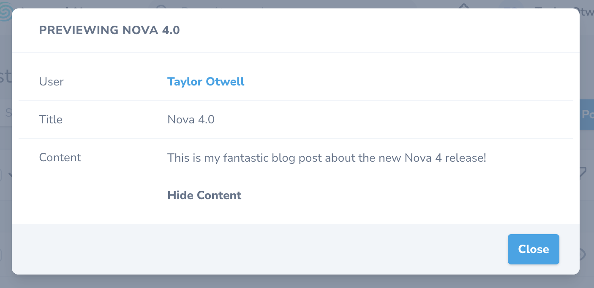

## Dynamic Field Methods

If your application requires it, you may specify a separate list of fields for specific display contexts. For example, imagine you have a resource with the following list of fields:

```php
use Laravel\Nova\Fields\Text;

// ,,,

return [
    Text::make('First Name'), # [!code focus:3]
    Text::make('Last Name'),
    Text::make('Job Title'),
];
```

On your detail page, you may wish to show a combined name via a computed field, followed by the job title. In order to do this, you could add a `fieldsForDetail` method to the resource class which returns a separate list of fields that should only be displayed on the resource's detail page:

```php
use Laravel\Nova\Fields\Text;
use Laravel\Nova\Http\Requests\NovaRequest;

/**
 * Get the fields displayed by the resource.
 *
 * @return array<int, \Laravel\Nova\Fields\Field>
 */
public function fields(NovaRequest $request): array # [!code focus:8]
{
    return [
        Text::make('First Name'),
        Text::make('Last Name'),
        Text::make('Job Title'),
    ];
}

/**
 * Get the fields displayed by the resource on detail page.
 *
 * @return array
 */
public function fieldsForDetail(NovaRequest $request) # [!code ++:10] # [!code focus:10]
{
    return [
        Text::make('Name', function () {
            return implode(' ', [$this->first_name, $this->last_name]);
        }),

        Text::make('Job Title'),
    ];
}
```

The available methods that may be defined for individual display contexts are:

- `fieldsForIndex`
- `fieldsForDetail`
- `fieldsForInlineCreate`
- `fieldsForCreate`
- `fieldsForUpdate`
- `fieldsForPreview`

:::tip Dynamic Field Methods Precedence ::
The `fieldsForIndex`, `fieldsForDetail`, `fieldsForInlineCreate`, `fieldsForCreate`,`fieldsForUpdate`, and `fieldsForPreview` methods always take precedence over the `fields` method.
:::

## Default Values

There are times you may wish to provide a default value to your fields. Nova offers this functionality via the `default` method, which accepts a value or callback. This value will be used as the field's default input value on the resource's creation view:

```php
use Illuminate\Support\Str; # [!code ++]
use Laravel\Nova\Fields\BelongsTo;
use Laravel\Nova\Fields\Text;

// ...

return [
    BelongsTo::make('Name') # [!code focus:2]
        ->default($request->user()->getKey()), # [!code ++]

    Text::make('Uuid') # [!code focus:2]
        ->default(fn ($request) => Str::orderedUuid()), # [!code ++]
];
```

## Field Placeholder Text

By default, the placeholder text of a field will be it's name. You can override the placeholder text of a field that supports placeholders by using the `placeholder` method:

```php
use Laravel\Nova\Fields\Text;

// ...

return [
    Text::make('Name') # [!code focus:2]
        ->placeholder('My New Post'),  # [!code ++]
];
```

## Field Hydration

On every create or update request that Nova receives for a given resource, each field's corresponding model attribute will automatically be filled before the model is persisted to the database. If necessary, you may customize the hydration behavior of a given field using the `fillUsing` method:

```php
use Illuminate\Support\Str; # [!code ++]
use Laravel\Nova\Fields\Text;
use Laravel\Nova\Http\Requests\NovaRequest;

// ...

return [
    Text::make('Name') # [!code focus:4]
        ->fillUsing(function ($request, $model, $attribute, $requestAttribute) { # [!code ++:3]
            $model->{$attribute} = Str::title($request->input($attribute));
        }),
];
```

## Field Panels

If your resource contains many fields, your resource "detail" page can become crowded. For that reason, you may choose to break up groups of fields into their own "panels":

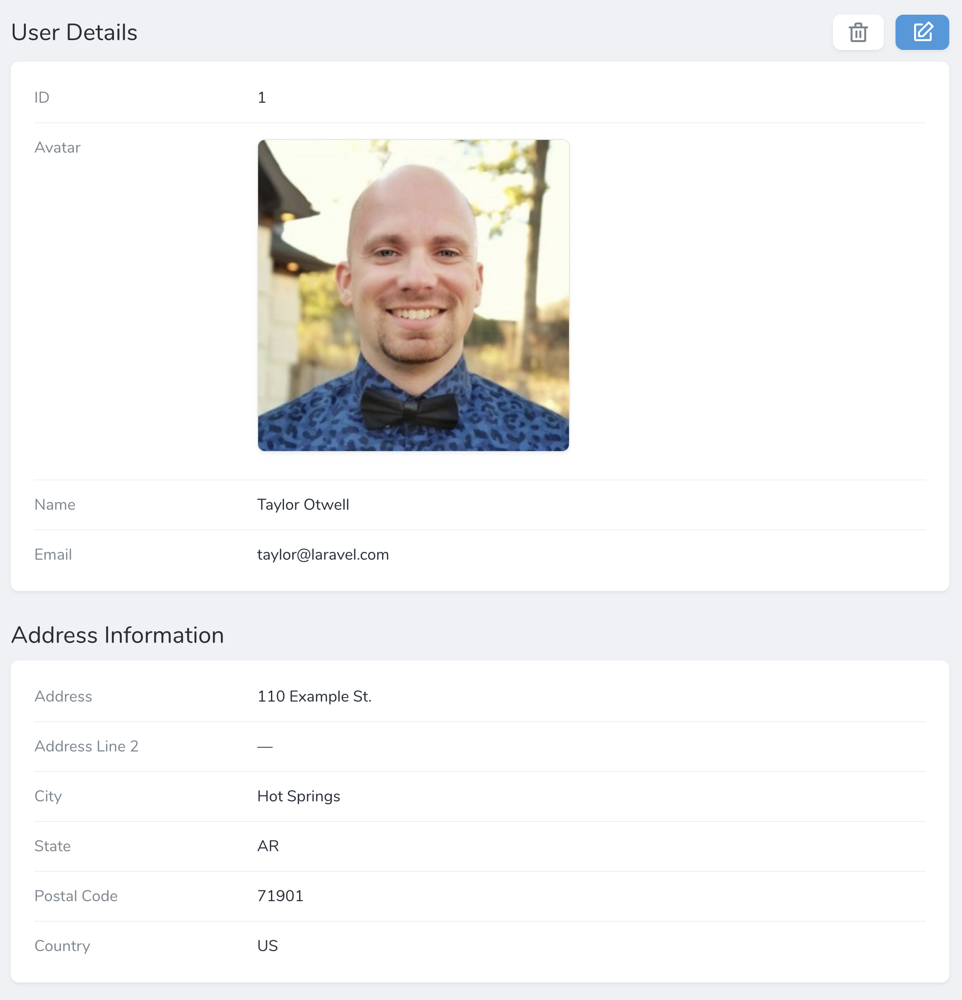

You may accomplish this by creating a new `Panel` instance within the `fields` method of a resource. Each panel requires a name and an array of fields that belong to that panel:

```php
use Laravel\Nova\Panel; # [!code ++] # [!code focus]
use Laravel\Nova\Fields\Date;
use Laravel\Nova\Fields\ID;
use Laravel\Nova\Fields\Text;

// ...

return [
    ID::make()->sortable(), # [!code focus:7]

    Panel::make('Profile', [ # [!code ++:5]
        Text::make('Full Name'),
        Date::make('Date of Birth'),
        Text::make('Place of Birth'),
    ]),
];
```

You may limit the amount of fields shown in a panel by using the `limit` method:

```php
use Laravel\Nova\Panel;
use Laravel\Nova\Fields\Date;
use Laravel\Nova\Fields\ID;
use Laravel\Nova\Fields\Text;

// ...

return [
    ID::make()->sortable(),

    Panel::make('Profile', [ # [!code focus:5]
        Text::make('Full Name'),
        Date::make('Date of Birth'),
        Text::make('Place of Birth'),
    ])->limit(1), # [!code ++]
];
```

Panels with a defined field limit will display a **Show All Fields** button in order to allow the user to view all of the defined fields when needed.

## Sortable Fields

When attaching a field to a resource, you may use the `sortable` method to indicate that the resource index may be sorted by the given field:

```php
use Laravel\Nova\Fields\Text;

// ...

return [
    Text::make('Name') # [!code focus:2]
        ->sortable(), # [!code ++]
];
```

## Field Types

:::tip Relationship Fields

This portion of the documentation only discusses non-relationship fields. To learn more about relationship fields, [check out their documentation](./relationships.html).
:::

Nova ships with a variety of field types. So, let's explore all of the available types and their options:

- [Audio](#audio-field)
- [Avatar](#avatar-field)
- [Badge](#badge-field)
- [Boolean](#boolean-field)
- [Boolean Group](#boolean-group-field)
- [Code](#code-field)
- [Color](#color-field)
- [Country](#country-field)
- [Currency](#currency-field)
- [Date](#date-field)
- [DateTime](#datetime-field)
- [Email](#email-field)
- [File](#file-field)
- [Gravatar](#gravatar-field)
- [Heading](#heading-field)
- [Hidden](#hidden-field)
- [ID](#id-field)
- [Image](#image-field)
- [KeyValue](#keyvalue-field)
- [Markdown](#markdown-field)
- [MultiSelect](#multiselect-field)
- [Number](#number-field)
- [Password](#password-field)
- [Password Confirmation](#password-confirmation-field)
- [Select](#select-field)
- [Slug](#slug-field)
- [Sparkline](#sparkline-field)
- [Status](#status-field)
- [Stack](#stack-field)
- [Tag](#tag-field)
- [Text](#text-field)
- [Textarea](#textarea-field)
- [Timezone](#timezone-field)
- [Trix](#trix-field)
- [UI-Avatar](#ui-avatar-field)
- [URL](#url-field)
- [Vapor File](#vapor-file-field)
- [Vapor Image](#vapor-image-field)

### Audio Field

The `Audio` field extends the [File field](#file-field) and accepts the same options and configurations. The `Audio` field, unlike the `File` field, will display a thumbnail preview of the underlying image when viewing the resource:

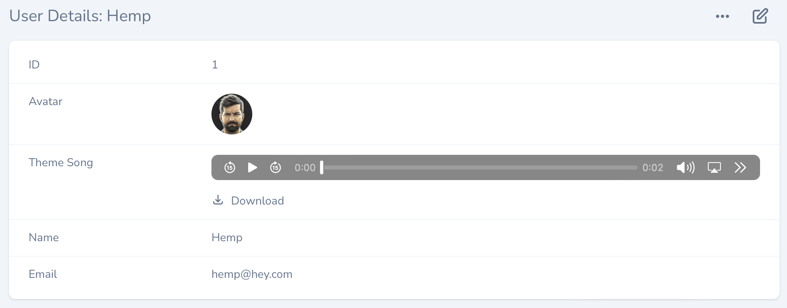

```php
use Laravel\Nova\Fields\Audio; # [!code ++]
use Laravel\Nova\Http\Requests\NovaRequest;

/**
 * Get the fields displayed by the resource.
 *
 * @return array<int, \Laravel\Nova\Fields\Field>
 */
public function fields(NovaRequest $request): array # [!code focus:6]
{
    return [
        Audio::make('Theme Song'), # [!code ++]
    ];
}
```

By default, the `Audio` field allows the user to download the linked file. To disable downloads, you may use the `disableDownload` method on the field definition:

```php
use Laravel\Nova\Fields\Audio;

// ...

return [
    Audio::make('Theme Song') # [!code focus:2]
        ->disableDownload(), # [!code ++]
];
```

You can set the [preload attribute](https://developer.mozilla.org/en-US/docs/Web/HTML/Element/audio#attr-preload) of the field by using the `preload` method:

```php
use Laravel\Nova\Fields\Audio;

// ...

return [
    Audio::make('Intro') # [!code focus:2]
        ->preload('auto'), # [!code ++]

    Audio::make('Theme Song') # [!code focus:2]
        ->preload(Audio::PRELOAD_METADATA), # [!code ++]
];
```

:::tip File Fields

To learn more about defining file fields and handling uploads, check out the comprehensive [file field documentation](./file-fields.md).
:::

### Avatar Field

The `Avatar` field extends the [Image field](#image-field) and accepts the same options and configuration:

```php
use Laravel\Nova\Fields\Avatar; # [!code ++]
use Laravel\Nova\Http\Requests\NovaRequest;

/**
 * Get the fields displayed by the resource.
 *
 * @return array<int, \Laravel\Nova\Fields\Field>
 */
public function fields(NovaRequest $request): array # [!code focus:6]
{
    return [
        Avatar::make('Avatar'), # [!code ++]
    ];
}
```

If a resource contains an `Avatar` field, that field will be displayed next to the resource's title when the resource is displayed in search results:

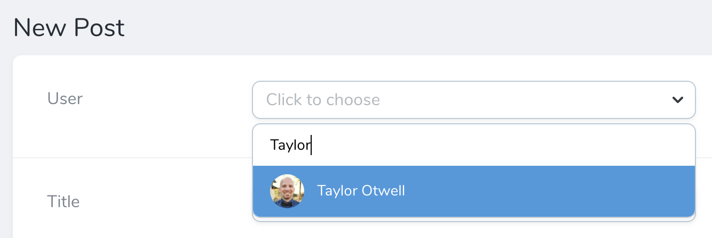

You may use the `squared` method to display the image's thumbnail with squared edges. Additionally, you may use the `rounded` method to display its thumbnails with fully-rounded edges:

```php
use Laravel\Nova\Fields\Avatar; 

// ...

return [
    Avatar::make('Avatar') # [!code focus:2]
        ->squared(), # [!code ++]  
];
```

### Badge Field

The `Badge` field can be used to display the status of a `Resource` in the index and detail views:

```php
use Laravel\Nova\Fields\Badge; # [!code ++]
use Laravel\Nova\Http\Requests\NovaRequest;

/**
 * Get the fields displayed by the resource.
 *
 * @return array<int, \Laravel\Nova\Fields\Field>
 */
public function fields(NovaRequest $request): array # [!code focus:6]
{
    return [
        Badge::make('Status', fn () => User::statuses[$this->status]), # [!code ++]
    ];
}
```

By default, the `Badge` field supports four variations: `info`, `success`, `danger`, and `warning`. You may define your possible field values and their associated badge types using the `map` method:

```php
use Laravel\Nova\Fields\Badge;

// ...

return [
    Badge::make('Status') # [!code focus:5]
        ->map([ # [!code ++:4]
            'draft' => 'danger',
            'published' => 'success',
        ]),
];
```

Alternatively, you may use the `types` method to completely replace the built-in badge types and their associated CSS classes. The CSS classes may be provided as a string or an array:

```php
use Laravel\Nova\Fields\Badge;

// ...

return [
    Badge::make('Status') # [!code focus:5]
        ->types([ # [!code ++:4]
            'draft' => 'font-medium text-gray-600',
            'published' => ['font-bold', 'text-green-600'],
        ]),
];
```

If you only wish to supplement the built-in badge types instead of overwriting all of them, you may use the `addTypes` method:

```php
use Laravel\Nova\Fields\Badge;

// ...

return [
    Badge::make('Status') # [!code focus:4]
        ->addTypes([ # [!code ++:3]
            'draft' => 'custom classes',
        ]),
];
```

:::tip Editing Badge Types

By default the `Badge` field is not shown on a resource's edit or update pages. If you wish to modify the underlying value represented by the `Badge` field on your edit forms, define another field in combination with the `onlyOnForms` field option.
:::

If you'd like to display your badge with an associated icon, you can use the `withIcons` method to direct Nova to display an icon:

```php
use Laravel\Nova\Fields\Badge;

// ...

return [
    Badge::make('Status') # [!code focus:6]
        ->map([
            'draft' => 'danger',
            'published' => 'success',
        ])
        ->withIcons(), # [!code ++]
];
```

If you'd like to customize the icons used when display `Badge` fields you can use the `icons` method:

```php
use Laravel\Nova\Fields\Badge;

// ...

return [
    Badge::make('Status') # [!code focus:9]
        ->map([
            'draft' => 'danger',
            'published' => 'success',
        ])
        ->icons([ # [!code ++:4]
            'danger' => 'exclamation-circle',
            'success' => 'check-circle',
        ]),
];
```

If you'd like to customize the label that is displayed you can use the `label` method:

```php
use Laravel\Nova\Fields\Badge;
use Laravel\Nova\Nova; # [!code ++]

// ...

return [
    Badge::make('Status') # [!code focus:6]
        ->map([
            'draft' => 'danger',
            'published' => 'success',
        ])
        ->label(fn ($value) => Nova::__($value)), # [!code ++]
];
```

You may provide a list of labels using the `labels` method:

```php
use Laravel\Nova\Fields\Badge;
use Laravel\Nova\Nova; # [!code --]

// ...

return [
    Badge::make('Status') # [!code focus:10]
        ->map([
            'draft' => 'danger',
            'published' => 'success',
        ])
        ->label(fn ($value) => Nova::__($value)), # [!code --]
        ->labels([ # [!code ++:4]
            'draft' => 'Draft',
            'published' => 'Published',
        ]),
];
```

### Boolean Field

The `Boolean` field may be used to represent a boolean / "tiny integer" column in your database. For example, assuming your database has a boolean column named `active`, you may attach a `Boolean` field to your resource like so:

```php
use Laravel\Nova\Fields\Boolean; # [!code ++]
use Laravel\Nova\Http\Requests\NovaRequest;

/**
 * Get the fields displayed by the resource.
 *
 * @return array<int, \Laravel\Nova\Fields\Field>
 */
public function fields(NovaRequest $request): array # [!code focus:6]
{
    return [
        Boolean::make('Active'), # [!code ++]
    ];
}
```

#### Customizing True / False Values

If you are using values other than `true`, `false`, `1`, or `0` to represent "true" and "false", you may instruct Nova to use the custom values recognized by your application. To accomplish this, chain the `trueValue` and `falseValue` methods onto your field's definition:

```php
use Laravel\Nova\Fields\Boolean;

// ...

return [
    Boolean::make('Active') # [!code focus:3]
        ->trueValue('On') # [!code ++:2]
        ->falseValue('Off'),
];
```

### Boolean Group Field

The `BooleanGroup` field may be used to group a set of Boolean checkboxes, which are then stored as JSON key-values in the database column they represent. You may create a `BooleanGroup` field by providing a set of keys and labels for each option:

```php
use Laravel\Nova\Fields\BooleanGroup; # [!code ++]
use Laravel\Nova\Http\Requests\NovaRequest;

/**
 * Get the fields displayed by the resource.
 *
 * @return array<int, \Laravel\Nova\Fields\Field>
 */
public function fields(NovaRequest $request): array # [!code focus:12]
{
    return [
        BooleanGroup::make('Permissions') # [!code ++:7]
            ->options([
                'create' => 'Create',
                'read' => 'Read',
                'update' => 'Update',
                'delete' => 'Delete',
            ]),
    ];
}
```

The user will be presented with a grouped set of checkboxes which, when saved, will be converted to JSON format:

```json
{
  "create": true,
  "read": false,
  "update": false,
  "delete": false
}
```

Before using this field type, you should ensure that the underlying Eloquent attribute is configured to cast to an `array` (or equivalent) within your Eloquent model class:

```php
namespace App\Models;

use Illuminate\Foundation\Auth\User as Authenticatable;

class User extends Authenticatable
{
    /**
     * The attributes that should be cast.
     *
     * @var array<string, mixed>
     */
    protected $casts = [ # [!code ++:3] # [!code focus:3]
        'permissions' => 'array'
    ];
}
```

Sometimes, you may wish to exclude values that are `true` or `false` from display to avoid cluttering the representation of the field. You may accomplish this by invoking the `hideFalseValues` or `hideTrueValues` methods on the field definition:

```php
use Laravel\Nova\Fields\BooleanGroup; 

// ...

return [
    BooleanGroup::make('Permissions') # [!code focus:7]
        ->options([
            'create' => 'Create',
            'read' => 'Read',
            'update' => 'Update',
            'delete' => 'Delete',
        ])->hideFalseValues(), # [!code ++]

    BooleanGroup::make('Permissions') # [!code focus:7]
        ->options([
            'create' => 'Create',
            'read' => 'Read',
            'update' => 'Update',
            'delete' => 'Delete',
        ])->hideTrueValues(), # [!code ++]
];
```

If the underlying field is empty, Nova will display "No Data". You may customize this text using the `noValueText` method:

```php
use Laravel\Nova\Fields\BooleanGroup; 

// ...

return [
    BooleanGroup::make('Permissions') # [!code focus:7]
        ->options([
            'create' => 'Create',
            'read' => 'Read',
            'update' => 'Update',
            'delete' => 'Delete',
        ])->noValueText('No permissions selected.'), # [!code ++]
];
```

### Code Field

The `Code` fields provides a beautiful code editor within your Nova administration panel. Generally, code fields should be attached to `TEXT` database columns:

```php
use Laravel\Nova\Fields\Code; # [!code ++]
use Laravel\Nova\Http\Requests\NovaRequest;

/**
 * Get the fields displayed by the resource.
 *
 * @return array<int, \Laravel\Nova\Fields\Field>
 */
public function fields(NovaRequest $request): array # [!code focus:6]
{
    return [
        Code::make('Snippet'), # [!code ++]    
    ];
}
```

You may also attach `Code` fields to `JSON` database columns. By default, the field will display the value as a JSON string. You may cast the underlying Eloquent attribute to `array`, `collection`, `object`, or `json` based on your application's needs:

```php
namespace App\Models;

use Illuminate\Database\Eloquent\Model;
 
class Post extends Model
{
    /**
     * The attributes that should be cast.
     *
     * @var array<string, mixed>
     */
	protected $casts = [ # [!code ++:3] # [!code focus:3]
		'options' => 'json', 
	];
}
```

:::tip Code Fields On The Index

By default, Nova will never display a `Code` field on a resource index listing.
:::

#### Editing JSON

If you intend to use a given `Code` field instance to only edit JSON, you may chain the `json` method onto your field definition:

```php
use Laravel\Nova\Fields\Code;

// ...

return [
    Code::make('Options') # [!code focus:2]
        ->json(), # [!code ++]
];
```

:::warning Code Field JSON Validation

Nova does not automatically apply the `json` validation rule to `Code` fields. This rule must be manually specified during validation if you wish for it to be applied.
:::

#### Syntax Highlighting

You may customize the language syntax highlighting of the `Code` field using the `language` method:

```php
use Laravel\Nova\Fields\Code;

// ...

return [
    Code::make('Snippet') # [!code focus:3]
        ->json() # [!code --]
        ->language('php'), # [!code ++]
];
```

The `Code` field's currently supported languages are:

- `dockerfile`
- `htmlmixed`
- `javascript`
- `markdown`
- `nginx`
- `php`
- `ruby`
- `sass`
- `shell`
- `sql`
- `twig`
- `vim`
- `vue`
- `xml`
- `yaml-frontmatter`
- `yaml`

### Color Field

The `Color` field generates a color picker using the HTML5 `color` input element:

```php
use Laravel\Nova\Fields\Color; # [!code ++]
use Laravel\Nova\Http\Requests\NovaRequest;

/**
 * Get the fields displayed by the resource.
 *
 * @return array<int, \Laravel\Nova\Fields\Field>
 */
public function fields(NovaRequest $request): array # [!code focus:6]
{
    return [
        Color::make('Color', 'label_color'), # [!code ++]
    ];
}
```

### Country Field

The `Country` field generates a `Select` field containing a list of the world's countries. The field will store the country's corresponding two-letter code:

```php
use Laravel\Nova\Fields\Country; # [!code ++]
use Laravel\Nova\Http\Requests\NovaRequest;

/**
 * Get the fields displayed by the resource.
 *
 * @return array<int, \Laravel\Nova\Fields\Field>
 */
public function fields(NovaRequest $request): array # [!code focus:6]
{
    return [
        Country::make('Country', 'country_code'), # [!code ++]
    ];
}
```

### Currency Field

The `Currency` field generates a `Number` field that is automatically formatted using the `brick/money` PHP package. Nova will use `USD` as the default currency; however, this can be changed by modifying the `nova.currency` configuration value:

```php
use Laravel\Nova\Fields\Currency; # [!code ++]
use Laravel\Nova\Http\Requests\NovaRequest;

/**
 * Get the fields displayed by the resource.
 *
 * @return array<int, \Laravel\Nova\Fields\Field>
 */
public function fields(NovaRequest $request): array # [!code focus:6]
{
    return [
        Currency::make('Price'), # [!code ++]
    ];
}
```

You may override the currency on a per-field basis using the `currency` method:

```php
use Laravel\Nova\Fields\Currency;

// ...

return [
    Currency::make('Price') # [!code focus:2]
        ->currency('EUR'), # [!code ++]
];
```

:::tip Prerequisites

The `ext-intl` PHP extension is required to display formatted currency. Or, you may install the `symfony/polyfill-intl-icu` Composer package which offers support for the "en" locale.
:::

You may use the `min`, `max`, and `step` methods to set their corresponding attributes on the generated `input` control:

```php
use Laravel\Nova\Fields\Currency;

// ...

return [
    Currency::make('price') # [!code focus:4]
        ->min(1) # [!code ++:3]
        ->max(1000)
        ->step(0.01),
];
```

:::warning Currency Step Limitation

If you plan to customize the currency "step" amount using the `step` method, you should ensure you always call the `step` method after the `currency`, `asMinorUnits`, and `asMajorUnits` methods. Calling these methods after the `step` method will override the `step` method's behavior.
:::

The field's locale will respect the value in your application's `app.locale` configuration value. You can override this behavior by providing a locale code to the `locale` method:

```php
use Laravel\Nova\Fields\Currency;

// ...

return [
    Currency::make('Price') # [!code focus:2] 
        ->locale('fr'), # [!code ++]
];
```

### Date Field

The `Date` field may be used to store a date value (without time). For more information about dates and timezones within Nova, check out the additional [date / timezone documentation](./date-fields.md):

```php
use Laravel\Nova\Fields\Date; # [!code ++]
use Laravel\Nova\Http\Requests\NovaRequest;

/**
 * Get the fields displayed by the resource.
 *
 * @return array<int, \Laravel\Nova\Fields\Field>
 */
public function fields(NovaRequest $request): array # [!code focus:6]
{
    return [
        Date::make('Birthday'), # [!code ++]
    ]
}
```

### DateTime Field

The `DateTime` field may be used to store a date-time value. For more information about dates and timezones within Nova, check out the additional [date / timezone documentation](./date-fields.md):

```php
use Laravel\Nova\Fields\DateTime; # [!code ++]
use Laravel\Nova\Http\Requests\NovaRequest;

/**
 * Get the fields displayed by the resource.
 *
 * @return array<int, \Laravel\Nova\Fields\Field>
 */
public function fields(NovaRequest $request): array # [!code focus:6]
{
    return [
        DateTime::make('Updated At')->hideFromIndex(), # [!code ++]
    ];
}
```

### Email Field

The `Email` field may be used to display a column with a `mailto:` link on the index and detail views:

```php
use Laravel\Nova\Fields\Email; # [!code ++]
use Laravel\Nova\Http\Requests\NovaRequest;

/**
 * Get the fields displayed by the resource.
 *
 * @return array<int, \Laravel\Nova\Fields\Field>
 */
public function fields(NovaRequest $request): array # [!code focus:6]
{
    return [
        Email::make(), # [!code ++]
    ];
}
```

By default, it will set the attribute to `email` but you can change this to `customer_email` for example using the following snippet:

```php
use Laravel\Nova\Fields\Email;

// ...

return [
    Email::make(), # [!code --] # [!code focus]
    Email::make('Customer Email', 'customer_email'), # [!code ++] # [!code focus]
];
```

### File Field

To learn more about defining file fields and handling uploads, please refer to the comprehensive [file field documentation](./file-fields.md).

```php
use Laravel\Nova\Fields\File; # [!code ++]
use Laravel\Nova\Http\Requests\NovaRequest;

/**
 * Get the fields displayed by the resource.
 *
 * @return array<int, \Laravel\Nova\Fields\Field>
 */
public function fields(NovaRequest $request): array # [!code focus:6]
{
    return [
        File::make('Attachment'), # [!code ++]
    ];
}
```

### Gravatar Field

The `Gravatar` field does not correspond to any column in your application's database. Instead, it will display the "Gravatar" image of the model it is associated with.

By default, the Gravatar URL will be generated based on the value of the model's `email` column:

```php
use Laravel\Nova\Fields\Gravatar; # [!code ++]
use Laravel\Nova\Http\Requests\NovaRequest;

/**
 * Get the fields displayed by the resource.
 *
 * @return array<int, \Laravel\Nova\Fields\Field>
 */
public function fields(NovaRequest $request): array # [!code focus:7]
{
    return [
        // Using the "email" column...
        Gravatar::make(), # [!code ++]
    ];
}
```

However, if your user's email addresses are not stored in the `email` column. You may pass a custom column name using the field's `make` method:

```php
use Laravel\Nova\Fields\Gravatar;

// ...

return [
    // Using the "email_address" column... # [!code focus:3]
    Gravatar::make(), # [!code --]
    Gravatar::make(attribute: 'email_address'), # [!code ++]
];
```

You may use the `squared` method to display the image's thumbnail with squared edges. Additionally, you may use the `rounded` method to display the images with fully-rounded edges:

```php
use Laravel\Nova\Fields\Gravatar;

// ...

return [
    Gravatar::make(attribute: 'email_address') # [!code focus:2]
        ->squared(), # [!code ++]
];
```

### Heading Field

The `Heading` field does not correspond to any column in your application's database. It is used to display a banner across your forms and can function as a separator for long lists of fields:

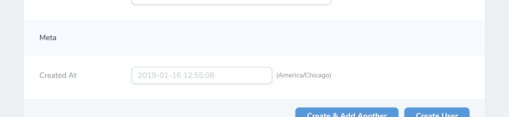

```php
use Laravel\Nova\Fields\Heading; # [!code ++]
use Laravel\Nova\Http\Requests\NovaRequest;

/**
 * Get the fields displayed by the resource.
 *
 * @return array<int, \Laravel\Nova\Fields\Field>
 */
public function fields(NovaRequest $request): array # [!code focus:6]
{
    return [
        Heading::make('Meta'), # [!code ++]
    ];
}
```

If you need to render HTML content within the `Heading` field, you may invoke the `asHtml` method when defining the field:

```php
use Laravel\Nova\Fields\Heading;

// ...

return [
    Heading::make('<p class="text-danger">* All fields are required.</p>') # [!code focus:2]
        ->asHtml(), # [!code ++]
];
```

::: tip Headings & The Index Page

`Heading` fields are automatically hidden from the resource index page.
:::

### Hidden Field

The `Hidden` field may be used to pass any value that doesn't need to be changed by the user but is required for saving the resource:

```php
use Illuminate\Support\Str;
use Laravel\Nova\Fields\Hidden; # [!code ++]
use Laravel\Nova\Http\Requests\NovaRequest;

/**
 * Get the fields displayed by the resource.
 *
 * @return array<int, \Laravel\Nova\Fields\Field>
 */
public function fields(NovaRequest $request): array # [!code focus:8]
{
    return [
        Hidden::make('Unique Key', 'uid'), # [!code ++]

        Hidden::make('Slug')->default(Str::random(64)), # [!code ++]
    ];
}
```

Combined with [default values](#default-values), `Hidden` fields are useful for passing things like related IDs to your forms:

```php
use Laravel\Nova\Fields\Hidden;

// ...

return [
    Hidden::make('User', 'user_id') # [!code focus:4]
        ->default(function ($request) { # [!code ++:3]
            return $request->user()->id;
        }),
];
```

### ID Field

The `ID` field represents the primary key of your resource's database table. Typically, each Nova resource you define should contain an `ID` field. By default, the `ID` field assumes the underlying database column is named `id`; however, you may pass the column name as the second argument to the `make` method if necessary:

```php
use Laravel\Nova\Fields\ID; # [!code ++]
use Laravel\Nova\Http\Requests\NovaRequest;

/**
 * Get the fields displayed by the resource.
 *
 * @return array<int, \Laravel\Nova\Fields\Field>
 */
public function fields(NovaRequest $request): array # [!code focus:6]
{
    return [
        ID::make(), # [!code ++]
    ];
}
```

By default, it will set the attribute to `id` but you can change this to `id_column` for example using the following snippet:

```php
use Laravel\Nova\Fields\ID;

// ...

return [
    ID::make(), # [!code --] # [!code focus]
    ID::make(attribute: 'id_column'), # [!code ++] # [!code focus]
];
```

If your application contains very large integer IDs, you may need to use the `asBigInt` method in order for the Nova client to correctly render the integer:

```php
use Laravel\Nova\Fields\ID;

// ...

return [
    ID::make() # [!code focus:2]
        ->asBigInt(), # [!code ++]
];
```

:::warning ID Fields
There should only be one `ID` field configured per resource.
:::

### Image Field

The `Image` field extends the [File field](#file-field) and accepts the same options and configurations. The `Image` field, unlike the `File` field, will display a thumbnail preview of the underlying image when viewing the resource:

```php
use Laravel\Nova\Fields\Image; # [!code ++]
use Laravel\Nova\Http\Requests\NovaRequest;

/**
 * Get the fields displayed by the resource.
 *
 * @return array<int, \Laravel\Nova\Fields\Field>
 */
public function fields(NovaRequest $request): array # [!code focus:6]
{
    return [
        Image::make('Photo'), # [!code ++]
    ];
}
```

By default, the `Image` field allows the user to download the linked file. To disable downloads, you may use the `disableDownload` method on the field definition:

```php
use Laravel\Nova\Fields\Image;

// ...

return [
    Image::make('Photo') # [!code focus:2]
        ->disableDownload(), # [!code ++]
];
```

You may use the `squared` method to display the image's thumbnail with squared edges. Additionally, you may use the `rounded` method to display its thumbnails with fully-rounded edges.

:::tip File Fields

To learn more about defining file fields and handling uploads, check out the comprehensive [file field documentation](./file-fields.md).
:::

### KeyValue Field

The `KeyValue` field provides a convenient interface to edit flat, key-value data stored inside `JSON` column types. For example, you might store profile information inside a [JSON column type](https://laravel.com/docs/eloquent-mutators#array-and-json-casting) named `meta`:

```php
use Laravel\Nova\Fields\KeyValue; # [!code ++]
use Laravel\Nova\Http\Requests\NovaRequest;

/**
 * Get the fields displayed by the resource.
 *
 * @return array<int, \Laravel\Nova\Fields\Field>
 */
public function fields(NovaRequest $request): array # [!code focus:6]
{
    return [
        KeyValue::make('Meta')->rules('json'), # [!code ++]
    ];
}
```

Given the field definition above, the following interface would be rendered by Nova:

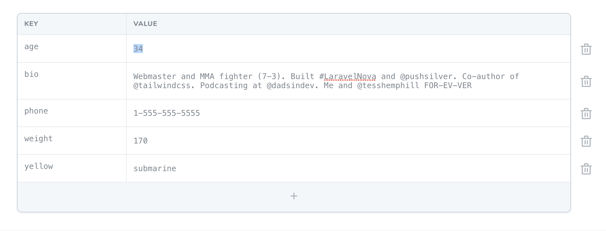

#### Customizing KeyValue Labels

You can customize the text values used in the component by calling the `keyLabel`, `valueLabel`, and `actionText` methods when defining the field. The `actionText` method customizes the "add row" button text:

```php
use Laravel\Nova\Fields\KeyValue;

// ...

return [
    KeyValue::make('Meta') #  [!code focus:4]
        ->keyLabel('Item') # [!code ++:3]
        ->valueLabel('Label')
        ->actionText('Add Item'),
];
```

:::tip KeyValue Fields & The Index Page

By default, Nova will never display a `KeyValue` field on a resource index listing.
:::

If you would like to disable the user's ability to edit the keys of the field, you may use the `disableEditingKeys` method to accomplish this. Disabling editing keys with the `disableEditingKeys` method will automatically disable adding rows as well:

```php
use Laravel\Nova\Fields\KeyValue;

// ...

return [
    KeyValue::make('Meta') # [!code focus:2]
        ->disableEditingKeys(), # [!code ++]
];
```

You may also remove the user's ability to add new rows to the field by chaining the `disableAddingRows` method onto the field's definition:

```php
use Laravel\Nova\Fields\KeyValue;

// ...

return [
    KeyValue::make('Meta') # [!code focus:2]
        ->disableAddingRows(), # [!code ++]
];
```

In addition, you may also wish to remove the user's ability to delete exisiting rows in the field. You may accomplish this by invoking the `disableDeletingRows` method when defining the field:

```php
use Laravel\Nova\Fields\KeyValue;

// ...

return [
    KeyValue::make('Meta') # [!code focus:2]
        ->disableDeletingRows(), # [!code ++]
];
```

### Markdown Field

The `Markdown` field provides a WYSIWYG Markdown editor for its underlying Eloquent attribute. Typically, this field will correspond to a `TEXT` column in your database. The `Markdown` field will store the raw Markdown text within the associated database column:

```php
use Laravel\Nova\Fields\Markdown; # [!code ++]
use Laravel\Nova\Http\Requests\NovaRequest;

/**
 * Get the fields displayed by the resource.
 *
 * @return array<int, \Laravel\Nova\Fields\Field>
 */
public function fields(NovaRequest $request): array # [!code focus:6]
{
    return [
        Markdown::make('Biography'), # [!code ++]
    ];
}
```

By default, Markdown fields will not display their content when viewing a resource's detail page. Instead, the content will be hidden behind a "Show Content" link that will reveal the field's content when clicked. You may specify that the Markdown field should always display its content by calling the `alwaysShow` method on the field itself:

```php
use Laravel\Nova\Fields\Markdown;

// ...

return [
    Markdown::make('Biography') # [!code focus:2]
        ->alwaysShow(), # [!code ++]
];
```

The Markdown field uses the `league/commonmark` package to parse Markdown content. By default, it uses a parsing strategy similar to GitHub Flavoured Markdown, which does not allow certain HTML within the Markdown content. However, you can change the parsing strategy using the `preset` method. Currently, the following built-in presets are `default`, `commonmark`, and `zero`:

```php
use Laravel\Nova\Fields\Markdown;

// ...

return [
    Markdown::make('Biography') # [!code focus:2]
        ->preset('commonmark'), # [!code ++]
];
```

Using the `preset` method, you may register and use custom preset implementations:

```php
use Illuminate\Support\Str; # [!code ++]
use Laravel\Nova\Fields\Markdown;
use Laravel\Nova\Fields\Markdown\MarkdownPreset; # [!code ++]

// ...

return [
    Markdown::make('Biography') # [!code focus:14]
        ->preset('github', new class implements MarkdownPreset { # [!code ++:13]
            /**
             * Convert the given content from markdown to HTML.
             *
             * @return string
             */
            public function convert(string $content)
            {
                return Str::of($content)->markdown([
                    'html_input' => 'strip',
                ]);
            }
        }),
];
```

#### Markdown File Uploads

If you would like to allow users to drag-and-drop photos into the `Markdown` field, you may chain the `withFiles` method onto the field's definition. When calling the `withFiles` method, you should pass the name of the [filesystem disk](https://laravel.com/docs/filesystem) that photos should be stored on:

```php
use Laravel\Nova\Fields\Markdown;

// ...

return [
    Markdown::make('Biography') # [!code focus:2]
        ->withFiles('public'), # [!code ++]
];
```

Nova will define two database tables to store pending and persisted `Field` uploads. These two tables will be created automatically when you run Nova's migrations during installation: `nova_pending_field_attachments` and `nova_field_attachments`.

Finally, in your `bootstrap/app.php` file, you should register a [daily scheduled task](https://laravel.com/docs/scheduling) to prune any stale attachments from the pending attachments table and storage. For convenience, Laravel Nova provides the job implementation needed to accomplish this:

```php
use Illuminate\Console\Scheduling\Schedule; # [!code ++]
use Illuminate\Foundation\Application;
use Illuminate\Foundation\Configuration\Exceptions;
use Illuminate\Foundation\Configuration\Middleware;
use Laravel\Nova\Fields\Attachments\PruneStaleAttachments; # [!code ++]

return Application::configure(basePath: dirname(__DIR__)) # [!code focus:7]
    // ...
    ->withSchedule(function (Schedule $schedule) { # [!code ++:3]
        $schedule->call(new PruneStaleAttachments)->daily();
    })
    // ...
    ->create();
```

### MultiSelect Field

The `MultiSelect` field provides a `Select` field that allows multiple selection options. This field pairs nicely with model attributes that are cast to `array` or equivalent:

```php
use Laravel\Nova\Fields\MultiSelect; # [!code ++]
use Laravel\Nova\Http\Requests\NovaRequest;

/**
 * Get the fields displayed by the resource.
 *
 * @return array<int, \Laravel\Nova\Fields\Field>
 */
public function fields(NovaRequest $request): array # [!code focus:11]
{
    return [
        MultiSelect::make('Sizes') # [!code ++:6]
            ->options([
                'S' => 'Small',
                'M' => 'Medium',
                'L' => 'Large',
            ]),
    ];
}
```

On the resource index and detail pages, the `MultiSelect` field's "key" value will be displayed. If you would like to display the label values instead, you may invoke the `displayUsingLabels` method when defining the field:

```php
use Laravel\Nova\Fields\MultiSelect;

// ...

return [
    MultiSelect::make('Sizes') # [!code focus:6]
        ->options([
            'S' => 'Small',
            'M' => 'Medium',
            'L' => 'Large',
        ])->displayUsingLabels(), # [!code ++]
];
```

You may also display multi-select options in groups by providing an array structure that contains keys and `label` / `group` pairs:

```php
use Laravel\Nova\Fields\MultiSelect;

// ...

return [
    MultiSelect::make('Size') # [!code focus:7]
        ->options([
            'MS' => ['label' => 'Small', 'group' => "Men's Sizes"], # [!code ++:4]
            'MM' => ['label' => 'Medium', 'group' => "Men's Sizes"],
            'WS' => ['label' => 'Small', 'group' => "Women's Sizes"],
            'WM' => ['label' => 'Medium', 'group' => "Women's Sizes"],
        ]),
];
```

### Number Field

The `Number` field provides an `input` control with a `type` attribute of `number`:

```php
use Laravel\Nova\Fields\Number; # [!code ++]
use Laravel\Nova\Http\Requests\NovaRequest;

/**
 * Get the fields displayed by the resource.
 *
 * @return array<int, \Laravel\Nova\Fields\Field>
 */
public function fields(NovaRequest $request): array # [!code focus:6]
{
    return [
        Number::make('price'), # [!code ++]
    ];
}
```

You may use the `min`, `max`, and `step` methods to set the corresponding HTML attributes on the generated `input` control:

```php
use Laravel\Nova\Fields\Number;

// ...

return [
    Number::make('price') # [!code focus:4]
        ->min(1) # [!code ++:3]
        ->max(1000)
        ->step(0.01),
];
```

You may also allow arbitrary-precision decimal values:

```php
use Laravel\Nova\Fields\Number;

// ...

return [
    Number::make('price') # [!code focus:5]
        ->min(1)
        ->max(1000)
        ->step(0.01) # [!code --]
        ->step('any'), # [!code ++]
];
```

### Password Field

The `Password` field provides an `input` control with a `type` attribute of `password`:

```php
use Laravel\Nova\Fields\Password; # [!code ++]
use Laravel\Nova\Http\Requests\NovaRequest;

/**
 * Get the fields displayed by the resource.
 *
 * @return array<int, \Laravel\Nova\Fields\Field>
 */
public function fields(NovaRequest $request): array # [!code focus:6]
{
    return [
        Password::make('Password'), # [!code ++]   
    ];
}
```

The `Password` field will automatically preserve the password that is currently stored in the database if the incoming password field is empty. Therefore, a typical password field definition might look like the following:

```php
use Illuminate\Validation\Rules\Password as PasswordRule; # [!code ++]
use Laravel\Nova\Fields\Password;

// ...

return [
    Password::make('Password') # [!code focus:4]
        ->onlyOnForms()
        ->creationRules('required', PasswordRule::defaults()) # [!code ++:2]
        ->updateRules('nullable', PasswordRule::defaults()),
];
```

### Password Confirmation Field

The `PasswordConfirmation` field provides an input that can be used for confirming another `Password` field. This field will only be shown on forms and will not attempt to hydrate an underlying attribute on the Eloquent model:

```php
use Laravel\Nova\Fields\Password;
use Laravel\Nova\Fields\PasswordConfirmation; # [!code ++]
use Laravel\Nova\Http\Requests\NovaRequest;

/**
 * Get the fields displayed by the resource.
 *
 * @return array<int, \Laravel\Nova\Fields\Field>
 */
public function fields(NovaRequest $request): array # [!code focus:8]
{
    return [
        Password::make('Password'), 

        PasswordConfirmation::make('Password Confirmation'), # [!code ++]
    ];
}
```

When using this field, you should define the appropriate validation rules on the corresponding `Password` field:

```php
use Illuminate\Validation\Rules\Password as PasswordRule; # [!code ++]
use Laravel\Nova\Fields\Password;
use Laravel\Nova\Fields\PasswordConfirmation;

// ...

return [
    Password::make('Password') # [!code focus:8]
        ->onlyOnForms()
        ->creationRules('required', PasswordRule::defaults()) # [!code --]
        ->creationRules('required', PasswordRule::defaults(), 'confirmed') # [!code ++]
        ->updateRules('nullable', PasswordRule::defaults()) # [!code --]
        ->updateRules('nullable', PasswordRule::defaults(), 'confirmed'), # [!code ++]

    PasswordConfirmation::make('Password Confirmation'), # [!code ++]
];
```

### Select Field

The `Select` field may be used to generate a drop-down select menu. The `Select` menu's options may be defined using the `options` method:

```php
use Laravel\Nova\Fields\Select; # [!code ++]
use Laravel\Nova\Http\Requests\NovaRequest;

/**
 * Get the fields displayed by the resource.
 *
 * @return array<int, \Laravel\Nova\Fields\Field>
 */
public function fields(NovaRequest $request): array # [!code focus:11]
{
    return [
        Select::make('Size') # [!code ++:6]
            ->options([
                'S' => 'Small',
                'M' => 'Medium',
                'L' => 'Large',
            ]),
    ];
}
```

On the resource index and detail pages, the `Select` field's "key" value will be displayed. If you would like to display the labels instead, you may use the `displayUsingLabels` method:

```php
use Laravel\Nova\Fields\Select;

// ...

return [
    Select::make('Size') # [!code focus:6]
        ->options([
            'S' => 'Small',
            'M' => 'Medium',
            'L' => 'Large',
        ])->displayUsingLabels(), # [!code ++]
];
```

You may also display `Select` options in groups by providing an array structure that contains keys and `label` / `group` pairs:

```php
use Laravel\Nova\Fields\Select;

// ...

return [
    Select::make('Size') # [!code focus:7]
        ->options([
            'MS' => ['label' => 'Small', 'group' => 'Men Sizes'], # [!code ++:4]
            'MM' => ['label' => 'Medium', 'group' => 'Men Sizes'],
            'WS' => ['label' => 'Small', 'group' => 'Women Sizes'],
            'WM' => ['label' => 'Medium', 'group' => 'Women Sizes'],
        ])->displayUsingLabels(),
];
```

If you need more control over the generation of the `Select` field's options, you may provide a closure to the `options` method:

```php
use Laravel\Nova\Fields\Select;

// ...

return [
    Select::make('Size') # [!code focus:6]
        ->options(fn () => array_filter([ # [!code ++:5]
            Size::SMALL => Size::MAX_SIZE === SIZE_SMALL ? 'Small' : null,
            Size::MEDIUM => Size::MAX_SIZE === SIZE_MEDIUM ? 'Medium' : null,
            Size::LARGE => Size::MAX_SIZE === SIZE_LARGE ? 'Large' : null,
        ]),
];
```

#### Searchable Select Fields

At times it's convenient to be able to search or filter the list of options available in a `Select` field. You can enable this by invoking the `searchable` method on the field:

```php
use Laravel\Nova\Fields\Select;

// ...

return [
    Select::make('Size') # [!code focus:7]
        ->searchable() # [!code ++]
        ->options([
            'S' => 'Small',
            'M' => 'Medium',
            'L' => 'Large',
        ])->displayUsingLabels(),
];
```

After marking a select field as `searchable`, Nova will display an `input` field which allows you to filter the list of options based on its label:

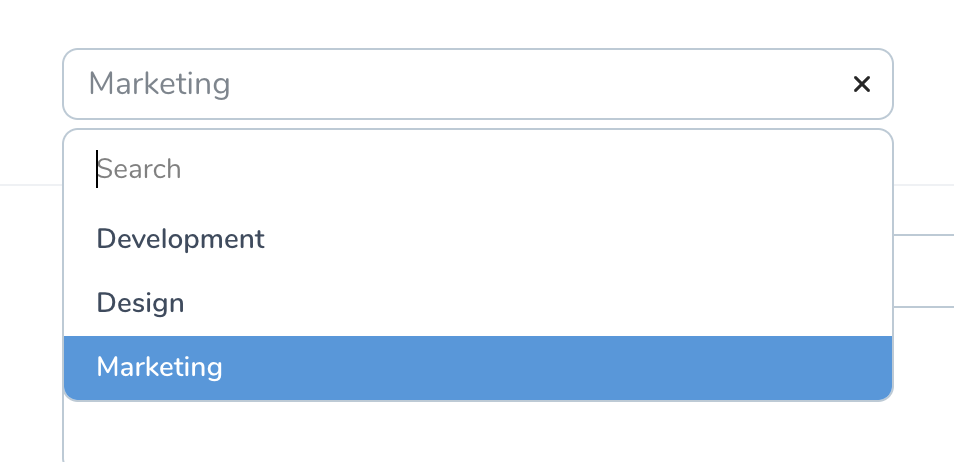

### Slug Field

Sometimes you may need to generate a unique, human-readable identifier based on the contents of another field, such as when generating a "slug" for a blog post title. You can automatically generate these "slugs" using the `Slug` field:

```php
use Laravel\Nova\Fields\Text;
use Laravel\Nova\Fields\Slug; # [!code ++]
use Laravel\Nova\Http\Requests\NovaRequest;

/**
 * Get the fields displayed by the resource.
 *
 * @return array<int, \Laravel\Nova\Fields\Field>
 */
public function fields(NovaRequest $request): array # [!code focus:8]
{
    return [
        Text::make('Title'),

        Slug::make('Slug')->from('Title'), # [!code ++]
    ];
}
```

By default, the field will convert a string like 'My Blog Post' to a slug like 'my-blog-post'. If you would like the field to use underscores instead of dashes, you may use the `separator` method to define your own custom "separator":

```php
use Laravel\Nova\Fields\Slug;

// ...

return [
    Slug::make('Slug') # [!code focus:3]
        ->from('Title')
        ->separator('_'), # [!code ++]
];
```

### Sparkline Field

The `Sparkline` field may be used to display a small line chart on a resource's index or detail page. The data provided to a `Sparkline` may be provided via an `array`:

```php
use Laravel\Nova\Fields\Sparkline; # [!code ++]
use Laravel\Nova\Http\Requests\NovaRequest;

/**
 * Get the fields displayed by the resource.
 *
 * @return array<int, \Laravel\Nova\Fields\Field>
 */
public function fields(NovaRequest $request): array # [!code focus:8]
{
    return [
        // Using an array...
        Sparkline::make('Post Views') # [!code ++:2]
            ->data([1, 2, 3, 4, 5, 6, 7, 8, 9, 10]),
    ];
}
```

Alternatively, a `callable` (which returns an array) may be provided:

```php
use Laravel\Nova\Fields\Sparkline;

// ...

return [
    // Using a callable... # [!code focus:4]
    Sparkline::make('Post Views')
        ->data([1, 2, 3, 4, 5, 6, 7, 8, 9, 10]), # [!code --]
        ->data(fn () => json_decode($this->views_data)), # [!code ++]
];
```

#### Using Trend Metrics

If the data needed by your `Sparkline` field requires complicated database queries to compute, you may wish to encapsulate the data retrieval within a [trend metric](./../metrics/defining-metrics.md) which can then be provided to the `Sparkline` field:

```php
use App\Nova\Metrics\PostViewsOverTime; # [!code ++]
use Laravel\Nova\Fields\Sparkline;

// ...

return [
    Sparkline::make('Post Views') # [!code focus:3]
        ->data([1, 2, 3, 4, 5, 6, 7, 8, 9, 10]), # [!code --]
        ->data(new PostViewsOverTime($this->id)), # [!code ++]
];
```

In the example above, we're providing the post's `id` to the metric's constructor. This value will become the `resourceId` property of the request that is available within the trend metric. For example, within the metric, we could access this post ID via `$request->resourceId`:

```php
namespace App\Nova\Metrics;

use App\Models\PostView;
use Laravel\Nova\Http\Requests\NovaRequest;
use Laravel\Nova\Metrics\Trend;
use Laravel\Nova\Metrics\TrendResult;

class PostViewsOverTime extends Trend
{
    /**
     * Calculate the value of the metric.
     */
    public function calculate(NovaRequest $request): TrendResult
    {
        return $this->countByDays( # [!code focus:4]
            $request,
            PostView::where('post_id', '=', $request->resourceId),
        );
    }
}
```

:::tip Default Ranges

When providing data to a `Sparkline` field via a trend metric, the `Sparkline` field will always use the first range defined in the `ranges` method of the metric.
:::

#### Customizing the Chart

If a bar chart better suits your data, you may invoke the `asBarChart` method when defining the field:

```php
use Laravel\Nova\Fields\Sparkline;

// ...

return [
    Sparkline::make('Post Views') # [!code focus:3]
        ->data([1, 2, 3, 4, 5, 6, 7, 8, 9, 10])
        ->asBarChart(), # [!code ++]
];
```

By default, a `Sparkline` will appear on a resource's detail page. You can customize the dimensions of the chart using the `height` and `width` methods:

```php
use Laravel\Nova\Fields\Sparkline;

// ...

return [
    Sparkline::make('Post Views') # [!code focus:4]
        ->data([1, 2, 3, 4, 5, 6, 7, 8, 9, 10])
        ->height(200) # [!code ++:2]
        ->width(600),
];
```

### Status Field

The `Status` field may be used to display a "progress state" column. Internally, Nova uses the `Status` field to indicate the current state (waiting, running, or finished) of queued actions. However, you are free to use this field for your own purposes as needed:

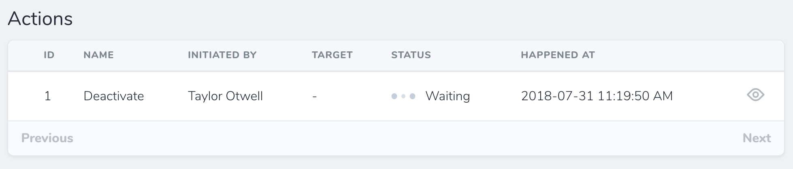

The `loadingWhen` and `failedWhen` methods may be used to instruct the field which words indicate a "loading" state and which words indicate a "failed" state. In this example, we will indicate that database column values of `waiting` or `running` should display a "loading" indicator:

```php
use Laravel\Nova\Fields\Status; # [!code ++]
use Laravel\Nova\Http\Requests\NovaRequest;

/**
 * Get the fields displayed by the resource.
 *
 * @return array<int, \Laravel\Nova\Fields\Field>
 */
public function fields(NovaRequest $request): array # [!code focus:8]
{
    return [
        Status::make('Status') # [!code ++:3]
            ->loadingWhen(['waiting', 'running'])
            ->failedWhen(['failed']),
    ];
}
```

### Stack Field

As your resource classes grow, you may find it useful to be able to group fields together to simplify your index and detail views. A `Stack` field allows you to display fields like `BelongsTo`, `Text`, and others in a vertical orientation:

```php
use Illuminate\Support\Str;
use Laravel\Nova\Fields\Stack; # [!code ++]
use Laravel\Nova\Fields\Text;
use Laravel\Nova\Http\Requests\NovaRequest;

/**
 * Get the fields displayed by the resource.
 *
 * @return array<int, \Laravel\Nova\Fields\Field>
 */
public function fields(NovaRequest $request): array # [!code focus:11]
{
    return [
        Stack::make('Details', [ # [!code ++:6]
            Text::make('Name'),
            Text::make('Slug')->resolveUsing(function () {
                return Str::slug(optional($this->resource)->name);
            }),
        ]),
    ];
}
```

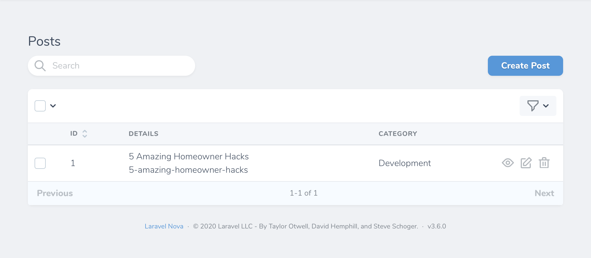

`Stack` fields are not shown on forms, and are only intended for stacking lines of text on the index and detail resource views.

#### Line Fields

To gain more control over how the individual fields in a `Stack` are displayed, you may use the `Line` field, which provides methods for controlling the display of the line's text. `Line` fields offer the following presentational methods:

- `asHeading`
- `asSubTitle`
- `asSmall`
- `asBase`

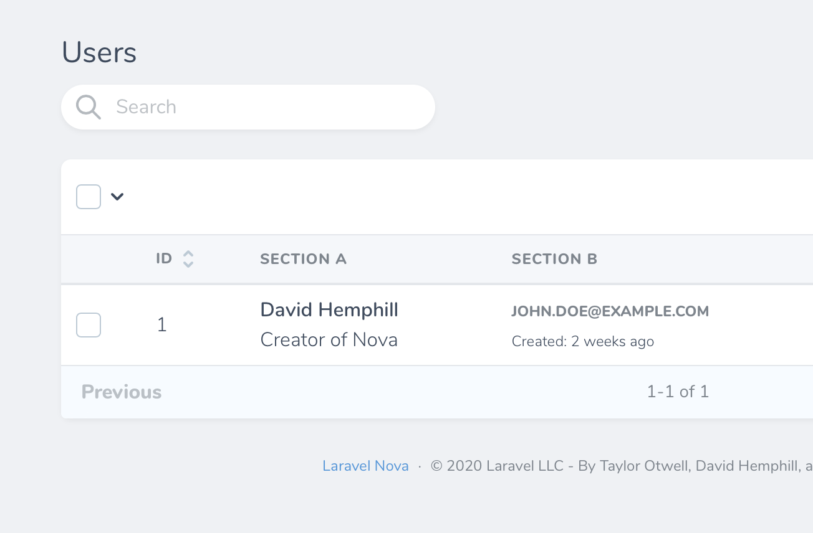

In addition to the `Line` field's presentational methods, you may also pass any additional Tailwind classes to the field to customize the appearance of the `Line`:

```php
use Laravel\Nova\Fields\Line; # [!code ++]
use Laravel\Nova\Fields\Stack;

// ...

return [
    Stack::make('Details', [ # [!code focus:3]
        Line::make('Title')->extraClasses('italic font-medium text-80'), # [!code ++]
    ]),
];
```

#### Passing Closures to Line Fields

In addition to passing `BelongsTo`, `Text`, and `Line` fields to the `Stack` field, you may also pass a closure. The result of the closure will automatically be converted to a `Line` instance:

```php
use Laravel\Nova\Fields\Line;
use Laravel\Nova\Fields\Stack;

// ...

return [
    Stack::make('Details', [ # [!code focus:4]
        Line::make('Name')->asHeading(),
        fn () => optional($this->resource)->position, # [!code ++]
    ]),
];
```

### Tag Field

The `Tag` field allows you to search and attach `BelongsToMany` relationships using a tag selection interface. This field is useful for adding roles to users, tagging articles, assigning authors to books, and other similar scenarios:

```php
use Laravel\Nova\Fields\Tag; # [!code ++]
use Laravel\Nova\Http\Requests\NovaRequest;

/**
 * Get the fields displayed by the resource.
 *
 * @return array<int, \Laravel\Nova\Fields\Field>
 */
public function fields(NovaRequest $request): array # [!code focus:6]
{
    return [
        Tag::make('Tags'), # [!code ++]
    ];
}
```

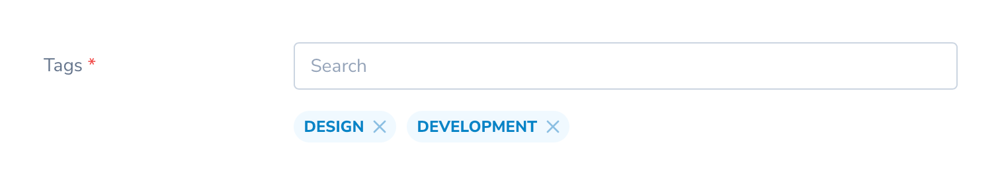

`Tag` fields will be displayed in a dropdown on the index view:

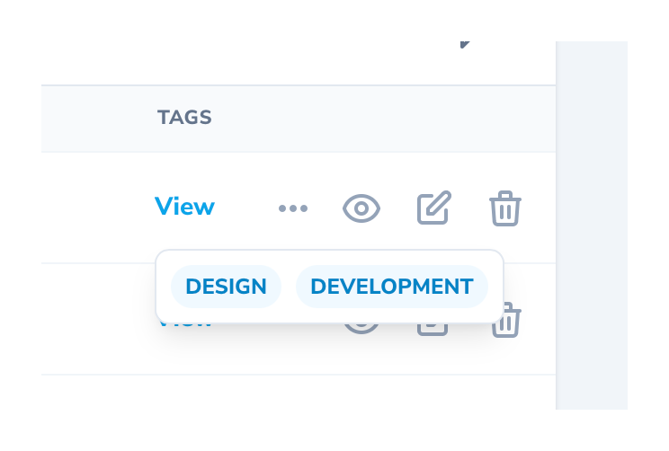

#### Previewing Tags

You may instruct the `Tag` field to allow previewing the tag's relation by invoking the `withPreview` method on the field. This will display the related resource's preview details in a modal:

```php
use Laravel\Nova\Fields\Tag;

// ...

return [
    Tag::make('Tags') # [!code focus:2]
        ->withPreview(), # [!code ++]
];
```

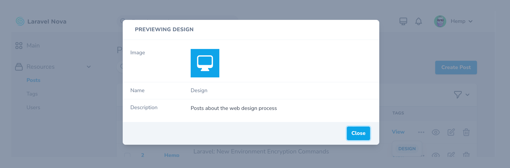

#### Displaying Tags as Lists

Instead of displaying your tags as an inline group, you may instead display your tags as a list:

```php
use Laravel\Nova\Fields\Tag;

// ...

return [
    Tag::make('Tags') # [!code focus:2]
        ->displayAsList(), # [!code ++]
];
```

This allows tags to be displayed with their title, subtitle, and a configured image field:

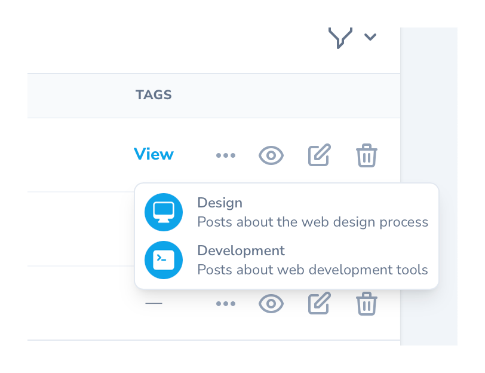

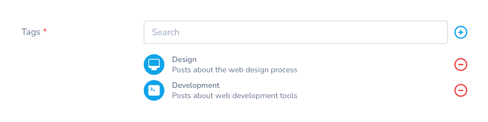

#### Creating New Tags Inline

For convenience, when `Tag` fields are shown on a resource create or update page, you may create the related resource inline via a modal window without leaving the creation / update page:

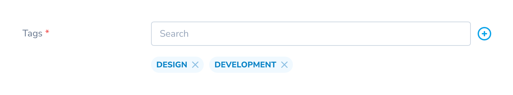

To enable this functionality, invoke the `showCreateRelationButton` method when defining the field:

```php
use Laravel\Nova\Fields\Tag;

// ...

return [
    Tag::make('Tags') # [!code focus:2]
        ->showCreateRelationButton(), # [!code ++]
];
```

#### Adjusting the Inline Creation Modal's Size

You may adjust the size of the modal using the `modalSize` method:

```php
use Laravel\Nova\Fields\Tag;

// ...

return [
    // Can be "sm", "md", "lg", "xl", "2xl", "3xl", "4xl", "5xl", "6xl", "7xl". # [!code focus:4]
    Tag::make('Tags')
        ->showCreateRelationButton()
        ->modalSize('7xl'), # [!code ++]
];
```

#### Preloading Available Tags

To make existing tags more discoverable, you may show the user all available tags during resource creation or update by invoking the `preload` method when defining the field:

```php
use Laravel\Nova\Fields\Tag;

// ...

return [
    Tag::make('Tags') # [!code focus:2]
        ->preload(), # [!code ++]
];
```

### Text Field

The `Text` field provides an `input` control with a `type` attribute of `text`:

```php
use Laravel\Nova\Fields\Text; # [!code ++]
use Laravel\Nova\Http\Requests\NovaRequest;

/**
 * Get the fields displayed by the resource.
 *
 * @return array<int, \Laravel\Nova\Fields\Field>
 */
public function fields(NovaRequest $request): array # [!code focus:6]
{
    return [
        Text::make('Name'), # [!code ++]
    ];
}
```

Text fields may be further customized by setting any attribute on the field. This can be done by calling the `withMeta` method and providing an `extraAttributes` array containing key / value pairs of HTML attributes:

```php
use Laravel\Nova\Fields\Text;

// ...

return [
    Text::make('Name') # [!code focus:6]
        ->withMeta([ # [!code ++:5]
            'extraAttributes' => ['placeholder' => 'David Hemphill'],
        ]),
];
```

#### Text Field Suggestions

To offer auto-complete suggestions when typing into the `Text` field, you may invoke the `suggestions` method when defining the field. The `suggestions` method should return an `array` of suggestions:

```php
use Laravel\Nova\Fields\Text;

// ...

return [
    Text::make('Name') # [!code focus:7]
    ->required()
    ->suggestions([ # [!code ++:5]
        'David Hemphill',
        'Taylor Otwell',
        'James Brooks',
    ]),
];
```

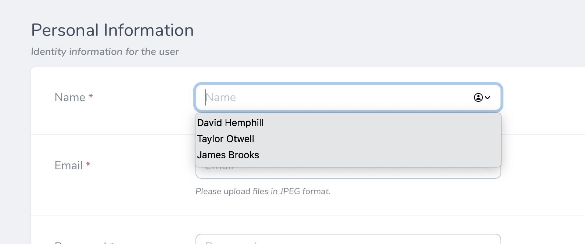

#### Formatting Text as Links

To format a `Text` field as a link, you may invoke the `asHtml` method when defining the field:

```php
use Laravel\Nova\Fields\Text;

// ...

return [
    Text::make('Twitter Profile', function () { # [!code focus:5]
        $username = $this->twitterUsername;

        return "<a href='https://twitter.com/{$username}'>@{$username}</a>";
    })->asHtml(), # [!code ++]
];
```

#### Copying Text Field Values to the Clipboard

Sometimes you may wish to copy the value of a field into the system clipboard for pasting elsewhere. You can enable this on the detail view for a resource by calling the `copyable` method on the `Text` field:

```php
use Laravel\Nova\Fields\Text;

// ...

return [
    Text::make('Twitter Profile') # [!code focus:2]
        ->copyable(), # [!code ++]
];
```

#### Setting `maxlength` on Text Fields

You may wish to indicate to the user that the content of a `Text` field should be kept within a certain length. You can do this by using the `maxlength` method on the field:

```php
use Laravel\Nova\Fields\Text;

// ...

return [
    Text::make('Name') # [!code focus:2]
        ->maxlength(250), # [!code ++]
];
```

Nova will display the maximum length for the field along with a character counter. However, Nova will not enforce the maximum length. To instruct Nova to enforce the limit, you may call the `enforceMaxlength` method on the field:

```php
use Laravel\Nova\Fields\Text;

// ...

return [
    Text::make('Name') # [!code focus:3]
        ->maxlength(250)
        ->enforceMaxlength(), # [!code ++]
];
```

### Textarea Field

The `Textarea` field provides a `textarea` control:

```php
use Laravel\Nova\Fields\Textarea; # [!code ++]
use Laravel\Nova\Http\Requests\NovaRequest;

/**
 * Get the fields displayed by the resource.
 *
 * @return array<int, \Laravel\Nova\Fields\Field>
 */
public function fields(NovaRequest $request): array # [!code focus:6]
{
    return [
        Textarea::make('Biography'), # [!code ++]
    ];
}
```

By default, Textarea fields will not display their content when viewing a resource's detail page. Instead, the contents of the field will be hidden behind a "Show Content" link, which will reveal the content when clicked. However, if you would like, you may specify that the `Textarea` field should always display its content by invoking the `alwaysShow` method on the field:

```php
Textarea::make('Biography')->alwaysShow(),
```

You may specify the `Textarea` height by invoking the `rows` method on the field:

```php
use Laravel\Nova\Fields\Textarea;

// ...

return [
    Textarea::make('Excerpt') # [!code focus:2]
        ->rows(3), # [!code ++]
];
```

`Textarea` fields may be further customized by setting any attribute on the field. This can be done by calling the `withMeta` method and providing an `extraAttributes` array containing key / value pairs of HTML attributes:

```php
use Laravel\Nova\Fields\Textarea;

// ...

return [
    Textarea::make('Excerpt') # [!code focus:4]
        ->withMeta([ # [!code ++:3]
            'extraAttributes' => ['placeholder' => 'Make it less than 50 characters']
        ]),
];
```

#### Setting `maxlength` on Textarea Fields

You may wish to indicate to the user that the content of a `Textarea` field should be kept within a certain length. You can do this by using the `maxlength` method on the field:

```php
use Laravel\Nova\Fields\Textarea;

// ...

return [
    Textarea::make('Name') # [!code focus:2]
        ->maxlength(250), # [!code ++]
];
```

Nova will display the maximum length for the field along with a character counter. However, Nova will not enforce the maximum length. To instruct Nova to enforce the limit, you may call the `enforceMaxlength` method on the field:

```php
use Laravel\Nova\Fields\Textarea;

// ...

return [
    Textarea::make('Name') # [!code focus:3]
        ->maxlength(250)
        ->enforceMaxlength(), # [!code ++]
];
```

### Timezone Field

The `Timezone` field generates a `Select` field containing a list of the world's timezones:

```php
use Laravel\Nova\Fields\Timezone; # [!code ++]
use Laravel\Nova\Http\Requests\NovaRequest;

/**
 * Get the fields displayed by the resource.
 *
 * @return array<int, \Laravel\Nova\Fields\Field>
 */
public function fields(NovaRequest $request): array # [!code focus:6]
{
    return [
        Timezone::make('Timezone'), # [!code ++]
    ];
}
```

### Trix Field

The `Trix` field provides a [Trix editor](https://github.com/basecamp/trix) for its associated field. Typically, this field will correspond to a `TEXT` column in your database. The `Trix` field will store its corresponding HTML within the associated database column:

```php
use Laravel\Nova\Fields\Trix; # [!code ++]
use Laravel\Nova\Http\Requests\NovaRequest;

/**
 * Get the fields displayed by the resource.
 *
 * @return array<int, \Laravel\Nova\Fields\Field>
 */
public function fields(NovaRequest $request): array # [!code focus:6]
{
    return [
        Trix::make('Biography'), # [!code ++]
    ];
}
```

By default, Trix fields will not display their content when viewing a resource on its detail page. Instead, the content will be hidden behind a "Show Content" link, which will reveal the field's content when clicked. If you would like, you may specify that the Trix field should always display its content by invoking the `alwaysShow` method when defining the field:

```php
use Laravel\Nova\Fields\Trix;

// ...

return [
    Trix::make('Biography') # [!code focus:2]
        ->alwaysShow(), # [!code ++]
];
```

#### Trix File Uploads

If you would like to allow users to drag-and-drop photos into the `Trix` field, you may chain the `withFiles` method onto the field's definition. When calling the `withFiles` method, you should pass the name of the [filesystem disk](https://laravel.com/docs/filesystem) that photos should be stored on:

```php
use Laravel\Nova\Fields\Trix;

// ...

return [
    Trix::make('Biography') # [!code focus:2]
        ->withFiles('public'), # [!code ++]
];
```

In addition, Nova will define two database tables to store pending and persisted `Field` uploads. These two tables will be created automatically when you run Nova's migrations during installation: `nova_pending_field_attachments` and `nova_field_attachments`.

Finally, in your `routes/console.php` file, you should register a [daily scheduled task](https://laravel.com/docs/scheduling) to prune any stale attachments from the pending attachments table and storage. For convenience, Laravel Nova provides the job implementation needed to accomplish this:

```php
use Illuminate\Console\Scheduling\Schedule; # [!code ++]
use Illuminate\Foundation\Application;
use Illuminate\Foundation\Configuration\Exceptions;
use Illuminate\Foundation\Configuration\Middleware;
use Laravel\Nova\Fields\Attachments\PruneStaleAttachments; # [!code ++] 

return Application::configure(basePath: dirname(__DIR__)) # [!code focus:7]
    // ...
    ->withSchedule(function (Schedule $schedule) { # [!code ++:3]
        $schedule->call(new PruneStaleAttachments)->daily();
    })
    // ...
    ->create();
```

### UI-Avatar Field

The `UiAvatar` field does not correspond to any column in your application's database. Instead, this field will generate a simple avatar containing the user's initials. This field is powered by [ui-avatars.com](https://ui-avatars.com).

By default, the `UiAvatar` image will be generated based on the value of the model's `name` column.

```php
use Laravel\Nova\Fields\UiAvatar; # [!code ++]
use Laravel\Nova\Http\Requests\NovaRequest;

/**
 * Get the fields displayed by the resource.
 *
 * @return array<int, \Laravel\Nova\Fields\Field>
 */
public function fields(NovaRequest $request): array # [!code focus:7]
{
    return [
        // Using the "name" column...
        UiAvatar::make(), # [!code ++]
    ];
}
```

However, if your user's names are not stored in the `name` column, you may pass a custom column name to the field's `make` method:
```php
use Laravel\Nova\Fields\UiAvatar;

// ...

return [
    // Using a custom column... # [!code focus:3]
    UiAvatar::make(), # [!code --]
    UiAvatar::make(attribute: 'full_name'), # [!code ++]
];
```

If necessary, you may invoke the `resolveUsing` method to specify a closure that should be invoked to determine the name that should be used to generate the avatar:

```php
use Laravel\Nova\Fields\UiAvatar;

// ...

return [
    UiAvatar::make() # [!code focus:2]
        ->resolveUsing(fn () => implode(' ', explode('@', $this->email))), # [!code ++]
];
```

You may use the `squared` method to display the image's thumbnail with squared edges. Additionally, you may use the `rounded` method to display the images with fully-rounded edges:

```php
use Laravel\Nova\Fields\UiAvatar;

// ...

return [
    UiAvatar::make(attribute: 'fullname') # [!code focus:2]
        ->squared(), # [!code ++]
];
```

Additional options available when defining `UiAvatar` fields include:

| Option           | Method                      | Description                                 |
| :--------------- | :-------------------------- | :------------------------------------------ |
| Font Size        | `fontSize(0.4)`             | Set a font size between `0.1` to `1`.       |
| Bold             | `bold()`                    | Set font weight to bold.                    |
| Background Color | `backgroundColor('1D4ED7')` | Set the hex color for the image background. |
| Text Color       | `color('FFFFFF')`           | Set the hex color for the image text.       |

### URL Field

The `URL` field renders URLs as clickable links instead of plain text:

```php
use Laravel\Nova\Fields\URL; # [!code ++]
use Laravel\Nova\Http\Requests\NovaRequest;

/**
 * Get the fields displayed by the resource.
 *
 * @return array<int, \Laravel\Nova\Fields\Field>
 */
public function fields(NovaRequest $request): array # [!code focus:6]
{
    return [
        URL::make('GitHub URL'), # [!code ++]
    ];
}
```

The `URL` field also supports customizing the generated link's text by invoking the `displayUsing` method when defining the field. The `displayUsing` method accepts a closure that should return the link's text:

```php
use Laravel\Nova\Fields\URL;

// ...

return [
    URL::make('Receipt') # [!code focus:2]
        ->displayUsing(fn () => "{optional($this->user)->name}'s receipt"), # [!code ++]
];
```

By providing a closure as the second argument to the `URL` field, you may use the field to render a link for a computed value that does not necessarily correspond to a column within the associated model's database table:

```php
use Laravel\Nova\Fields\URL;

// ...

return [
    URL::make('Receipt', fn () => $this->receipt_url) # [!code focus]
];
```

### Vapor File Field

The Vapor file field provides convenience and compatibility for uploading files when deploying applications to a serverless environment using [Laravel Vapor](https://vapor.laravel.com):

```php
use Laravel\Nova\Fields\VaporFile; # [!code ++]
use Laravel\Nova\Http\Requests\NovaRequest;

/**
 * Get the fields displayed by the resource.
 *
 * @return array<int, \Laravel\Nova\Fields\Field>
 */
public function fields(NovaRequest $request): array # [!code focus:6]
{
    return [
        VaporFile::make('Document'), # [!code ++]
    ];
}
```

When uploading a file using a `VaporFile` field, Nova will first generate a signed storage URL on Amazon S3. Next, Nova will upload the file directly to temporary storage in the Amazon S3 bucket. When the resource is saved, Nova will move the file to permanent storage.

:::tip Vapor Storage

For more information on how file storage is handled for Vapor applications, please refer to the [Laravel Vapor storage documentation](https://docs.vapor.build/1.0/resources/storage.html).
:::

### Vapor Image Field

Vapor file fields provide convenience and compatibility for uploading image files when deploying applications in a serverless environment using [Laravel Vapor](https://vapor.laravel.com):

```php
use Laravel\Nova\Fields\VaporImage; # [!code ++]
use Laravel\Nova\Http\Requests\NovaRequest;

/**
 * Get the fields displayed by the resource.
 *
 * @return array<int, \Laravel\Nova\Fields\Field>
 */
public function fields(NovaRequest $request): array # [!code focus:6]
{
    return [
        VaporImage::make('Avatar'), # [!code ++]
    ];
}
```

Vapor image files support many of the same methods available to [`Image`](#image-field) fields.

:::tip File Fields

To learn more about defining file fields and handling uploads, check out the additional [file field documentation](./file-fields.md).
:::

#### Validating Vapor Image / File Fields

In order to validate the size or other attributes of a Vapor file, you will need to inspect the file directly via the `Storage` facade:

```php
use Illuminate\Support\Facades\Storage; # [!code ++]
use Laravel\Nova\Fields\VaporFile;

// ...

return [
    VaporFile::make('Document') # [!code focus:6]
        ->rules('bail', 'required', function ($attribute, $value, $fail) use ($request) { # [!code ++:5]
            if (Storage::size($request->input('vaporFile')[$attribute]['key']) > 1000000) {
                return $fail('The document size may not be greater than 1 MB');
            }
        }),
];
```

## Computed Fields

In addition to displaying fields that are directly associated with columns in your database, Nova allows you to create "computed fields". Computed fields may be used to display computed values that are not associated with a database column. Since they are not associated with a database column, computed fields may not be `sortable`. These fields may be created by passing a callable (instead of a column name) as the second argument to the field's `make` method:

```php
use Laravel\Nova\Fields\Text;

// ...

return [
    Text::make('Name', fn () => $this->first_name.' '.$this->last_name), # [!code focus]
];
```

The model instance will be passed to the computed field callable, allowing you to access the model's properties while computing the field's value:

```php
use Laravel\Nova\Fields\Text;

// ...

return [
    Text::make('Name', fn () => $this->first_name.' '.$this->last_name), # [!code --] # [!code focus]
    Text::make('Name', fn ($model) => $model->first_name.' '.$model->last_name), # [!code ++] # [!code focus]
];
```

:::tip Model Attribute Access

As you may have noticed in the example above, you may also use `$this` to access the resource's underlying model attributes and relationships.
:::

By default, Vue will escape the content of a computed field. If you need to render HTML content within the field, invoke the `asHtml` method when defining your field:

```php
use Laravel\Nova\Fields\Text;

// ...

return [
    Text::make('Status', function () { # [!code focus:5]
        return view('partials.status', [
            'isPassing' => $this->isPassing(),
        ])->render();
    })->asHtml(), # [!code ++]
];
```

## Customization

### Readonly Fields

There are times where you may want to allow the user to only create and update certain fields on a resource. You can mark fields as "read only" by invoking the `readonly` method on the field, which will disable the field's corresponding input. You may pass a boolean argument to the `readonly` method to dynamically control whether a field should be "read only":

```php
use Laravel\Nova\Fields\Text;

// ...

return [
    Text::make('Email') # [!code focus:2]
        ->readonly(optional($this->resource)->trashed()), # [!code ++]
];
```

You may also pass a closure to the `readonly` method, and the result of the closure will be used to determine if the field should be "read only". The closure will receive the current `NovaRequest` as its first argument:

```php
use Laravel\Nova\Fields\Text;

// ...

return [
    Text::make('Email') # [!code focus:3]
        ->readonly(optional($this->resource)->trashed()) # [!code --]
        ->readonly(fn ($request) => ! $request->user()->isAdmin()), # [!code ++]
```

If you only want to mark a field as "read only" when creating or attaching resources, you may use the `isCreateOrAttachRequest` and `isUpdateOrUpdateAttachedRequest` methods available via the `NovaRequest` instance, respectively:

```php
use Laravel\Nova\Fields\Text;

// ...

return [
    Text::make('Email') # [!code focus:2]
        ->readonly(fn ($request) => $request->isUpdateOrUpdateAttachedRequest()), # [!code ++]
];

```

### Required Fields

By default, Nova will use a red asterisk to indicate a field is required:

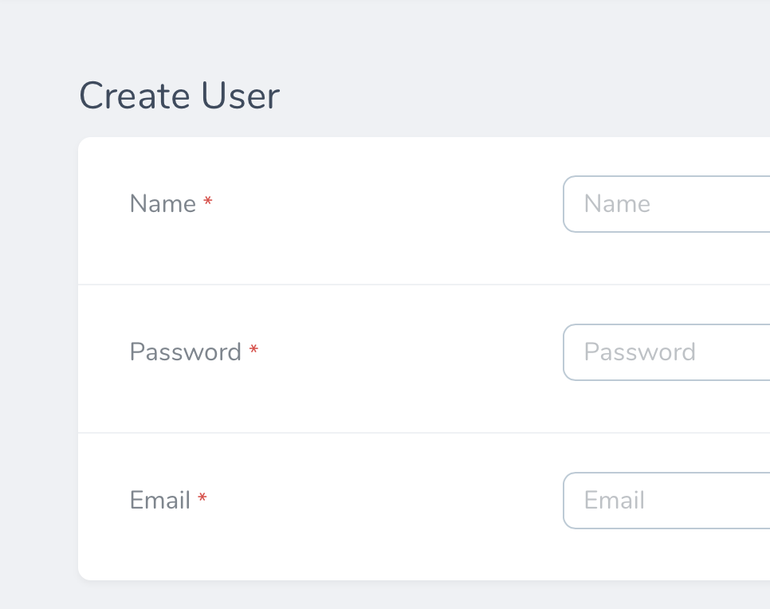

Nova does this by looking for the `required` rule inside the field's validation rules to determine if it should show the required state. For example, a field with the following definition would receive a "required" indicator:

```php
use Laravel\Nova\Fields\Text;

// ...

return [
    Text::make('Email') # [!code focus:2]
        ->rules('required'), # [!code ++]
];
```

When you have complex `required` validation requirements, you can manually mark the field as required by passing a boolean to the `required` method when defining the field. This will inform Nova that a "required" indicator should be shown in the UI:

```php
use Laravel\Nova\Fields\Text;

// ...

return [
    Text::make('Email') # [!code focus:2]
        ->required(true), # [!code ++]
];
```

In addition, you may also pass a closure to the `required` method to determine if the field should be marked as required. The closure will receive an instance of `NovaRequest`. The value returned by the closure will be used to determine if field is required:

```php
use Illuminate\Validation\Rule;
use Laravel\Nova\Fields\Text;

// ...

return [
    Text::make('Email') # [!code focus:2]
        ->required(fn ($request) => $this->notify_via_email), # [!code ++]
];
```

:::warning <code>required()</code> Limitations

The `required()` method will only add a "required" indicator to the Nova UI. You must still define the related requirement `rules()` that should apply during validation.
:::

### Nullable Fields

By default, Nova attempts to store all fields with a value, however, there are times where you may prefer that Nova store a `null` value in the corresponding database column when the field is empty. To accomplish this, you may invoke the `nullable` method on your field definition:

```php
use Laravel\Nova\Fields\Text;

// ...

return [
    Text::make('Position') # [!code focus:2]
        ->nullable(), # [!code ++]
];
```

You may also set which values should be interpreted as a `null` value using the `nullValues` method, which accepts an array or a closure as its only argument:

```php
use Laravel\Nova\Fields\Text;

// ...

return [
    Text::make('Position') # [!code focus:3]
        ->nullable()
        ->nullValues(['', '0', 'null']), # [!code ++]

    Text::make('Position') # [!code focus:5]
        ->nullable()
        ->nullValues(function ($value) { # [!code ++:3]
            return $value == '' || $value == 'null' || (int)$value === 0;
        }),
];
```

### Field Help Text

If you would like to place "help" text beneath a field, you may invoke the `help` method when defining your field:

```php
use Laravel\Nova\Fields\Text;

// ...

return [
    Text::make('Tax Rate') # [!code focus:4]
        ->help('The tax rate to be applied to the sale'), # [!code ++]
];
```

If necessary, you may include HTML within your field's help text to further customize the help text:

```php
use Laravel\Nova\Fields\Text;

// ...

return [
    Text::make('First Name') # [!code focus:2]
        ->help('<a href="#">External Link</a>'), # [!code ++]

    Text::make('Last Name') # [!code focus:2]
        ->help(view('partials.help-text', ['name' => $this->name])->render()), # [!code ++]
];
```

### Field Stacking

By default, Nova displays fields next to their labels on the create / update forms, however some fields like "Code", "Markdown", and "Trix" may benefit from the extra width that can be gained by placing the field under their corresponding labels. Fields can be stacked underneath their label using the `stacked` method:

```php
use Laravel\Nova\Fields\Trix;

// ...

return [
    Trix::make('Content') # [!code focus:2]
        ->stacked(), # [!code ++]
];
```

### Full Width Fields

You may indicate that the field should be "full width" using the `fullWidth` method:

```php
use Laravel\Nova\Fields\Trix;

// ...

return [
    Trix::make('Content') # [!code focus:2]
        ->fullWidth(), # [!code ++]
];
```

### Field Text Alignment

You may change the text alignment of fields using the `textAlign` method:

```php
use Laravel\Nova\Fields\Text;

// ...

return [
    Text::make('Phone Number') # [!code focus:2]
        ->textAlign('left'), # [!code ++]
];
```

The following alignments are valid:

- `left`
- `center`
- `right`

### Field Resolution / Formatting

The `resolveUsing` method allows you to customize how a field is formatted after it is retrieved from your database but before it is sent to the Nova front-end. This method accepts a callback which receives the raw value of the underlying database column:

```php
use Laravel\Nova\Fields\Text;

// ...

return [
    Text::make('Name') # [!code focus:2]
        ->resolveUsing(fn ($name) => strtoupper($name)), # [!code ++]
];
```

If you would like to customize how a field is formatted only when it is displayed on a resource's "index" or "detail" pages, you may use the `displayUsing` method. Like the `resolveUsing` method, this method accepts a single callback:

```php
use Laravel\Nova\Fields\Text;

// ...

return [
    Text::make('Name') # [!code focus:2]
        ->displayUsing(fn ($name) => strtoupper($name)), # [!code ++]
];
```

## Filterable Fields

The `filterable` method allows you to enable convenient, automatic [filtering](./../filters/defining-filters.md) functionality for a given field on resources, relationships, and lenses. The Nova generated filter will automatically be made available via the resource filter menu on the resource's index:

```php
use Laravel\Nova\Fields\DateTime;

// ...

return [
    DateTime::make('Created At') # [!code focus:2]
        ->filterable(), # [!code ++]
];
```

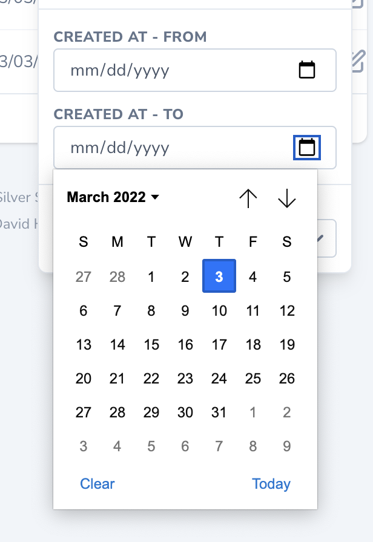

The `filterable` method also accepts a closure as an argument. This closure will receive the filter query, which you may then customize in order to filter the resource results to your liking:

```php
use Laravel\Nova\Fields\Text;

// ...

return [
    Text::make('Email') # [!code focus:4]
        ->filterable(function ($request, $query, $value, $attribute) { # [!code ++:3]
            $query->where($attribute, 'LIKE', "{$value}%");
        }),
];
```

The generated filter will be a text filter, select filter, number range filter, or date range filter depending on the underlying field type that was marked as filterable.

## Dependent Fields

The `dependsOn` method allows you to specify that a field's configuration depends on one or more other field's values. The `dependsOn` method accepts an `array` of dependent field attributes and a closure that modifies the configuration of the current field instance.

Dependent fields allow advanced customization, such as toggling read-only mode, validation rules, and more based on the state of another field:

```php
use Laravel\Nova\Fields\FormData;
use Laravel\Nova\Fields\Select;
use Laravel\Nova\Fields\Text;
use Laravel\Nova\Http\Requests\NovaRequest;

// ...

return [
    Select::make('Purchase Type', 'type') # [!code focus:17]
        ->options([
            'personal' => 'Personal',
            'gift' => 'Gift',
        ]),

    // Recipient field configuration is customized based on purchase type...
    Text::make('Recipient')
        ->readonly()
        ->dependsOn( # [!code ++:8]
            ['type'],
            function (Text $field, NovaRequest $request, FormData $formData) {
                if ($formData->type === 'gift') {
                    $field->readonly(false)->rules(['required', 'email']);
                }
            }
        ),
];
```

To define dependent fields separately for creating and updating resources, you may use the `dependsOnCreating` and `dependsOnUpdating` methods.

#### Supported Dependent Fields

The following field types may depend on other fields:

- Audio
- BelongsTo
- Boolean
- BooleanGroup
- Color
- Code
- Country
- Currency
- Date
- DateTime
- File
- Heading
- Hidden
- Image
- KeyValue
- Markdown
- MorphTo
- Number
- Password
- PasswordConfirmation
- Select
- Status
- Textarea
- Text
- Timezone
- Trix
- URL
- VaporAudio
- VaporFile
- VaporImage

The following field types may not be depended upon by other fields since they do not live-report their changes to Nova:

- Audio
- Code
- File
- Image
- KeyValue
- Status
- Tag
- Trix
- VaporAudio
- VaporFile
- VaporImage

#### Toggling Field Visibility using `dependsOn`

One common use-case for dependent fields is toggling field visibility based on the value of another field. You can accomplish this using the `hide` and `show` methods:

```php
use Laravel\Nova\Fields\BelongsTo;
use Laravel\Nova\Fields\Boolean;
use Laravel\Nova\Fields\FormData;
use Laravel\Nova\Http\Requests\NovaRequest;

// ...

return [
    Boolean::make('Anonymous Comment', 'anonymous') # [!code focus:11]
        ->default(true),

    BelongsTo::make('User')
        ->hide() # [!code ++]
        ->rules('sometimes')
        ->dependsOn('anonymous', function (BelongsTo $field, NovaRequest $request, FormData $formData) {
            if ($formData->boolean('anonymous') === false) { # [!code ++:3]
                $field->show()->rules('required');
            }
        }),
];
```

#### Setting a Field's Value Using `dependsOn`

Another common use-case for dependent fields is to set the value of a field based on the value of another field. You can accomplish this using the `setValue` method:

```php
use Laravel\Nova\Fields\DateTime;
use Laravel\Nova\Fields\FormData;
use Laravel\Nova\Http\Requests\NovaRequest;

// ...

return [
    DateTime::make('Created At'), # [!code focus:6]

    DateTime::make('Updated At')
        ->dependsOn(['created_at'], function (DateTime $field, NovaRequest $request, FormData $form) {
            $field->setValue(Carbon::parse($form->created_at)->addDays(7)); # [!code ++]
        }),
];
```

#### Accessing Request Resource IDs

When interacting with dependent fields, you may retrieve the current resource and related resource IDs via the `resource` method:

```php
use Laravel\Nova\Fields\BelongsTo;
use Laravel\Nova\Fields\Currency;
use Laravel\Nova\Fields\FormData;
use Laravel\Nova\Http\Requests\NovaRequest;

// ...

return [
    BelongsTo::make(__('Books'), 'books', Book::class), # [!code focus:18]

    Currency::make('Price')
        ->dependsOn('books', function (Currency $field, NovaRequest $request, FormData $formData) {
            $bookId = (int) $formData->resource(Book::uriKey(), $formData->books); # [!code ++]

            if ($bookId == 1) {
                $field->rules([
                    'required', 'numeric', 'min:10', 'max:199'
                ])->help('Price starts from $10-$199');

                return;
            }

            $field->rules([
                'required', 'numeric', 'min:0', 'max:99'
            ])->help('Price starts from $0-$99');
        }),
];
```

## Extending Fields

Fields are "macroable", which allows you to add additional methods to the `Field` class at run time. The `Field` class' `macro` method accepts a closure that will be executed when your macro is called. The macro closure may access the field's other methods via `$this`, just as if it were a real method of the field class. For example, the following code adds a `toUpper` method to the `Field` class:

```php
use Illuminate\Support\Str;
use Laravel\Nova\Fields\Field;

/**
 * Bootstrap any application services.
 */
public function boot(): void # [!code focus:8]
{
    Field::macro('toUpper', function () { # [!code ++:5]
        return $this->displayUsing(function ($value) {
            return Str::upper($value);
        });
    });
}
```

Once the macro has been defined, it may be used when defining any field:

```php
use Laravel\Nova\Fields\Text;

// ...

return [
    Text::make('Name') # [!code focus:2]
        ->toUpper(), # [!code ++]
];
```

#### Macro Arguments

If necessary, you may define macros that accept additional arguments:

```php
use Laravel\Nova\Fields\Field;

/**
 * Bootstrap any application services.
 */
public function boot(): void # [!code focus:8]
{
    Field::macro('showWhen', function ($condition) { # [!code ++:5]
        $condition === true ? $this->show() : $this->hide();

        return $this;
    });
}
```

#### Macro on Specific Fields

You can also add a macro only to a specific type of `Field`. For example, you might add a `withFriendlyDate` macro to the `DateTime` field class:

```php
use Laravel\Nova\Fields\DateTime;

/**
 * Bootstrap any application services.
 */
public function boot(): void # [!code focus:14]
{
    DateTime::macro('withFriendlyDate', function () { # [!code ++:11]
        return $this->tap(function ($field) {
            $field->displayUsing(function ($d) use ($field) {
                if ($field->isValidNullValue($d)) {
                    return null;
                }

                return Carbon::parse($d)->diffForHumans();
            });
        });
    });
}
```
