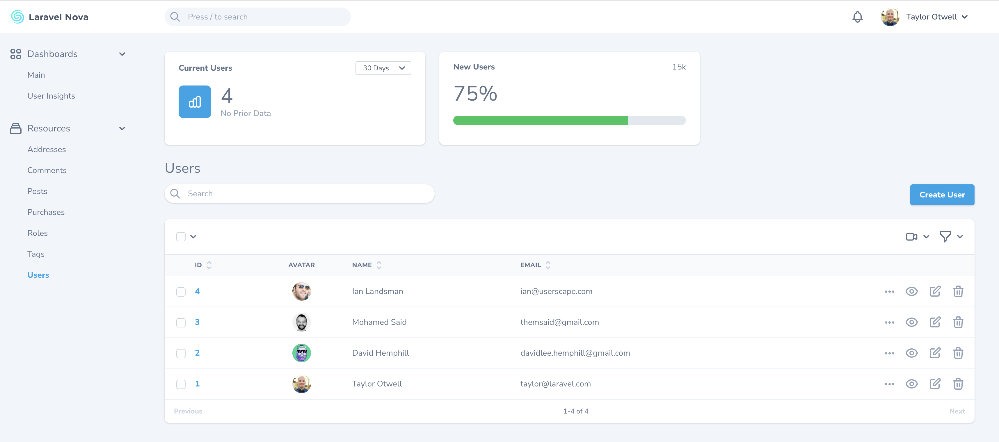
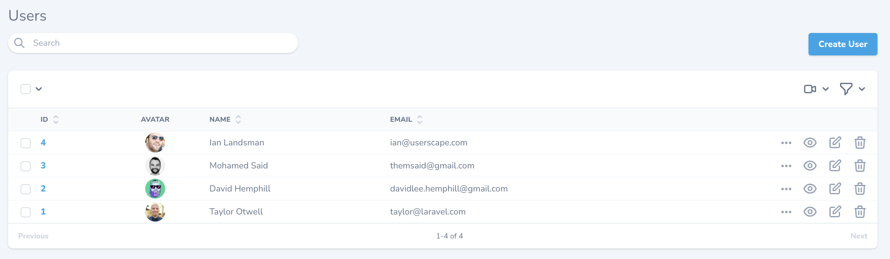
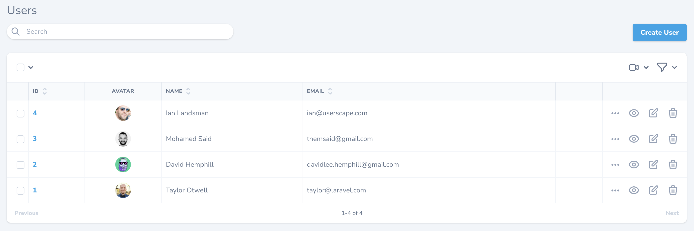
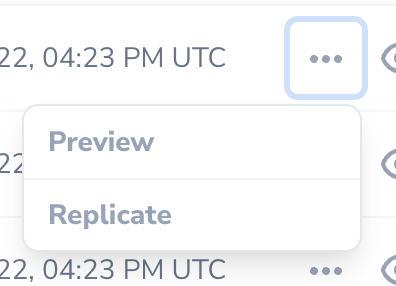
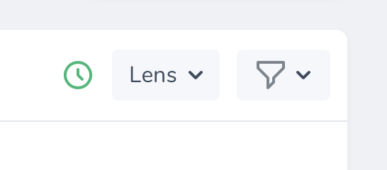
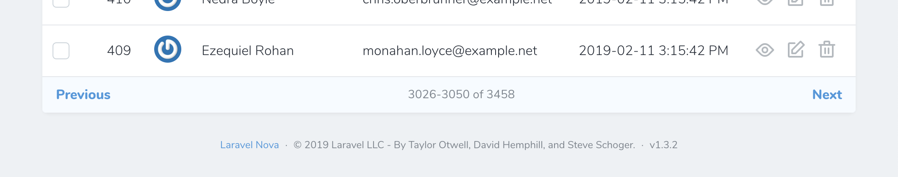
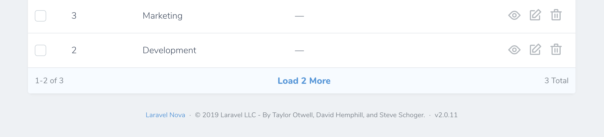
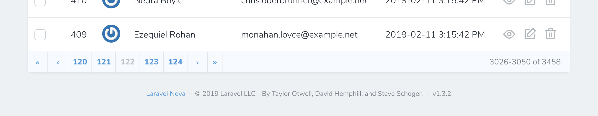

# The Basics

[[toc]]

## Introduction

Laravel Nova is a beautiful administration dashboard for Laravel applications. Of course, the primary feature of Nova is the ability to administer your underlying database records using Eloquent. Nova accomplishes this by allowing you to define a Nova "resource" that corresponds to each Eloquent model in your application.

## Defining Resources

By default, Nova resources are stored in the `app/Nova` directory of your application. You may generate a new resource using the `nova:resource` Artisan command:

```bash
php artisan nova:resource Post
```

The most basic and fundamental property of a resource is its `model` property. This property tells Nova which Eloquent model the resource corresponds to:

```php
namespace App\Nova;

class Post extends Resource # [!code focus]
{
    /**
     * The model the resource corresponds to.
     *
     * @var class-string
     */
    public static $model = \App\Models\Post::class; # [!code focus]
}
```

Freshly created Nova resources only contain an `ID` field definition. Don't worry, we'll add more fields to our resource soon.

:::warning Reserved Resource Names

Nova contains a few reserved words which may not be used for resource names:

- Card
- Dashboard
- Field
- Impersonate
- Metric
- Resource
- Search
- Script
- Style
- Tool
  :::

## Registering Resources

:::tip Automatic Registration

By default, all resources within the `app/Nova` directory will automatically be registered with Nova. You are not required to manually register them.
:::

Before resources are available within your Nova dashboard, they must first be registered with Nova. Resources are typically registered in your application's `app/Providers/NovaServiceProvider.php` file. This file contains various configuration and bootstrapping code related to your Nova installation.

**As mentioned above, you are not required to manually register your resources; however, if you choose to do so, you may do so by overriding the `resources` method of your `NovaServiceProvider`**.

There are two approaches to manually registering resources. You may use the `resourcesIn` method to instruct Nova to register all Nova resources within a given directory. Alternatively, you may use the `resources` method to manually register individual resources:

```php
namespace App\Providers;

use App\Nova\User;
use App\Nova\Post;
use Laravel\Nova\NovaApplicationServiceProvider;

class NovaServiceProvider extends NovaApplicationServiceProvider
{
    /**
     * Register the application's Nova resources.
     */
    protected function resources(): void # [!code focus:9]
    {
        Nova::resourcesIn(app_path('Nova'));

        Nova::resources([
            User::class, 
            Post::class, 
        ]); 
    }
}
```

Once your resources are registered with Nova, they will be available in the Nova sidebar:



If you do not want a resource to appear in the sidebar, you may override the `displayInNavigation` property of your resource class:

```php
namespace App\Nova;

class Post extends Resource
{
    /**
     * Indicates if the resource should be displayed in the sidebar.
     *
     * @var bool
     */
    public static $displayInNavigation = false; # [!code ++] # [!code focus]
}
```

#### Customizing Resource Menus

You can customize the resource's menu by defining a `menu` method on your resource class:

```php
namespace App\Nova;

use Illuminate\Http\Request; # [!code ++]

class Post extends Resource
{
    /**
     * The model the resource corresponds to.
     *
     * @var class-string
     */
    public static $model = \App\Models\Post::class;

    /**
     * Get the menu that should represent the resource.
     *
     * @return \Laravel\Nova\Menu\MenuItem
     */
    public function menu(Request $request) # [!code ++:6]  # [!code focus:6]
    {
        return parent::menu($request)->withBadge(function () {
            return static::$model::count();
        });
    }
}
```

Please refer to the documentation on [menu customization](./../customization/menus.html) for more information.

## Grouping Resources

If you would like to separate resources into different sidebar groups, you may override the `group` property of your resource class:

```php
namespace App\Nova;

class Post extends Resource
{
    /**
     * The logical group associated with the resource.
     *
     * @var string
     */
    public static $group = 'Admin'; # [!code ++] # [!code focus]
}
```

## Resource Table Style Customization

Nova supports a few visual customization options for your resources.

### Table Styles

Sometimes it's convenient to show more data on your resource index tables. To accomplish this, you can use the "tight" table style option designed to increase the visual density of your table rows. To accomplish this, override the static `$tableStyle` property or the static `tableStyle` method on your resource class:

```php
namespace App\Nova;

class Post extends Resource
{
    /**
     * The visual style used for the table. Available options are 'tight' and 'default'.
     *
     * @var string
     */
    public static $tableStyle = 'tight'; # [!code ++] # [!code focus]
}
```

This will display your table rows with less visual height, enabling more data to be shown:



### Column Borders

You can instruct Nova to display column borders by overriding the static `$showColumnBorders` property or the static `showColumnBorders` method on your resource class:

```php
namespace App\Nova;

class Post extends Resource
{
    /**
     * Whether to show borders for each column on the X-axis.
     *
     * @var bool
     */
    public static $showColumnBorders = true; # [!code ++] # [!code focus]
}
```

Setting this property to `true` will instruct Nova to display the table with borders on every table item:



## Resource Table Click Action

By default, when clicking on a resource table row, Nova will navigate to the detail view for the resource. However, you may want Nova to navigate to the edit form instead. You can customize this behavior by changing the `clickAction` property or the static `clickAction` method on your resource class:

```php
namespace App\Nova;

class Post extends Resource
{
    /**
     * The click action to use when clicking on the resource in the table.
     *
     * Can be one of: 'detail' (default), 'edit', 'select', 'preview', or 'ignore'.
     *
     * @var string
     */
    public static $clickAction = 'edit'; # [!code ++] # [!code focus]
}
```

Choosing the `select` option will select the resource row's checkbox. The `ignore` option instructs Nova to ignore click events altogether.

## Eager Loading

If you routinely need to access a resource's relationships within your fields, [resource title](./../search/global-search.md#title-subtitle-attributes), or [resource subtitle](./../search/global-search.md#title-subtitle-attributes), it may be a good idea to add the relationship to the `with` property of your resource. This property instructs Nova to always eager load the listed relationships when retrieving the resource.

For example, if you access a `Post` resource's `user` relationship within the `Post` resource's `subtitle` method, you should add the `user` relationship to the `Post` resource's `with` property:

```php
namespace App\Nova;

class Post extends Resource
{
    /**
     * The relationships that should be eager loaded on index queries.
     *
     * @var array
     */
    public static $with = ['user']; # [!code ++] # [!code focus]
}
```

## Resource Replication

Sometimes, you may want to create a new resource while using all of the data from an existing resource as a starting point. Nova's resource replication feature does just that. After clicking the replicate button, you'll be whisked away to a resource creation form with all of the replicated resource's data hydrated into the form and ready for tweaking:



To customize the replication model, you can override the `replicate` method on the resource class:

```php
namespace App\Nova;

class Post extends Resource
{
    /**
     * Return a replicated resource.
     *
     * @return static
     *
     * @throws \InvalidArgumentException
     */
    public function replicate() # [!code ++:8] # [!code focus:8]
    {
        return tap(parent::replicate(), function ($resource) {
            $model = $resource->model();

            $model->name = 'Duplicate of '.$model->name;
        });
    }
}
```

::: warning Attachments May Not Be Replicated

`Markdown` and `Trix` fields that use the `withFiles` method may not be replicated.
:::

If you need to store a reference to the original resource's ID, you may access the `fromResourceId` value on the replication request. Typically, this value would be accessed from an event listener or observer that is listening for the model's `creating` event:

```php
namespace App\Observers;

use App\Models\Post;
use Laravel\Nova\Http\Requests\NovaRequest; # [!code ++] # [!code focus]
use Laravel\Nova\Nova; # [!code ++] # [!code focus]

class PostObserver
{
    /**
     * Handle the creation of a new Post.
     *
     * @param  \App\Models\Post  $model
     * @return void
     */
    public function creating(Post $model): void # [!code focus:6]
    {
        Nova::whenServing(function (NovaRequest $request) use ($model) { # [!code ++:3]
            $model->parent_id = $request->input('fromResourceId'); 
        });
    }
}
```

## Resource Events

All Nova operations use the typical `save`, `delete`, `forceDelete`, `restore` Eloquent methods you are familiar with. Therefore, it is easy to listen for model events triggered by Nova and react to them. The easiest approach is to simply attach a Laravel [model observer](https://laravel.com/docs/eloquent#observers) to a model:

```php
namespace App\Providers;

use App\Models\User; # [!code ++]
use App\Observers\UserObserver; # [!code ++]
use Illuminate\Support\ServiceProvider;

class AppServiceProvider extends ServiceProvider
{
    /**
     * Bootstrap any application services.
     */
    public function boot(): void
    {
        parent::boot();

        User::observe(UserObserver::class);  # [!code ++] # [!code focus]
    }
}
```

If you would like to attach an observer whose methods are invoked **only during** Nova related HTTP requests, you may register observers using the `make` method provided by the `Laravel\Nova\Observable` class. Typically, this should be done within your application's `NovaServiceProvider`:

```php
namespace App\Providers;

use App\Models\User; # [!code ++]
use Laravel\Nova\Observable; # [!code ++] # [!code focus]
use App\Observers\UserObserver; # [!code ++]
use Laravel\Nova\NovaApplicationServiceProvider;

class NovaServiceProvider extends NovaApplicationServiceProvider
{
    /**
     * Bootstrap any application services.
     */
    public function boot(): void
    {
        parent::boot();

        Observable::make(User::class, UserObserver::class); # [!code ++] # [!code focus]

        //
    }
}
```

Alternatively, you can determine if the current HTTP request is serving a Nova related request within the `Observer` itself using Nova's `whenServing` method:

```php
namespace App\Observers;

use App\Models\User;
use Illuminate\Http\Request; # [!code ++] # [!code focus]
use Laravel\Nova\Http\Requests\NovaRequest; # [!code ++] # [!code focus]
use Laravel\Nova\Nova; # [!code ++] # [!code focus]

class UserObserver
{
    /**
     * Handle the User "created" event.
     *
     * @param  \App\Models\User  $user
     * @return void
     */
    public function created(User $user) # [!code focus:10]
    {
        Nova::whenServing(function (NovaRequest $request) use ($user) { # [!code ++:5]
            // Only invoked during Nova requests...
        }, function (Request $request) use ($user) {
            // Invoked for non-Nova requests...
        });

        // Always invoked...
    }
}
```

### Resource Hooks

Nova also allows you to define the following static methods on a resource to serve as hooks that are only invoked when the corresponding resource action is executed from within Laravel Nova:

- `afterCreate`
- `afterUpdate`
- `afterDelete`
- `afterForceDelete`
- `afterRestore`

For example, you may want to send an email verification notification after a user has been created within Nova:

```php
namespace App\Nova;

use App\Nova\Resource;
use Illuminate\Database\Eloquent\Model; # [!code ++]
use Laravel\Nova\Http\Requests\NovaRequest;

class User extends Resource
{
    /**
     * Register a callback to be called after the resource is created.
     *
     * @param  \Laravel\Nova\Http\Requests\NovaRequest  $request
     * @param  \Illuminate\Database\Eloquent\Model  $model
     * @return void
     */
    public static function afterCreate(NovaRequest $request, Model $model) # [!code ++:4] # [!code focus:4]
    {
        $model->sendEmailVerificationNotification();
    }
}
```

## Preventing Conflicts

If a model has been updated since it was last retrieved by Nova, Nova will automatically respond with a `409 Conflict` HTTP status code and display an error message to prevent unintentional model changes. This may occur if another user updates the model after you have opened the "Edit" page on the resource. This feature is also known as the Nova "Traffic Cop".

### Disabling Traffic Cop

If you are not concerned with preventing conflicts, you can disable the Traffic Cop feature by setting the `trafficCop` property to `false` on a given resource class:

```php
namespace App\Nova;

class User extends Resource
{
    /**
     * Indicates whether Nova should check for modifications between viewing and updating a resource.
     *
     * @var bool
     */
    public static $trafficCop = false; # [!code ++] # [!code focus]
}
```

You may also override the `trafficCop` method on the resource if you have more intense customization needs in order to determine if this feature should be enabled:

```php
namespace App\Nova;

class User extends Resource
{
    /**
     * Indicates whether Nova should check for modifications between viewing and updating a resource.
     *
     * @param  \Illuminate\Http\Request  $request
     * @return  bool
    */
    public static function trafficCop(Request $request) # [!code ++:4] # [!code focus:4]
    {
        return false;
    }
}
```

:::tip Time Synchronization

If you are experiencing issues with traffic cop you should ensure that your system time is correctly synchronized using NTP.
:::

## Resource Polling

Nova can automatically fetch the latest records for a resource at a specified interval. To enable polling, override the `polling` property of your Resource class:

```php
namespace App\Nova;

class User extends Resource
{
    /**
     * Indicates whether the resource should automatically poll for new resources.
     *
     * @var bool
     */
    public static $polling = true; # [!code ++] # [!code focus]
}
```

To customize the polling interval, you may override the `pollingInterval` property on your resource class with the number of seconds Nova should wait before fetching new resource records:

```php
namespace App\Nova;

class User extends Resource
{
    /**
     * The interval at which Nova should poll for new resources.
     *
     * @var int
     */
    public static $pollingInterval = 5; # [!code ++] # [!code focus]
}
```

## Toggling Resource Polling

By default, when resource polling is enabled, there is no way to disable it once the page loads. You can instruct Nova to display a start / stop toggle button for resource polling by setting the `showPollingToggle` property on your resource class to `true`:

```php
namespace App\Nova;

class User extends Resource
{
    /**
     * Indicates whether to show the polling toggle button inside Nova.
     *
     * @var bool
     */
    public static $showPollingToggle = true; # [!code ++] # [!code focus]
}
```

Nova will then display a clickable button that you may use to enable / disable polling for the resource:



## Redirection

Nova allows you to easily customize where a user is redirected after performing resource actions such as creating or updating a resource:

- [redirectAfterCreate()](#after-creating-redirection)
- [redirectAfterUpdate()](#after-updating-redirection)
- [redirectAfterDelete()](#after-deletion-redirection)

Behind the scenes, Nova's redirect features use Inertia.js's `visit` method. Because of this, redirection is limited to paths within Laravel Nova. You may invoke the `URL::remote` method to redirect to an external URL:

```php
use Laravel\Nova\URL;

return URL::remote('https://nova.laravel.com'); # [!code focus]
```

#### After Creating Redirection

You may customize where a user is redirected after creating a resource using by overriding your resource's `redirectAfterCreate` method:

```php
namespace App\Nova;

use Laravel\Nova\Http\Requests\NovaRequest;
use Laravel\Nova\Resource as NovaResource; # [!code ++]

class User extends Resource
{
    /**
     * Return the location to redirect the user after creation.
     *
     * @param  \Laravel\Nova\Resource  $resource
     * @return \Laravel\Nova\URL|string
     */
    public static function redirectAfterCreate( # [!code ++:6] # [!code focus:6]
        NovaRequest $request, 
        NovaResource $resource
    ) {
        return '/resources/'.static::uriKey().'/'.$resource->getKey();
    }
}
```

#### After Updating Redirection

You may customize where a user is redirected after updating a resource using by overriding your resource's `redirectAfterUpdate` method:

```php
namespace App\Nova;

use Laravel\Nova\Http\Requests\NovaRequest;
use Laravel\Nova\Resource as NovaResource; # [!code ++]

class User extends Resource
{
    /**
     * Return the location to redirect the user after update.
     *
     * @param  \Laravel\Nova\Resource  $resource
     * @return \Laravel\Nova\URL|string
     */
    public static function redirectAfterUpdate( # [!code ++:6] # [!code focus:6]
        NovaRequest $request, 
        NovaResource $resource
    ) {
        return '/resources/'.static::uriKey().'/'.$resource->getKey();
    }
}
```

#### After Deletion Redirection

You may customize where a user is redirected after deleting a resource using by overriding your resource's `redirectAfterDelete` method:

```php
namespace App\Nova;

use Laravel\Nova\Http\Requests\NovaRequest;

class User extends Resource
{
    /**
     * Return the location to redirect the user after deletion.
     *
     * @return \Laravel\Nova\URL|string|null
     */
    public static function redirectAfterDelete(NovaRequest $request) # [!code ++:4] # [!code focus:4]
    {
        return null;
    }
}
```

## Pagination

Nova has the ability to show pagination links for your Resource listings. You can choose between three different styles: "simple", "load-more", and "links", depending on your application's needs:







By default, Nova Resources are displayed using the "simple" style. However, you may customize this to use either the `load-more` or `links` styles by changing the value of the `pagination` configuration option within your application's `config/nova.php` configuration file:

```php
return [

    // ...

    'pagination' => 'simple', # [!code --] # [!code focus]
    'pagination' => 'links', # [!code ++] # [!code focus]

],
```

### Customizing Pagination

If you would like to customize the selectable maximum result amounts shown on each resource's "per page" filter menu, you can do so by customizing the resource's `perPageOptions` property:

```php
namespace App\Nova;

class User extends Resource
{
    /**
     * The pagination per-page options configured for this resource.
     *
     * @return array
     */
    public static $perPageOptions = [50, 100, 150]; # [!code ++] # [!code focus]
}
```

Alternatively, you can override the `perPageOptions` method on your application's base `Resource` class, which is created when you install Nova:

```php
namespace App\Nova;

class User extends Resource
{
    /**
     * The pagination per-page options configured for this resource.
     *
     * @return array
     */
    public static function perPageOptions() # [!code ++:4] # [!code focus:4]
    {
        return [50, 100, 150];
    }
}
```

:::tip Customizing <code>perPageOptions</code> & Resource Fetching

Changing the value of `perPageOptions` on your `Resource` will cause Nova to fetch the number of resources equal to the first value in the `perPageOptions` array.
:::

Using the `$perPageViaRelationship` property, you may also customize the number of resources displayed when a particular resource is displayed on another resource's detail view as a relationship:

```php
namespace App\Nova;

class User extends Resource
{
    /**
     * The number of resources to show per page via relationships.
     *
     * @var int
     */
    public static $perPageViaRelationship = 10; # [!code ++] # [!code focus]
}
```

## CSV Export

Occasionally you may need to export a group of resource records as a CSV file so that you can interact with the data in a spreadsheet application or import the data into another system. Thankfully, Nova includes built-in support for exporting resource data.

To get started, add the `Laravel\Nova\Actions\ExportAsCsv` [action](./../actions/registering-actions.md) to your Nova resource:

```php
namespace App\Nova;

use Laravel\Nova\Actions\ExportAsCsv; # [!code ++] # [!code focus]
use Laravel\Nova\Http\Requests\NovaRequest;

class User extends Resource
{
    /**
     * Get the actions available for the resource.
     *
     * @return array<int, \Laravel\Nova\Actions\Action>
     */
    public function actions(NovaRequest $request): array # [!code focus:6]
    {
        return []; # [!code --]
        return [ # [!code ++:3]
            ExportAsCsv::make(),
        ];
    }
```

If you would like to allow the user to name the CSV file that is downloaded, you may invoke the `nameable` method when registering the action:

```php
use Laravel\Nova\Actions\ExportAsCsv;

return [
    ExportAsCsv::make()  # [!code focus:2]
        ->nameable(), # [!code ++]
];
```

If you would like to customize and format the fields that are included in the generated CSV, you may invoke the `withFormat` method when registering the action:

```php
use Laravel\Nova\Actions\ExportAsCsv;

return [
    ExportAsCsv::make() # [!code focus:6]
        ->withFormat(fn ($model) => [ # [!code ++:5]
            'ID' => $model->getKey(),
            'Name' => $model->name,
            'Email Address' => $model->email,
        ]),
];
```

## Resource Index Search Debounce

You may wish to customize the search debounce timing of an individual resource's index listing. For example, the queries executed to retrieve some resources may take longer than others. You can customize an individual resource's search debounce by setting the `debounce` property on the resource class:

```php
namespace App\Nova;

class User extends Resource
{
    /**
     * The debounce amount (in seconds) to use when searching this resource.
     *
     * @var float
     */
    public static $debounce = 0.5; // 0.5 seconds # [!code ++] # [!code focus]
}
```

## Keyboard Shortcuts

You may press the `C` key on a resource index to navigate to the "Create Resource" page. On the resource detail page, the `E` key may be used to navigate to the "Update Resource" page.
