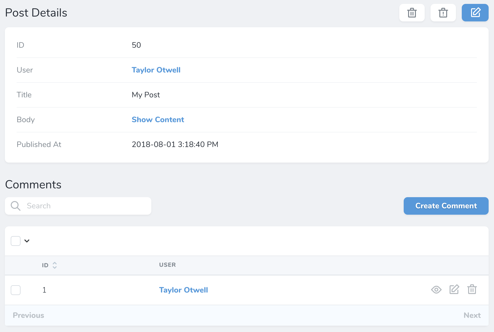
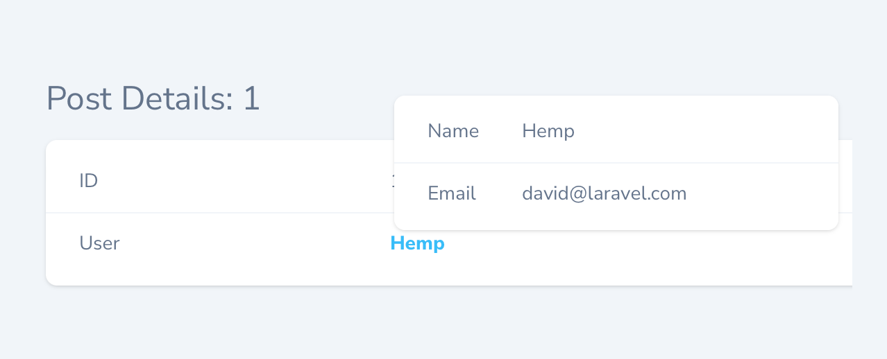
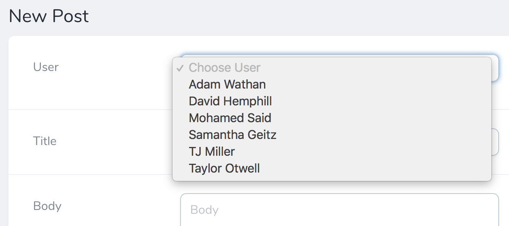
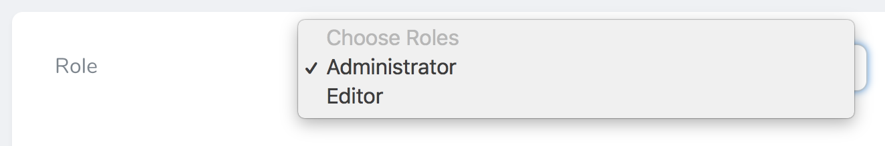
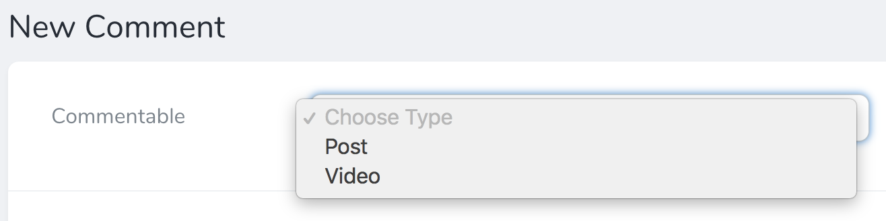
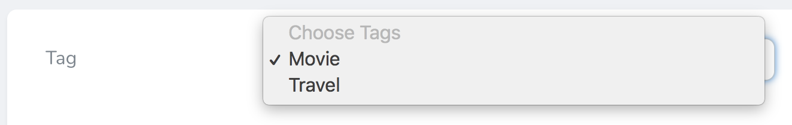
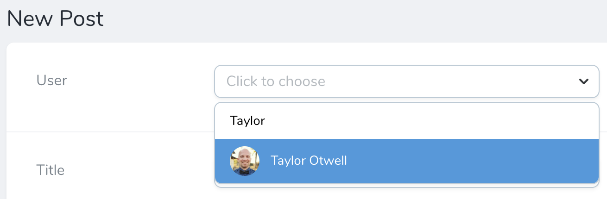
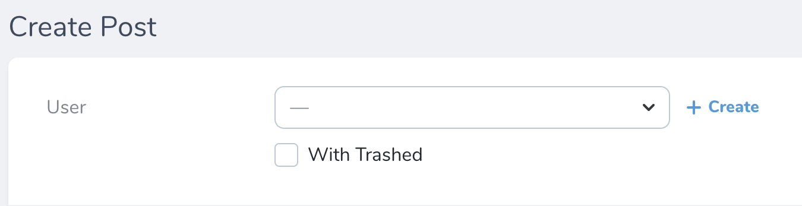

# Relationships

[[toc]]

In addition to the variety of fields we've already discussed, Nova has full support for all of Laravel's relationships. Once you add relationship fields to your Nova resources, you'll start to experience the full power of the Nova dashboard, as the resource detail page will allow you to quickly view and search a resource's related models:



## HasOne

The `HasOne` field corresponds to a `hasOne` Eloquent relationship. For example, let's assume a `User` model `hasOne` `Address` model. We may add the relationship to our `User` Nova resource like so:

```php
namespace App\Nova;

use Laravel\Nova\Fields\HasOne; # [!code ++]
use Laravel\Nova\Http\Requests\NovaRequest;

class User extends Resource
{
    /**
     * Get the fields displayed by the resource.
     *
     * @return array<int, \Laravel\Nova\Fields\Field>
     */
    public function fields(NovaRequest $request): array # [!code focus:6]
    {
        return [
            HasOne::make('Address'), # [!code ++]
        ];
    }
}
```

Like other types of fields, relationship fields will automatically "camel case" the displayable name of the field to determine the underlying relationship method / attribute. However, you may explicitly specify the name of the relationship method by passing it as the second argument to the field's `make` method:

```php
use Laravel\Nova\Fields\HasOne; 

// ...

return [
    HasOne::make('Address'), # [!code --]
    HasOne::make('Dirección', 'address'), # [!code ++]
];
```

### HasOneOfMany

The `HasOne` relationship field can be transformed into an "has one of many" Eloquent relationship using the `ofMany` method. For example, let's assume a `User` model `hasMany` `Post` models. We may add the "has one of many" relationship to our `User` Nova resource like so:

```php
namespace App\Nova;

use App\Nova\Post; # [!code ++]
use Laravel\Nova\Fields\HasOne; # [!code ++]
use Laravel\Nova\Http\Requests\NovaRequest;

class User extends Resource
{
    /**
     * Get the fields displayed by the resource.
     *
     * @return array<int, \Laravel\Nova\Fields\Field>
     */
    public function fields(NovaRequest $request): array # [!code focus:6]
    {
        return [
            HasOne::ofMany('Latest Post', 'latestPost', Post::class), # [!code ++]
        ];
    }
}
```

## HasMany

The `HasMany` field corresponds to a `hasMany` Eloquent relationship. For example, let's assume a `User` model `hasMany` `Post` models. We may add the relationship to our `User` Nova resource like so:

```php
namespace App\Nova;

use Laravel\Nova\Fields\HasMany; # [!code ++]
use Laravel\Nova\Http\Requests\NovaRequest;

class User extends Resource
{
    /**
     * Get the fields displayed by the resource.
     *
     * @return array<int, \Laravel\Nova\Fields\Field>
     */
    public function fields(NovaRequest $request): array # [!code focus:6]
    {
        return [
            HasMany::make('Posts'), # [!code ++]
        ];
    }
}
```

Once the field has been added to your resource, it will be displayed on the resource's detail page.

:::warning Plural Resource Names

When defining `HasMany` relationships, make sure to use the plural form of the relationship so Nova can infer the correct singular resource name:

```php
HasMany::make('Posts'),
```

:::

## HasOneThrough

The `HasOneThrough` field corresponds to a `hasOneThrough` Eloquent relationship. For example, let's assume a `Mechanic` model has one `Car`, and each `Car` may have one `Owner`. While the `Mechanic` and the `Owner` have no direct connection, the `Mechanic` can access the `Owner` through the `Car` itself. You can display this relationship by adding it to your Nova resource:

```php
namespace App\Nova;

use Laravel\Nova\Fields\HasOneThrough; # [!code ++]
use Laravel\Nova\Http\Requests\NovaRequest;

class Mechanic extends Resource
{
    /**
     * Get the fields displayed by the resource.
     *
     * @return array<int, \Laravel\Nova\Fields\Field>
     */
    public function fields(NovaRequest $request): array # [!code focus:6]
    {
        return [
            HasOneThrough::make('Owner'), # [!code ++]
        ];
    }
}
```

## HasManyThrough

The `HasManyThrough` field corresponds to a `hasManyThrough` Eloquent relationship. For example, a `Country` model might have many `Post` models through an intermediate `User` model. In this example, you could easily gather all blog posts for a given country. To display this relationship within Nova, you may add it to your Nova resource:

```php
namespace App\Nova;

use Laravel\Nova\Fields\HasManyThrough; # [!code ++]
use Laravel\Nova\Http\Requests\NovaRequest;

class Country extends Resource
{
    /**
     * Get the fields displayed by the resource.
     *
     * @return array<int, \Laravel\Nova\Fields\Field>
     */
    public function fields(NovaRequest $request): array # [!code focus:6]
    {
        return [
            HasManyThrough::make('Posts'), # [!code ++]
        ];
    }
}
```

## BelongsTo

The `BelongsTo` field corresponds to a `belongsTo` Eloquent relationship. For example, let's assume a `Post` model `belongsTo` a `User` model. We may add the relationship to our `Post` Nova resource like so:

```php
namespace App\Nova;

use Laravel\Nova\Fields\BelongsTo; # [!code ++]
use Laravel\Nova\Http\Requests\NovaRequest;

class Post extends Resource
{
    /**
     * Get the fields displayed by the resource.
     *
     * @return array<int, \Laravel\Nova\Fields\Field>
     */
    public function fields(NovaRequest $request): array # [!code focus:6]
    {
        return [
            BelongsTo::make('User'), # [!code ++]
        ];
    }
}
```

:::tip Customizing Resource Classes
You may customize the resource class used by the relation field by providing the second and third arguments of the `make` method, which define the name of the relationship and the underlying Nova resource class:

```php
BelongsTo::make('Author', 'author', 'App\Nova\User'),
```

:::

### Peeking at BelongsTo Relationships

When hovering over a `BelongsTo` link when viewing the index or detail views, Nova will show a small card allowing you to "take a peek" at the linked relation:



### Preventing Peeking at `BelongsTo` Relationships

Relationship peeking is enabled by default; however, you can prevent the user from peeking at the relation using the `noPeeking` helper on your `BelongsTo` field:

```php
use Laravel\Nova\Fields\BelongsTo;

// ...

return [
    BelongsTo::make('Author') # [!code focus:2]
        ->noPeeking(), # [!code ++]
];
```

You may also use the `peekable` method to determine whether the user should be allowed to peek at the relation:

```php
use Laravel\Nova\Fields\BelongsTo;

// ...

return [
    BelongsTo::make('Author') # [!code focus:4]
        ->peekable(function (NovaRequest $request) {  # [!code ++:3]
            return $request->isResourceDetailRequest();
        }),
];
```

#### Nullable Relationships

If you would like your `BelongsTo` relationship to be `nullable`, you may simply chain the `nullable` method onto the field's definition:

```php
use Laravel\Nova\Fields\BelongsTo;

// ...

return [
    BelongsTo::make('User') # [!code focus:2]
        ->nullable(), # [!code ++]
];
```

#### Title Attributes

When a `BelongsTo` field is shown on a resource creation / update page, a drop-down selection menu or search menu will display the "title" of the resource. For example, a `User` resource may use the `name` attribute as its title. Then, when the resource is shown in a `BelongsTo` selection menu, that attribute will be displayed:



To customize the "title" attribute of a resource, you may define a `title` property on the resource class:

```php
namespace App\Nova;

class User extends Resource 
{
    /**
     * The single value that should be used to represent the resource when being displayed.
     *
     * @var string
     */
    public static $title = 'name'; # [!code ++] # [!code focus]
}
```

Alternatively, you may override the resource's `title` method:

```php
namespace App\Nova;

class User extends Resource 
{
    /**
     * Get the value that should be displayed to represent the resource.
     *
     * @return string
     */
    public function title() # [!code ++:4] # [!code focus:4]
    {
        return $this->name;
    }
}
```

#### Disable Ordering by Title

By default, associatable resources will be sorted by their title when listed in a select dropdown. Using the `dontReorderAssociatables` method, you can disable this behavior so that the resources as sorted based on the ordering specified by the [relatable query](./authorization.html#relatable-filtering):

```php
use Laravel\Nova\Fields\BelongsTo;

// ...

return [
    BelongsTo::make('User') # [!code focus:2]
        ->dontReorderAssociatables(), # [!code ++]
];
```

#### Filter Trashed Items

By default, the `BelongsTo` field will allow users to select soft-deleted models; however, this can be disabled using the `withoutTrashed` method:

```php
use Laravel\Nova\Fields\BelongsTo;

// ...

return [
    BelongsTo::make('User') # [!code focus:2]
        ->withoutTrashed(), # [!code ++]
];
```

## BelongsToMany

The `BelongsToMany` field corresponds to a `belongsToMany` Eloquent relationship. For example, let's assume a `User` model `belongsToMany` `Role` models:

```php
namespace App\Models;

use Illuminate\Database\Eloquent\Relations\BelongsToMany;
use Illuminate\Foundation\Auth\User as Authenticatable;

class User extends Authenticatable 
{
    public function roles(): BelongsToMany # [!code focus:4]
    {
        return $this->belongsToMany(Role::class);
    }
}
```

We may add the relationship to our `User` Nova resource like so:

```php
namespace App\Nova;

use Laravel\Nova\Fields\BelongsToMany; # [!code ++]
use Laravel\Nova\Http\Requests\NovaRequest;

class User extends Resource
{
    /**
     * Get the fields displayed by the resource.
     *
     * @return array<int, \Laravel\Nova\Fields\Field>
     */
    public function fields(NovaRequest $request): array # [!code focus:6]
    {
        return [ 
            BelongsToMany::make('Roles'), # [!code ++]
        ];
    }
}
```

You may customize the resource class used by the relationship field by providing the second and third arguments to the `make` method:

```php
use Laravel\Nova\Fields\BelongsToMany;

// ...

return [ 
    BelongsToMany::make('Roles'), # [!code --]
    BelongsToMany::make('Roles', 'roles', Role::class), # [!code ++]
];
```

Once the field has been added to your resource, it will be displayed on the resource's detail page.

#### Pivot Fields

If your `belongsToMany` relationship interacts with additional "pivot" fields that are stored on the intermediate table of the many-to-many relationship, you may also attach those to your `BelongsToMany` Nova relationship. Once these fields are attached to the relationship field, and the relationship has been defined on both of the related models / resources, they will be displayed on the related resource index.

For example, let's assume our `User` model `belongsToMany` `Role` models. On our `role_user` intermediate table, let's imagine we have a `notes` field that contains some simple text notes about the relationship. We can attach this pivot field to the `BelongsToMany` field using the `fields` method:

```php
namespace App\Nova;

use Laravel\Nova\Fields\BelongsToMany;
use Laravel\Nova\Fields\Text;
use Laravel\Nova\Http\Requests\NovaRequest;

class User extends Resource # [!code focus]
{
    /**
     * Get the fields displayed by the resource.
     *
     * @return array<int, \Laravel\Nova\Fields\Field>
     */
    public function fields(NovaRequest $request): array
    {
        return [
            BelongsToMany::make('Roles') # [!code focus:4]
                ->fields(fn ($request, $relatedModel) => [ # [!code ++:3]
                    Text::make('Notes'),
                ]),
        ];
    }
}
```

Of course, it is likely we would also define this field on the inverse of the relationship. So, if we define the `BelongsToMany` field on the `User` resource, we would define its inverse on the `Role` resource:

```php
namespace App\Nova;

use Laravel\Nova\Fields\BelongsToMany;
use Laravel\Nova\Fields\Text;
use Laravel\Nova\Http\Requests\NovaRequest;

class Role extends Resource # [!code focus]
{
    /**
     * Get the fields displayed by the resource.
     *
     * @return array<int, \Laravel\Nova\Fields\Field>
     */
    public function fields(NovaRequest $request): array
    {
        return [
            BelongsToMany::make('Users') # [!code focus:4]
                ->fields(fn ($request, $relatedModel) => [ # [!code ++:3]
                    Text::make('Notes'),
                ]),
        ];
    }
}
```

:::warning Pivot fields must be defined
Don't forget to define the pivot fields inside your Model's relationship definition using the
`withPivot` method:
[https://laravel.com/docs/eloquent-relationships#retrieving-intermediate-table-columns](https://laravel.com/docs/eloquent-relationships#retrieving-intermediate-table-columns)
:::

Since defining the field on both ends of the relationship can cause some code duplication, Nova allows you to pass an invokable object to the `fields` method:

```php
use App\Nova\RoleUserFields; # [!code ++]
use Laravel\Nova\Fields\BelongsToMany;

// ...

return [
    BelongsToMany::make('Users') # [!code focus:2]
        ->fields(new RoleUserFields), # [!code ++]
];
```

In this example, the `RoleUserFields` class would be a simple, invokable class that returns the array of pivot fields:

```php
namespace App\Nova;

use Illuminate\Database\Eloquent\Model;
use Laravel\Nova\Fields\Text;
use Laravel\Nova\Http\Requests\NovaRequest;

class RoleUserFields
{
    /**
     * Get the pivot fields for the relationship.
     */
    public function __invoke(NovaRequest $request, Model $relatedModel): array
    {
        return [
            Text::make('Notes'),
        ];
    }
}
```

#### Pivot Computed Fields

Laravel Nova also allows you to define computed fields within the field list of a `belongsToMany` relationship field:

```php
use Laravel\Nova\Fields\BelongsToMany;

// ...

return [
    BelongsToMany::make('Users') # [!code focus:8]
        ->fields(fn ($request, $relatedModel) => [
            Text::make('Notes'),

            Boolean::make( # [!code ++:3] 
                'Has Notes', fn ($pivot) => ! empty($pivot->notes),
            ),
        ]),
];
```

#### Pivot Actions

Typically, [Nova actions](./../actions/defining-actions.md) operate on a resource. However, you may also attach actions to `belongsToMany` fields so that they can operate on pivot / intermediate table records. To accomplish this, you may chain the `actions` method onto your field's definition:

```php
use App\Nova\Actions\MarkAsActive; # [!code ++]
use Laravel\Nova\Fields\BelongsToMany;

// ...

return [
    BelongsToMany::make('Roles') # [!code focus:4]
        ->actions(fn () => [ # [!code ++:3]
            new MarkAsActive(),
        ]),
];
```

Once the action has been attached to the field, you will be able to select the action and execute it from the relationship index on the parent resource's detail page.

:::tip Actions

To learn more about Nova actions, check out the complete [action documentation](./../actions/defining-actions.md).
:::

#### Title Attributes

When a `BelongsToMany` field is shown on a resource creation / update page, a drop-down selection menu or search menu will display the "title" of the resource. For example, a `Role` resource may use the `name` attribute as its title. Then, when the resource is shown in a `BelongsToMany` selection menu, that attribute will be displayed:



To customize the "title" attribute of a resource, you may define a `title` property on the resource class:

```php
namespace App\Nova;

class Role extends Resource 
{
    /**
     * The single value that should be used to represent the resource when being displayed.
     *
     * @var string
     */
    public static $title = 'name'; # [!code ++] # [!code focus]
}
```

Alternatively, you may override the resource's `title` method:

```php
namespace App\Nova;

class Role extends Resource 
{
    /**
     * Get the value that should be displayed to represent the resource.
     *
     * @return string
     */
    public function title() # [!code ++:4] # [!code focus:4]
    {
        return $this->name;
    }
}
```

#### Disabling Ordering by Title

By default, associatable resources will be sorted by their title when listed in a select dropdown. Using the `dontReorderAttachables` method, you can disable this behavior so that the resources as sorted based on the ordering specified by the [relatable query](./authorization.html#relatable-filtering):

```php
use Laravel\Nova\Fields\BelongsToMany;

// ...

return [
    BelongsToMany::make('Roles') # [!code focus:2]
        ->dontReorderAttachables(), # [!code ++]
];
```

#### Allowing Duplicate Relations

By default, Laravel Nova ensures that "belongs to many" relationships are unique. However, if necessary, you may instruct Nova to allow duplicate relationship entries.

To get started, you should ensure that your pivot record's `id` column is available by using the `withPivot` method when defining the relationship on your Eloquent model. In this example, let's imagine that a `User` may purchase a `Book` one or more times:

```php
namespace App\Models;

use Illuminate\Database\Eloquent\Relations\BelongsToMany;
use Illuminate\Foundation\Auth\User as Authenticatable;

class User extends Authenticatable
{
    public function books(): BelongsToMany # [!code focus:7]
    {
        return $this->belongsToMany(Book::class)
            ->using(BookPurchase::class)
            ->withPivot('id', 'notes') # [!code ++]
            ->withTimestamps();
    }
}
```

Next, we can define the Nova relationship that allows duplicate relations using the `allowDuplicateRelations` method:

```php
namespace App\Nova;

use Laravel\Nova\Fields\BelongsToMany; # [!code ++]

// ...

return [
    BelongsToMany::make('Books') # [!code focus:4]
        ->fields(fn () => [
            Text::make('Notes'),
        ])->allowDuplicateRelations(), # [!code ++]
];
```

## MorphOne

The `MorphOne` field corresponds to a `morphOne` Eloquent relationship. For example, let's assume a `Post` has a one-to-one polymorphic relationship with the `Image` model. We may add the relationship to our `Post` Nova resource like so:

```php
namespace App\Nova;

use Laravel\Nova\Fields\MorphOne; # [!code ++]
use Laravel\Nova\Http\Requests\NovaRequest;

class Post extends Resource 
{
    /**
     * Get the fields displayed by the resource.
     *
     * @return array<int, \Laravel\Nova\Fields\Field>
     */
    public function fields(NovaRequest $request): array # [!code focus:6]
    {
        return [
            MorphOne::make('Image'), # [!code ++]
        ];
    }
}
```

### MorphOneOfMany

The `MorphOne` relationship field can be transformed into a "morph one of many" Eloquent relationship using the `ofMany` method. For example, let's assume a `Post` has a one-to-many polymorphic relationship with the `Comment` model. We may add the relationship to our `Post` Nova resource like so:

```php
namespace App\Nova;

use App\Nova\Comment; # [!code ++]
use Laravel\Nova\Fields\MorphOne; # [!code ++]
use Laravel\Nova\Http\Requests\NovaRequest;

class Post extends Resource 
{
    /**
     * Get the fields displayed by the resource.
     *
     * @return array<int, \Laravel\Nova\Fields\Field>
     */
    public function fields(NovaRequest $request): array # [!code focus:6]
    {
        return [
            MorphOne::ofMany('Latest Comment', 'latestComment', Comment::class), # [!code ++]
        ];
    }
}
```

## MorphMany

The `MorphMany` field corresponds to a `morphMany` Eloquent relationship. For example, let's assume a `Post` has a one-to-many polymorphic relationship with the `Comment` model. We may add the relationship to our `Post` Nova resource like so:

```php
namespace App\Nova;

use Laravel\Nova\Fields\MorphMany; # [!code ++]
use Laravel\Nova\Http\Requests\NovaRequest;

class Post extends Resource 
{
    /**
     * Get the fields displayed by the resource.
     *
     * @return array<int, \Laravel\Nova\Fields\Field>
     */
    public function fields(NovaRequest $request): array # [!code focus:6]
    {
        return [
            MorphMany::make('Comments'), # [!code ++]
        ]
    }
}

```

## MorphTo

The `MorphTo` field corresponds to a `morphTo` Eloquent relationship. For example, let's assume a `Comment` model has a polymorphic relationship with both the `Post` and `Video` models. We may add the relationship to our `Comment` Nova resource like so:

```php
namespace App\Nova;

use App\Nova\Post; # [!code ++]
use App\Nova\Video; # [!code ++]
use Laravel\Nova\Fields\MorphTo;
use Laravel\Nova\Http\Requests\NovaRequest;

class Comment extends Resource
{
    /**
     * Get the fields displayed by the resource.
     *
     * @return array<int, \Laravel\Nova\Fields\Field>
     */
    public function fields(NovaRequest $request): array # [!code focus:10]
    {
        return [
            MorphTo::make('Commentable') # [!code ++:5]
                ->types([
                    Post::class,
                    Video::class,
                ]),
        ];
    }
}
```

As you can see in the example above, the `types` method is used to instruct the `MorphTo` field what types of resources it may be associated with. Nova will use this information to populate the `MorphTo` field's type selection menu on the creation and update pages:



:::tip MorphTo Title Attributes

When a `MorphTo` field is shown on a resource creation / update page, the [title attributes](#title-attributes) of the available resources will automatically be displayed.
:::

### Nullable `MorphTo` Relationships

If you would like your `MorphTo` relationship to be `nullable`, chain the `nullable` method onto the field's definition:

```php
use App\Nova\Post;
use App\Nova\Video;
use Laravel\Nova\Fields\MorphTo;

// ...

return [
    MorphTo::make('Commentable') # [!code focus:5]
        ->types([
            Post::class,
            Video::class,
        ])->nullable(), # [!code ++]
];
```

### Peeking at `MorphTo` Relationships

When hovering over a `MorphTo` link when viewing the index or detail views, Nova will show a small card allowing you to "take a peek" at the linked relation:


### Preventing Peeking at `MorphTo` Relationships

Relationship peeking is enabled by default; however, you can prevent the user from peeking at the relation using the `noPeeking` helper on your `MorphTo` field:

```php
use Laravel\Nova\Fields\MorphTo;

// ...

return [
    MorphTo::make('Author') # [!code focus:2]
        ->noPeeking(), # [!code ++]
];
```

You may also use the `peekable` method to determine whether the user should be allowed to peek at the relation:

```php
use Laravel\Nova\Fields\MorphTo;

// ...

return [
    MorphTo::make('Author') # [!code focus:5]
        ->noPeeking(), # [!code --]
        ->peekable(function (NovaRequest $request) { # [!code ++:3]
            return $request->isResourceDetailRequest();
        }),
];
```

### Setting Default Values on `MorphTo` Relationships

When setting the default value for a `MorphTo` field, in addition to setting the field's initial value using the `default` method, you also need to specify the class name of the resource to be used. You may accomplish this via the `defaultResource` method:

```php
use App\Nova\Post; # [!code ++]
use Laravel\Nova\Fields\MorphTo;

// ...

return [
    MorphTo::make('Commentable') # [!code focus:3]
        ->default(1) # [!code ++:2]
        ->defaultResource(Post::class),
];
```

## MorphToMany

The `MorphToMany` field corresponds to a `morphToMany` Eloquent relationship. For example, let's assume a `Post` has a many-to-many polymorphic relationship with the `Tag` model. We may add the relationship to our `Post` Nova resource like so:

```php
namespace App\Nova;

use Laravel\Nova\Fields\MorphToMany;
use Laravel\Nova\Http\Requests\NovaRequest;

class Post extends Resource 
{
    /**
     * Get the fields displayed by the resource.
     *
     * @return array<int, \Laravel\Nova\Fields\Field>
     */
    public function fields(NovaRequest $request): array # [!code focus:6]
    {
        return [
            MorphToMany::make('Tags'), # [!code ++]
        ];
    }
}
```

#### Pivot Fields

If your `morphToMany` relationship interacts with additional "pivot" fields that are stored on the intermediate table of the many-to-many relationship, you may also attach those to your `MorphToMany` Nova relationship. Once these fields are attached to the relationship field, they will be displayed on the related resource index.

For example, on our `taggables` intermediate table, let's imagine we have a `notes` field that contains some simple text notes about the relationship. We can attach this pivot field to the `MorphToMany` field using the `fields` method:

```php
namespace App\Nova;

use Laravel\Nova\Fields\MorphToMany;
use Laravel\Nova\Fields\Text;
use Laravel\Nova\Http\Requests\NovaRequest;

class Post extends Resource # [!code focus]
{
    /**
     * Get the fields displayed by the resource.
     *
     * @return array<int, \Laravel\Nova\Fields\Field>
     */
    public function fields(NovaRequest $request): array # [!code focus:9]
    {
        return [
            MorphToMany::make('Tags') # [!code ++:4]
                ->fields(fn ($request, $relatedModel) => [
                    Text::make('Notes'),
                ]),
        ];
    }
}
```

Of course, it is likely we would also define this field on the inverse of the relationship. So, if we define the `MorphToMany` field on the `Post` resource, we would define it's inverse on the `Tag` resource:

```php
namespace App\Nova;

use Laravel\Nova\Fields\MorphToMany;
use Laravel\Nova\Fields\Text;
use Laravel\Nova\Http\Requests\NovaRequest;

class Tag extends Resource # [!code focus]
{
    /**
     * Get the fields displayed by the resource.
     *
     * @return array<int, \Laravel\Nova\Fields\Field>
     */
    public function fields(NovaRequest $request): array # [!code focus:9]
    {
        return [
            MorphToMany::make('Posts') # [!code ++:4]
                ->fields(fn ($request, $relatedModel) => [
                    Text::make('Notes'),
                ]),
        ];
    }
}
```

:::warning Pivot fields must be defined
Don't forget to define the pivot fields inside your Model's relationship definition using the
`withPivot` method:
[https://laravel.com/docs/eloquent-relationships#retrieving-intermediate-table-columns](https://laravel.com/docs/eloquent-relationships#retrieving-intermediate-table-columns)
:::

Since defining the field on both ends of the relationship can cause some code duplication, Nova allows you to pass an invokable object to the `fields` method:

```php
use App\Nova\TaggableFields; # [!code ++]
use Laravel\Nova\Fields\MorphToMany;

// ...

return [
    MorphToMany::make('Users') # [!code focus:2]
        ->fields(new TaggableFields), # [!code ++]
];
```

In this example, the `TaggableFields` class would be a simple, invokable class that returns the array of pivot fields:

```php
namespace App\Nova;

use Illuminate\Database\Eloquent\Model;
use Laravel\Nova\Fields\Text;
use Laravel\Nova\Http\Requests\NovaRequest;

class TaggableFields
{
    /**
     * Get the pivot fields for the relationship.
     */
    public function __invoke(NovaRequest $request, Model $relatedModel): array
    {
        return [
            Text::make('Notes'),
        ];
    }
}
```

#### Title Attributes

When a `MorphToMany` field is shown on a resource creation / update page, a drop-down selection menu or search menu will display the "title" of the resource. For example, a `Tag` resource may use the `name` attribute as its title. Then, when the resource is shown in a `MorphToMany` selection menu, that attribute will be displayed:



To customize the "title" attribute of a resource, you may define a `title` property on the resource class:

```php
namespace App\Nova;

class Tag extends Resource 
{
    /**
     * The single value that should be used to represent the resource when being displayed.
     *
     * @var string
     */
    public static $title = 'name'; # [!code ++] # [!code focus]
}
```

Alternatively, you may override the resource's `title` method:

```php
namespace App\Nova;

class Tag extends Resource 
{
    /**
     * Get the value that should be displayed to represent the resource.
     *
     * @return string
     */
    public function title() # [!code ++:4] # [!code focus:4]
    {
        return $this->name;
    }
}
```

## Collapsable Relations

By default, the `BelongsToMany`, `HasMany`, and `MorphToMany` relationship fields are shown on the resource detail page. However, this can quickly become cumbersome if a resource has many performance-intensive relationships which cause the page to be slow.

For this reason, Nova allows you to mark as relationship as `collapsable`. When a relationship is collapsable, users may collapse some of the relations for a given resource and Nova will remember their preferences on subsequent page loads. Collapsed relationships are not retrieved from the database until the relationship is expanded in Nova's user interface:

```php
use Laravel\Nova\Fields\MorphToMany;

// ...

return [
    MorphToMany::make('Tags') # [!code focus:2]
        ->collapsable(), # [!code ++]
];
```

You may also indicate a relationship should always be collapsed by default via the `collapsedByDefault` method:

```php
use Laravel\Nova\Fields\MorphToMany;

// ...

return [
    MorphToMany::make('Tags') # [!code focus:3]
        ->collapsable(), # [!code --]
        ->collapsedByDefault(), # [!code ++]
];
```

## Searchable Relations

By default, when the `BelongsTo`, `MorphTo`, `BelongsToMany` and `MorphToMany` relationship fields are shown on a resource creation / update page, a simple drop-down selection menu will be displayed. However, this can quickly become cumbersome if a resource model has many records. For example, imagine a drop-down selection menu populated with over 10,000 users!

Instead of displaying a drop-down selection menu, you may mark your relationships as `searchable`. When a relationship is marked as `searchable`, a beautiful search input control will be displayed instead:



To mark a relationship as `searchable`, chain the `searchable` method onto the field's definition. If you would like to conditionally determine if a field should be searchable:

```php
use Laravel\Nova\Fields\BelongsTo;

// ...

return [
    BelongsTo::make('User') # [!code focus:2]
        ->searchable(), # [!code ++]
];
```

Alternatively, you may pass a closure to the `searchable` method:

```php
use Laravel\Nova\Fields\BelongsTo;

// ...

return [
    BelongsTo::make('User') # [!code focus:3]
        ->searchable(), # [!code --]
        ->searchable(fn ($request) => true), # [!code ++]
];
```

You may also instruct the relation field to display the [resource's subtitle](./../search/global-search) by invoking the `withSubtitles` method when defining the field:

```php
use Laravel\Nova\Fields\BelongsTo;

// ...

return [
    BelongsTo::make('User') # [!code focus:3]
        ->searchable()
        ->withSubtitles(), # [!code ++]
];
```

#### Relatable Query Filtering

If you would like to customize the relatable query, you may do so by invoking the `relatableQueryUsing` method:

```php
use Illuminate\Contracts\Database\Eloquent\Builder;
use Laravel\Nova\Fields\BelongsTo;
use Laravel\Nova\Http\Requests\NovaRequest;

// ...

return [
    BelongsTo::make('User') # [!code focus:4]
        ->relatableQueryUsing(function (NovaRequest $request, Builder $query) { # [!code ++:3]
            $query->whereIn('teams', ['editor', 'writer']);
        }),
];
```

The `relatableQueryUsing` method may also prove useful when you need to adjust the query based on the value of another field:

```php
use Illuminate\Contracts\Database\Eloquent\Builder;
use Laravel\Nova\Fields\BelongsTo;
use Laravel\Nova\Fields\FormData;
use Laravel\Nova\Http\Requests\NovaRequest;

// ...

return [
    BelongsTo::make('User') # [!code focus:8]
        ->dependsOn('topic', function (BelongsTo $field, NovaRequest $request, FormData $formData) { # [!code ++:7]
            if ($formData->topic === 'laravel-nova') {
                $field->relatableQueryUsing(function (NovaRequest $request, Builder $query) { 
                    $query->whereIn('email', ['taylor@laravel.com', 'david@laravel.com']);
                });
            }
        }),
];
```

#### Limiting Relation Results

You can limit the number of results that are returned when searching the field by defining a `relatableSearchResults` property on the class of the resource that you are searching for:

```php
namespace App\Nova;

class User extends Resource
{
    /**
     * The number of results to display when searching for relatable resources without Scout.
     *
     * @var int|null
     */
    public static $relatableSearchResults = 200; # [!code ++] # [!code focus]
}
```

## Creating Inline Relations

For convenience, When `BelongsTo` or `MorphTo` relationship fields are shown on a resource create or update page, you may create the related resource inline via a modal window without leaving the creation / update page:



To enable this functionality, invoke the `showCreateRelationButton` method when defining the relationship field:

```php
use Laravel\Nova\Fields\BelongsTo;

// ...

return [
    BelongsTo::make('User') # [!code focus:2]
        ->showCreateRelationButton(), # [!code ++]
];
```

You may also pass a closure to the `showCreateRelationButton` method to conditionally determine if inline resource creation should be enabled:

```php
use Laravel\Nova\Fields\BelongsTo;

// ...

return [
    BelongsTo::make('User') # [!code focus:5]
        ->showCreateRelationButton(), # [!code --]
        ->showCreateRelationButton(function ($request) { # [!code ++:3]
            //
        }),
];
```

You may also create related many-to-many relationships from the "attach" and "update attached" pages. To enable this feature, invoke the `showCreateRelationButton` when defining a `BelongsToMany` or `MorphToMany` relationship:

```php
use Laravel\Nova\Fields\BelongsToMany;

// ...

return [
    BelongsToMany::make('Roles') # [!code focus:2]
        ->showCreateRelationButton(), # [!code ++]
];
```

To hide the inline creation button, invoke the `hideCreateRelationButton` method when defining the relationship field:

```php
use Laravel\Nova\Fields\BelongsTo;

// ...

return [
    BelongsTo::make('User') # [!code focus:2]
        ->hideCreateRelationButton(), # [!code ++]
];
```

The inline relation creation process will respect any [authorization policies](./authorization.md) you have defined.

### Inline Creation Modal Size

You may adjust the size of the modal using the `modalSize` method:

```php
use Laravel\Nova\Fields\BelongsTo;

// ...

return [
    // Can be "sm", "md", "lg", "xl", "2xl", "3xl", "4xl", "5xl", "6xl", "7xl". # [!code focus:4]
    BelongsTo::make('User')
        ->showCreateRelationButton()
        ->modalSize('7xl'), # [!code ++]
];
```

:::warning Inline Creation Limitations

Inline relation creation only supports creating relations **one level deep**. This means you cannot trigger an additional inline creation modal inside an existing inline creation modal. Instead, you must select a resource that already exists.
:::
