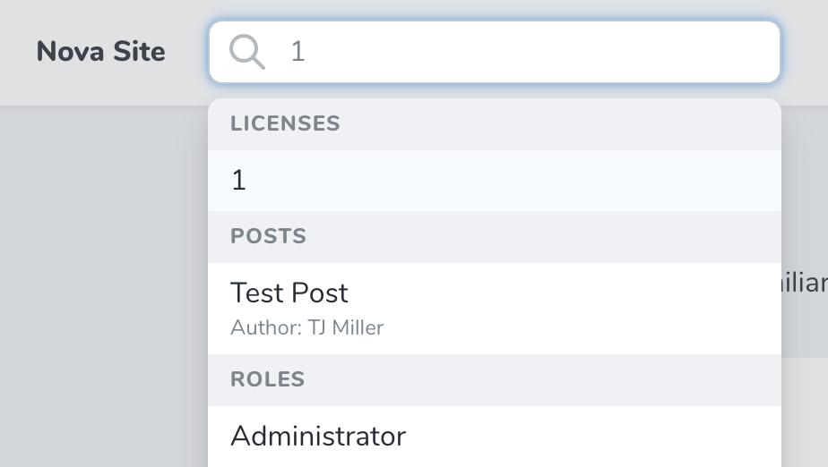

# Global Search

[[toc]]

Nova not only allows you to search within specific resources and relationships, you may also globally search across all your resources using the global search input located within the top-navigation bar of the Nova administration panel:



:::tip Focusing Global Search

You can focus the global search input by pressing `/` (forward slash) on your keyboard. Pressing `ESC` (the escape key) will also close the global search input.
:::

## Title / Subtitle Attributes

When a resource is shown within the search results, the results will display the "title" of the resource. For example, a `User` resource may specify the `name` attribute as its title. Then, when the resource is shown within the global search results, that attribute will be displayed.

To customize the "title" attribute of a resource, you may define a `title` property on the resource class:

```php
namespace App\Nova;

class Team extends Resource 
{
    /**
     * The single value that should be used to represent the resource when being displayed.
     *
     * @var string
     */
    public static $title = 'name'; # [!code ++] # [!code focus]
}
```

Alternatively, you may override the resource's `title` method:

```php
namespace App\Nova;

class Team extends Resource 
{
    /**
     * Get the value that should be displayed to represent the resource.
     *
     * @return string
     */
    public function title() # [!code ++:4] # [!code focus:4]
    {
        return $this->name;
    }
}
```

:::tip Displaying Avatar in Search Results

You may also display resource's "avatar" next to the title in the search result by adding an [Avatar](./../resources/fields.md#avatar-field) field to the resource.
:::

### Subtitles

You may also display a smaller "subtitle" attribute within the global search results. The subtitle will be placed directly under the title attribute. In this screenshot, you can see that the `Post` resource's author is displayed as a subtitle, allowing quick identification of who wrote a given post:


To define a resource's subtitle, you should override the `subtitle` method of the resource:

```php
namespace App\Nova;

class Post extends Resource 
{
    /**
     * Get the search result subtitle for the resource.
     *
     * @return string
     */
    public function subtitle() # [!code ++:4] # [!code focus:4]
    {
        return "Author: {$this->user->name}";
    }
}
```

:::tip Eager Loading

If your subtitle accesses information on a related resource, you should consider adding the related resource to your resource's [eager load array](./../resources/index.md#eager-loading).
:::

## Customization

### Limiting Global Search Results

You can limit the number of results that are returned via global search for a given resource by overriding the `globalSearchResults` property on the resource:

```php
namespace App\Nova;

class Post extends Resource 
{
    /**
     * The maximum number of results to include when searching globally.
     *
     * @var int
     */
    public static $globalSearchResults = 5; # [!code ++] # [!code focus]
}
```

### Global Search Debounce

You can configure the debounce timing of the global search field using the `Nova::globalSearchDebounce` method. Normally, this method should be called from within your application's `NovaServiceProvider`:

```php
namespace App\Providers;

use Laravel\Nova\Nova;
use Laravel\Nova\NovaApplicationServiceProvider;

class NovaServiceProvider extends NovaApplicationServiceProvider
{
    /**
     * Boot any application services.
     */
    public function boot()
    {
        parent::boot();

        Nova::globalSearchDebounce(1); // 1 second # [!code ++] # [!code focus]

        // 
    }
}

```

### Custom Avatars / Covers

If you are building a [custom field](./../customization/fields.md) that you would like to serve as the "avatar image" / cover art for global search results, your field should implement the `Laravel\Nova\Contracts\Cover` interface. This interface requires you to define a `resolveThumbnailUrl` method, which should return the URL of your desired "cover art":

```php
namespace App\Nova;

class Team extends Resource 
{
    /**
     * Resolve the thumbnail URL for the field.
     *
     * @return string|null
     */
    public function resolveThumbnailUrl() # [!code ++:4] # [!code focus:4]
    {
        return 'https://www.example.com/avatar/'.md5(strtolower($this->name)).'?s=300';
    }
}
```

## Disabling Global Search for a Resource

By default, all Nova resources are globally searchable; however, you may exclude a given resource from the global search by overriding the `globallySearchable` property on the resource:

```php
namespace App\Nova;

class Team extends Resource 
{
    /**
     * Indicates if the resource should be globally searchable.
     *
     * @var bool
     */
    public static $globallySearchable = false; # [!code ++] # [!code focus]
}
```

## Disabling Global Search Globally

If you wish to completely disable global search inside of Nova, you can call the `withoutGlobalSearch` method from your `App/Providers/NovaServiceProvider`: 

```php
namespace App\Providers;

use Laravel\Nova\Nova;
use Laravel\Nova\NovaApplicationServiceProvider;

class NovaServiceProvider extends NovaApplicationServiceProvider
{
    /**
     * Boot any application services.
     */
    public function boot()
    {
        parent::boot();

        Nova::withoutGlobalSearch(); # [!code ++] # [!code focus]

        // 
    }
}
```
